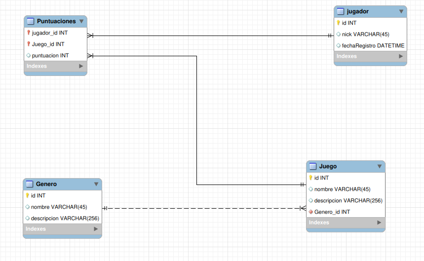
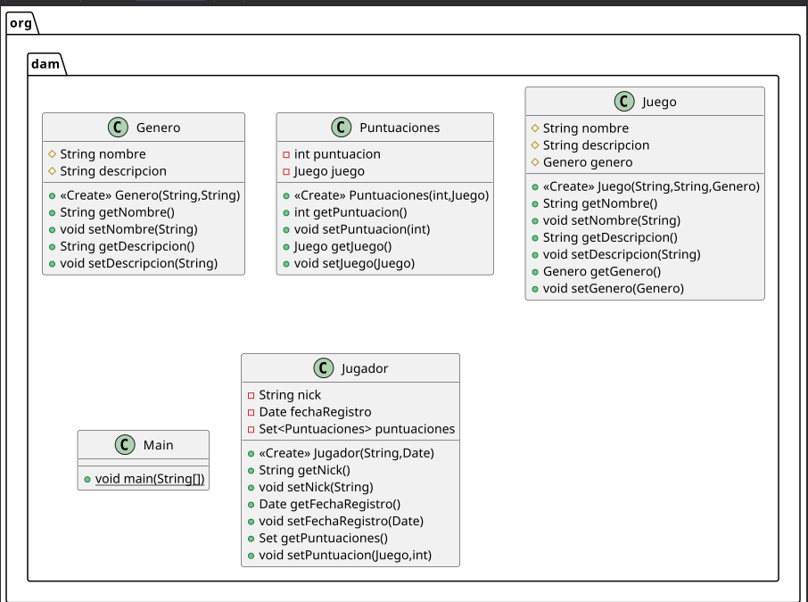

# 1. Desfase objeto-relacional

Los **Sistemas de Gestión de Bases de Datos** (SGBD) se basan principalmente en el modelo Entidad-Relación (E/R), donde la información se almacena en varias tablas **relacionadas** entre sí. Es una tecnología sencilla y eficiente, que ha resistido al paso de los años y que todavía es el modelo utilizado por la mayoría de bases de datos y SGBD actualmente. Pese a su éxito, el modelo tiene algunas limitaciones como la representación de información mal estructurada o compleja.

Los modelos conceptuales nos ayudan a moldear una realidad compleja y se basan en un proceso de abstracción de la realidad. Cada modelo tiene una forma de capturar esta realidad, pero todos ellos están más cercanos a la mentalidad humana que a la memoria de un ordenador.

Cuando modelizamos una base de datos, utilizamos el modelo conceptual de **Entidad-Relación** y posteriormente realizamos un proceso de transformación en tablas y normalización de este modelo para obtener un modelo de datos **relacional**.

En el caso de la programación **orientada a objetos**, intentamos representar la realidad mediante objetos y las relaciones entre ellos. Éste es otro tipo de modelo conceptual, pero que tiene como objetivo representar la misma realidad que el modelo relacional.

Así pues, tenemos dos aproximaciones distintas para representar la realidad de un problema: el Modelo Relacional de la base de datos y el modelo Orientado a Objetos de nuestras aplicaciones.

## 1.1. Representación de la información con el modelo relacional

El modelo relacional se basa en tablas y la relación entre ellas:

- Cada tabla tiene tantas columnas como atributos queremos representar y tantas filas como registros o elementos de ese tipo contiene.
- Las tablas tienen una clave primaria, que identifica cada uno de los registros, y puede estar formada por uno o más atributos.
- La relación entre tablas se representa mediante claves externas, que consisten en incluir en una tabla la clave primaria de otra tabla, como _referencia_ a la misma. Cuando se elimina un registro de una tabla, cuya clave primaria es referenciada por otra, debe garantizarse que se mantiene la **integridad referencial** de la base de datos. Entonces, antes de esta eliminación de una clave primaria, podemos: 
- No permitir la eliminación (**NO ACTION**), 
- Realizar la eliminación en cascada, eliminando también todos los registros que hacían referencia a la clave primaria del registro eliminado (**CASCADE**), 
- Establecer a null (**SET NULL**), de modo que la clave externa que hacía referencia a la clave primaria de la otra tabla tome el valor de `NULL`.
- Los diferentes campos de las tablas también pueden tener ciertas restricciones asociadas, como: 
- Restricción de valor **no nulo**, por lo que el campo no puede ser nulo en ningún caso, 
- Restricción de **unicidad** en uno o varios campos, por lo que el valor debe ser único en toda la tabla. 
- Restricción de dominio, o lo que es lo mismo, puede tener un conjunto de valores posibles por defecto.

!!! note "Atención" 
Las claves primarias tienen ambas propiedades: valor no nulo y unicidad.


### 1.1.1. Ejemplo

Una base de datos para almacenar información sobre jugadores, juegos, etc. puede ser así:



Implementada con el SGBD `MySQL`:

```sql
CREATE SCHEMA IF NOT EXISTS `BDJuegos` DEFAULT CHARACTER SET utf8 ;
USE `BDJuegos` ;

CREATE TABLE IF NOT EXISTS `BDJuegos`.`jugador` ( 
`id` INT NOT NULL, 
`nick` VARCHAR(45) NULL, 
`fechaRegistro` DATETIME NULL, 
PRIMARY KEY (`id`))
ENGINE = InnoDB;

CREATE TABLE IF NOT EXISTS `BDJuegos`.`Genero` ( 
`id` INT NOT NULL, 
`nombre` VARCHAR(45) NULL, 
`descripcion` VARCHAR(256) NULL, 
PRIMARY KEY (`id`))
ENGINE = InnoDB;


CREATE TABLE IF NOT EXISTS `BDJuegos`.`Juego` ( 
`id` INT NOT NULL, 
`nombre` VARCHAR(45) NULL, 
`descripcion` VARCHAR(256) NULL, 
`Genero_id` INT NOT NULL, 
PRIMARY KEY (`id`), 
INDEX `fk_Juego_Genero1_idx` (`Genero_id` ASC), 
CONSTRAINT `fk_Juego_Genero1` 
FOREIGN KEY (`Genero_id`) 
REFERENCES `BDJuegos`.`Genero` (`id`) 
ON DELETE NO ACTION 
ON UPDATE NO ACTION)
ENGINE = InnoDB;

CREATE TABLE IF NOT EXISTS `BDJuegos`.`Puntuaciones` ( 
`jugador_id` INT NOT NULL, 
`Juego_id` INT NOT NULL, 
`puntuacion` INT NULL, 
PRIMARY KEY (`jugador_id`, `Juego_id`), 
INDEX `fk_jugador_has_Juego_Juego1_idx` (`Juego_id` ASC), 
INDEX `fk_jugador_has_Juego_jugador1_idx` (`jugador_id` ASC), 
CONSTRAINT `fk_jugador_has_Juego_jugador1` 
FOREIGN KEY (`jugador_id`) 
REFERENCES `BDJuegos`.`jugador` (`id`) 
ON DELETE NO ACTION 
ON UPDATE NO ACTION, 
CONSTRAINT `fk_jugador_has_Juego_Juego1` 
FOREIGN KEY (`Juego_id`) 
REFERENCES `BDJuegos`.`Juego` (`id`) 
ON DELETE NO ACTION 
ON UPDATE NO ACTION)
ENGINE = InnoDB;
```

## 1.2. Representación de la información con el modelo orientado a objetos

Como la entidad-relación, el modelo orientado a objetos es un modelo de datos conceptual, pero que da importancia a la modelización de los objetos.

Un objeto puede representar cualquier elemento concibetual: entidades, procesos, acciones... Un objeto no sólo representa las características o propiedades, sino que también se centra en los procesos que sufren. En términos del modelo orientado a objetos, decimos que un objeto es datos más operaciones o comportamiento.

En la unidad introductoria ya revisamos la programación orientada a objetos, así que nos limitaremos a una breve revisión de los principales conceptos:

- Un objeto es una entidad con ciertas propiedades y cierto comportamiento.
- En términos de POO, las propiedades se conocen como **atributos**, y el conjunto de sus valores determina el estado del objeto en un momento dado.
- El comportamiento está determinado por una serie de funciones y procedimientos que llamamos **métodos**, y que modifican el estado del objeto.
- Un objeto también tendrá un nombre con el que se identifica.
- Una **clase** es una abstracción de un conjunto de objetos, y un objeto debe pertenecer necesariamente a alguna clase.
- Las clases definen los atributos y métodos que los objetos de esa clase tendrán.
- Un objeto se dice que es una **instancia** de una clase.

El mismo ejemplo que hemos representado recientemente, con una representación orientada a objetos, podría ser:




Como podemos ver, tiene una estructura similar, a la que también hemos añadido algunos métodos como getters y setters. Además, las distintas clases no tienen un atributo identificador, puesto que cada objeto se identifica a sí mismo. Aquí tenemos una pequeña aproximación de cómo implementaríamos esta jerarquía en Java.

La clase `Genere` es una clase POJO, que sólo almacena información (nombre y descripción del tipo de juego) e implementa getters y setters.

```java
package org.dam;

public class Genero {
    protected String nombre;
    protected String descripcion;

    public Genero(String nombre, String descripcion) {
        this.nombre = nombre;
        this.descripcion = descripcion;
    }

    public String getNombre() {return nombre;}
    public void setNombre(String nombre) {this.nombre = nombre;}

    public String getDescripcion() {return descripcion;}
    public void setDescripcion(String descripcion) {
        this.descripcion = descripcion;
    }
}
```

La clase `Juego` almacena el nombre, la descripción y el género del juego. A diferencia del modelo relacional, donde lo que se almacena sería una clave externa al género, ya que aquí no tenemos claves externas, almacenamos el propio objeto (la referencia).

```java
package org.dam;

public class Juego {
    protected String nombre;
    protected String descripcion;
    protected Genero genero;

    public Juego(String nombre, String descripcion, Genero genero) {
        this.nombre = nombre;
        this.descripcion = descripcion;
        this.genero = genero;

    }

    public String getNombre() {return this.nombre;}
    public void setNombre(String nombre) {this.nombre = nombre;}

    public String getDescripcion() {return this.descripcion;}
    public void setDescripcion(String descripcion) {
        this.descripcion= descripcion;
    }

    public Genero getGenero() {return this.genero;}

    public void setGenero(Genero genero) {this.genero = genero;}
}
```

La clase `Puntuaciones` presenta la relación entre `Jugador` y `Juego` (cuando un jugador juega a un juego) y almacena los puntos y una referencia al juego.

```java
package org.dam;

public class Puntuaciones {
    private int puntuacion;
    private Juego juego;

    public Puntuaciones(int puntuacion, Juego juego) {
        this.puntuacion = puntuacion;
        this.juego = juego;
    }

    public int getPuntuacion() {return puntuacion;}
    public void setPuntuacion(int puntuacion) {
        this.puntuacion = puntuacion;
    }

    public Juego getJuego() {return juego;}

    public void setJuego(Juego juego) {this.juego = juego;}
}

```


Y finalmente, la clase `Jugador` almacena el apodo y la fecha de registro para cada jugador, y después, un array con todos los juegos que el jugador ha jugado:

```java
package org.dam;

import java.util.Date;
import java.util.Set;

public class Jugador {

    private String nick;
    private Date fechaRegistro;
    private Set<Puntuaciones> puntuaciones;

    public Jugador(String nick, Date fechaRegistro) {
        this.nick = nick;
        this.fechaRegistro = fechaRegistro;
    }

    public String getNick() {return nick;}
    public void setNick(String nick) {this.nick = nick;}

    public Date getFechaRegistro() {return fechaRegistro;}
    public void setFechaRegistro(Date fechaRegistro) {
        this.fechaRegistro = fechaRegistro;
    }

    public Set getPuntuaciones() {return this.puntuaciones;}
    public void setPuntuacion(Juego juego, int puntuacion) {
        Puntuaciones registro = new Puntuaciones(puntuacion, juego);
        this.puntuaciones.add(registro);
    }
}
```

!!! info "La interfaz `Set` y la clase `HashSet`" 

`Set` es una interfaz del paquete `java.util` que trata una colección o conjunto de elementos sin desorden y sin duplicados. 

Por otra parte, `HashSet` es una clase que implementa la interfaz `Set` y que se basa en una tabla de hash, una estructura de datos que permite localizar objetos basándose en una clave que indica la posición en la tabla, permitiendoel acceso directo al elemento, lo que les hace ideales para búsquedas, inserciones y eliminaciones.


## 1.3. Modelo Relacional vs Modelo Orientado a Objetos

Conceptualmente, el modelo orientado a objetos es un _modelo dinámico_, que se centra en los objetos y en los procesos que éstos experimentan, pero que no tiene en cuenta, desde el principio, su persistencia. Debemos ser capaces, por tanto, de guardar los estados de los objetos de forma permanente y cargarlos cuando la aplicación los necesite, así como mantener la consistencia entre estos datos almacenados y los objetos que los representan en la aplicación.

Una forma de ofrecer esta persistencia a los objetos sería utilizar un _SGBD Relacional_, pero nos encontraremos con algunas complicaciones. La primera, desde un punto de vista conceptual, es que el modelo Entidad-Relación se centra en los datos, mientras que el modelo orientado a objetos se centra en los objetos, entendidos como grupos de datos y operaciones realizadas sobre ellos.

Otra diferencia, bastante importante, es la vinculación de los elementos entre un modelo y otro. Por un lado, el modelo relacional añade información adicional a las tablas en forma de clave externa, mientras que en el modelo orientado a objetos no necesitamos este dato externo, sino que la vinculación entre objetos se realiza a través de referencias entre ellos. Un objeto, por ejemplo, no necesitará una clave primaria, ya que el objeto se identifica por sí mismo.

Como hemos visto en el ejemplo de las secciones anteriores, las tablas en el modelo relacional tenían una clave primaria para identificar los objetos y claves externas para expresar las relaciones, mientras que en el modelo orientado a objetos éstas desaparecen, expresando las relaciones entre objetos mediante referencias. Además, la forma en que se expresan estas relaciones también es diferente. En el modelo relacional, por ejemplo, el registro de puntuaciones es una tabla que enlaza la mesa de jugadores con la mesa de juegos y añade la puntuación del jugador en el juego. Por otra parte, en la implementación en Java que hemos hecho tenemos objetos de tipo `Registro` que almacenan una puntuación y una referencia al juego, pero es la clase Jugador la que mantiene el conjunto de registros de sus puntuaciones.

Por otra parte, al manipular los datos, hay que tener en cuenta que el modelo relacional dispone de lenguajes (principalmente SQL) diseñados exclusivamente para este propósito, mientras que en un lenguaje orientado a objetos funciona de forma diferente, por lo que será necesario incorporar mecanismos que permitan realizar estas consultas desde el lenguaje de programación. Además, cuando obtenemos los resultados de la consulta, también encontramos otro problema, y es la conversión de los resultados. Cuando se realiza una consulta a una base de datos, siempre se devuelve un resultado en forma de **tabla**, por lo que será necesario transformar estos resultados en estados de los objetos de la aplicación.

Todas estas diferencias implican lo que se conoce como **desfase relacional-objeto**, y que nos obligará a realizar determinadas conversiones entre objetos y tablas cuando queremos guardar la información en un SGBD. En esta unidad y en las siguientes, veremos cómo superar este retraso desde distintos enfoques.