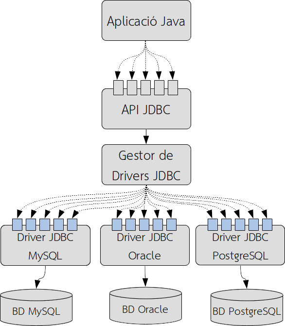
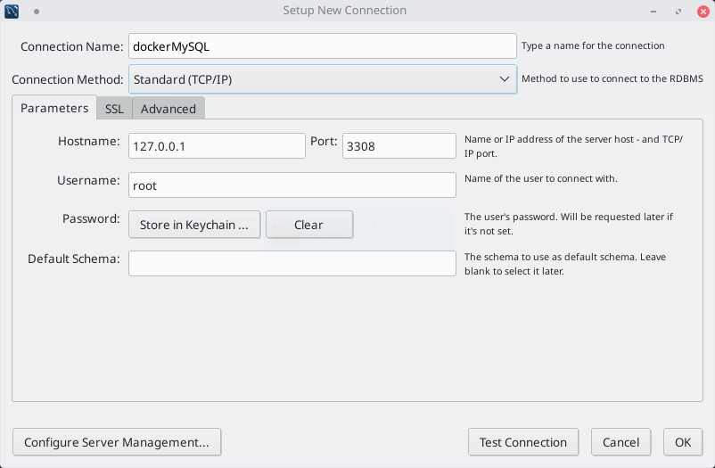

# 2. Conectores

## 2.1. La arquitectura cliente-servidor en SGBD

Una vez conocemos el retraso relacional-objeto, centrémonos en cómo acceder a bases de datos relacionales desde los lenguajes de programación. Los SGBD, se popularizaron en los años 80, siendo los más extendidos actualmente. Salvo algunas excepciones, funcionan siguiendo una arquitectura cliente-servidor, de modo que tenemos un servidor donde ejecuta el SGBD y varios clientes que se conectan al servidor y hacen las peticiones correspondientes.

Los SGBD ofrecían sus propios lenguajes de programación, pero estaban muy ligados a ellos y el mantenimiento de la aplicación era muy caro. Por este motivo, la tendencia era desacoplar (separar) a los SGBD del lenguaje de programación, y hacer uso de estándares de conexión entre ellos.

Gracias a la arquitectura cliente-servidor, los SGBD pudieron separar los datos por un lado y los programas para acceder por otros. Esta versatilidad tenía un pequeño inconveniente, y es que era necesario desarrollar por un lado el servidor, pero por otro, también la parte del cliente para poder conectarse a los servidores. Estas conexiones entre clientes y servidores requerirán de protocolos y lenguajes específicos. Aquí nace el concepto de **middleware**, entendido como una capa intermedia de persistencia, formada por bibliotecas, lenguajes y protocolos ubicados en el cliente y en el servidor y que permiten conectar la base de datos con las aplicaciones.

Aunque inicialmente cada SGBD implementó soluciones específicas, se impusieron estándares, entre ellos el lenguaje de consulta SQL (Structured Query Language), y que supuso un gran avance, ya que unificó la manera de acceder a las bases de datos, aunque las aplicaciones continuaron requieren una API para hacer uso de SQL.

## 2.2. Protocolos de acceso a bases de datos

Cuando hablamos de protocolos de acceso a bases de datos, nos encontramos con dos reglas principales de conexión:

- **ODBC** (Open Data Base Connectivity): Ésta es una API (Application Program Interface) desarrollada por _Microsoft para sistemas Windows_ que permite añadir diferentes conectores a varias bases de datos relacionales basadas en SQL, de una manera sencilla y transparente. Utilizando ODBC, las aplicaciones pueden abrir conexiones en la base de datos, enviar consultas, actualizaciones y gestionar los resultados.
- **JDBC** (Java Database Connectivity), que define una API multiplataforma que los programas Java pueden utilizar para conectarse al SGBD.

## 2.3. JDBC

Como hemos dicho, JDBC es una API de conexión a bases de datos específica de Java. Su modo de funcionamiento es el siguiente:

- Se ofrece una API, encapsulada en clases, que garantiza uniformidad en la forma en que las aplicaciones se conectan a la base de datos, independientemente del SGBD subyacente.
- Necesitaremos un controlador para cada base de datos a la que queremos conectarnos. Java no tiene ninguna librería ODBC específica, pero, para no perder el potencial de estas conexiones, se han incorporado controladores especiales que actúan como adaptadores entre JDBC y ODBC, por lo que es posible, a través de este puente, conectar cualquier aplicación Java con cualquier conexión ODBC. Actualmente, casi todos los SGBD tienen controladores JDBC, pero en caso de que no tenga conocimiento, puede utilizar este puente ODBC-JDBC.

### 2.3.1. Arquitectura JDBC

La biblioteca estándar JDBC proporciona un conjunto de interfaces independientes de la implementación. Los controladores de cada DBMS serán los encargados de su implementación. Las aplicaciones, para acceder a la base de datos, tendrán que utilizar las interfaces JDBC, de modo que la implementación de cada DBMS sea completamente transparente para la aplicación.


<figure markdown="span">
  { width="700" }
  <figcaption>JDBC</figcaption>
</figure>

Como podemos ver, las aplicaciones Java acceden a los distintos métodos que API especifica como interfaces, pero son los controladores los que acceden a la base de datos.

Hay que decir que las aplicaciones pueden utilizar varios controladores JDBC simultáneamente y acceder, por tanto, a múltiples bases de datos. La aplicación especifica un controlador JDBC utilizando una URL (Universal Resource Locator) en el gestor de controladores, y éste es el responsable de establecer correctamente las conexiones con las bases de datos a través de los controladores. Los controladores pueden ser de distintos tipos:

- Tipo I o **controladores de puente**, caracterizados por hacer uso de tecnología externa a JDBC y actuar como adaptadores entre JDBC y la tecnología específica utilizada. Un ejemplo es el puente JDBC-ODBC.
- Tipo II o controladores con API parcialmente nativa, o **controladores nativos**. Están entrenados por un lado en Java y por otro hacen uso de librerías del sistema operativo. Su uso se debe a algunos SGBD que incorporan conectores propietarios que no siguen ningún estándar (normalmente pre-ODBC/JDBC).
- Tipo III o **controladores Java a través de protocolo de red**, que son controladores desarrollados en Java que traducen las llamadases JDBC en un protocolo de red contra un servidor proxy. Es un sistema muy flexible, ya que los cambios en la implementación de la base de datos no afectan a las aplicaciones.
- Tipo IV o **100% Java puras**, también llamados protocolo nativos, y éstos son controladores escritos íntegramente en Java. Las solicitudes al SGBD se realizan a través del protocolo de red que utiliza el propio SGBD, por lo que no es necesario ningún código nativo al cliente ni un servidor proxy. Es la alternativa que se ha acabado imponiendo, puesto que no requiere ningún tipo de instalación.

## 2.4. MySQL, Docker, Workbench

Este año utilizaremos MySQL como SGBD, por su amplia utilización en diversos contextos y por su simplicidad. Para utilizarlo, debes instalar `mysql-server` como servicio en tu sistema, como has estudiado en los últimos años.

El servidor MySQL se puede instalar en tu ordenador, o puedes instalarlo en una máquina virtual o configurarlo como contenedor Docker. Por tener un sistema más limpio, la opción recomendada es con contenedor Docker, ya que podrás ejecutar varias versiones de MySQL sin interferencias entre ellas.


!!! note 
Tiene una documentación adicional sobre cómo crear un contenedor MySQL en un documento llamado [Docker para MySQL](./Docker_mysql.pdf). Así pues, y con respecto al resto del documento, asumiremos que ya tiene la imagen de Docker de MySQL y un contenedor en ejecución en el puerto `3308` (MySQL utiliza el puerto 3306 por defecto, pero en nuestro contenedor expondremos el servicio en el puerto 3308, en caso de que ya tenga un servidor MySQL 3 local).


```bash
# Remember that to create the container (only fisrt time)

docker run --name mysql-srv 
-p 3308:3306 
-e MYSQL_ROOT_PASSWORD="root" 
-d mysql:latest

# Se crea y start el container

# To stop the container
docker stop mysql-srv

# And to start the container ( AVOID TO run IT AGAIN !!!)
docker start mysql-srv
```

Y finalmente, pero no menos importante, evidentemente, puede utilizar una herramienta gráfica para acceder a MySQL, como `mysql-workbench` o `dbeaver`. Debe configurar una conexión al puerto de Docker:
<figure markdown="span">
  { width="700" }
  <figcaption>mysql-workbench</figcaption>
</figure>


!!! warning "Espacio" 
Revisa las notas de tu módulo de bases de datos sobre cómo trabajar con Workbench: 

- Carga y ejecuta scripts SQL 
- Recupera la estructura de la base de datos 
- Edita y crea SQL 
- Edita y guarda datos

Dispones del scrip [Esquema BD Juegos](./esquemaBDJocs.sql) para cargar los ejemplos de los apuntes