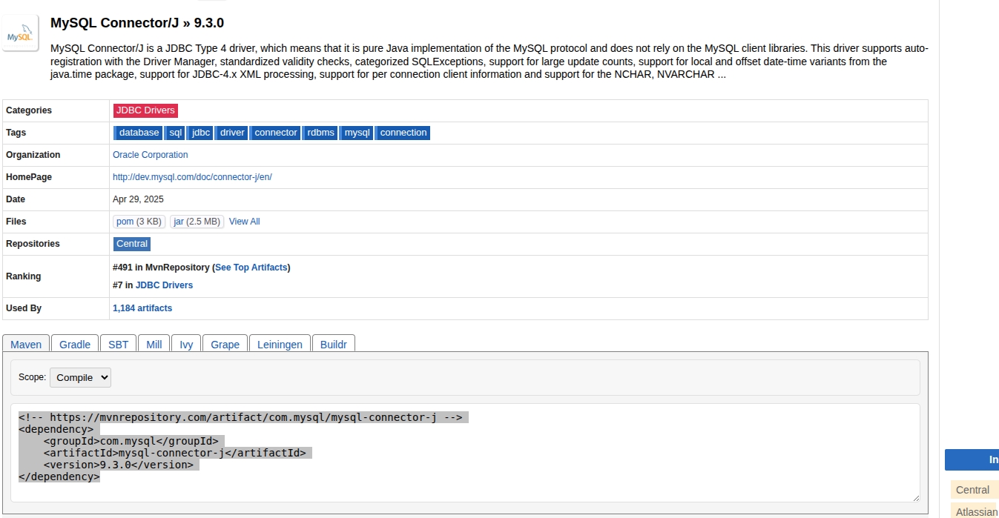

# 3. Conectando a bases de datos
## 3.1. Controlador JDBC de MySQL

Para crear programas Java utilizando el controlador de MySQL, necesitamos cargarlo en nuestro programa y previamente en nuestro entorno de desarrollo. Cómo utilizaremos `Maven` vamos a ver cómo hacerlo:

1. Debemos encontrar la versión del controlador de nuestro servidor JDBC, y podemos encontrarlo en el repositorio central de Maven <https://mvnrepository.com>.
2. Buscamos `mysql jdbc`, y obtendremos como primer resultado [MySQL Connector/J](https://mvnrepository.com/artifact/com.mysql/mysql-connector-j/9.3.0).
3. Asegúrese de seleccionar la versión correcta, y luego seleccione el gestor de paquetes (gradle, maven, etc.) y obtendrá:

```bash
<!-- https://mvnrepository.com/artifact/com.mysql/mysql-connector-j -->
<dependency>
    <groupId>com.mysql</groupId>
    <artifactId>mysql-connector-j</artifactId>
    <version>9.3.0</version>
</dependency>
```

4. Cuando guarde o compile su proyecto, podrá importar los controladores correctamente.

<figure markdown="span">
  { width="700" }
  <figcaption>mysql-maven</figcaption>
</figure>


## 3.2. URL de conexión

Una vez haya importado el controlador, debe decirle a su programa Java cómo conectarse a su base de datos y finalmente conectarse a su programa. Para esta tarea, debemos crear una `Connection` utilizando una URL especial llamada _URL de conexión_. Como otras URL, una URL de conexión puede contener:

- **Protocolo** $\rightarrow$ utilizaremos `jdbc`.
- **SGBD** $\rightarrow$ podríamos utilizar `mysql`, `postgres`, `sqlite`, `sqlserver` o cualquier SGBD con un conector JDBC.
- **Dirección del servidor** $\rightarrow$ podemos utilizar tanto un nombre completo como la dirección IP del servidor.
- [opcional]**Port** $\rightarrow$ el puerto donde el servidor está escuchando. Si no se utiliza ninguna, el controlador intentará conectarse al puerto predeterminado. Recuerde separar el puerto de la dirección con `:`.
- **Otros parámetros**, separándolos con `?` al principio y con `&` entre los parámetros. Por ejemplo: 
- **user**=`usuario` 
- **pass**=`contraseña` 
- **useUnicode**=`true` 
- **characterEncoding**=`UTF-8`

Una muestra de URL de conexión puede ser:

```java
String connectionUrl = "jdbc:mysql://localhost:3308/Cycling?useUnicode=true&characterEncoding=UTF-8&user=root&password=root";
```

Una mejor opción sería:

```java
String server="localhost";
int puerto=3308;
String user="root";
String pass="root";
String DBName="Cycling";
String connectionUrl = "jdbc:mysql://"+server+":"+puerto;
connectionUrl+="/" + DBName;
connectionUrl+="?useUnicode=true&characterEncoding=UTF-8";
connectionUrl+="&user="+user;
connectionUrl+="&password="+pass;
```

!!! warning "Atención" 
Tenga en cuenta que ambos ejemplos son código **hard-coded**, ya que tiene los valores del servidor (usuario y contraseña) escritos dentro de cadenas de texto. Es mejor opción almacenar estos valores dentro de variables o archivos de propiedades.

## 3.3. Clase `Connection`

En Java, la clase necesaria para gestionar el controlador es `java.sql.DriverManager`. Intenta cargar los controladores del sistema cuando lee la propiedad de los controladores JDBC, pero podemos indicar que se cargue utilizando la instrucción:

```java
Class.forName("com.mysql.cj.jdbc.Driver");
```

La clase que centralizará todas las operaciones con la base de datos es `java.sql.Connection`, y debemos obtenerla desde el `DriverManager` con cualquiera de los 3 métodos estáticos que tiene:

- `static Connection getConnection(String url)` $\rightarrow$ Devuelve una conexión, si es posible, a la base de datos con los parámetros especificados en la URL de conexión. Recuerde crear una URL de conexión a partir de la parte anterior.
- `static Connection getConnection(String url, Properties info)` $\rightarrow$ Devuelve una conexión, si es posible, a la base de datos, con algunos parámetros especificados en la URL y otros en un objeto de propiedades (`Properties` clase estudiada en la unidad 1). Veremos ejemplos más adelante.
- `static Connection getConnection(String url, String user, String pass)` $\rightarrow$ Devuelve una conexión, si es posible, a la base de datos con los parámetros especificados en la URL. Los datos de usuario y contraseña se proporcionan en dos parámetros adicionales, por lo que no es necesario escribirlos en la URL de conexión.

Una muestra inicial será:

```java
public static void main (String [] args ) 
throws ClassNotFoundException, SQLException{ 

Class.forName("com.mysql.cj.jdbc.Driver"); 
String server="localhost"; 
int puerto=3308; 
String user="root"; 
String pass="root"; 
String DBName="Cycling"; 
String connectionUrl = "jdbc:mysql://"+server+":"+puerto; 
connectionUrl+="/" + DBName; 
connectionUrl+="?useUnicode=true&characterEncoding=UTF-8"; 

Connection conn = DriverManager.getConnection(connectionUrl,user,pass); 

// if no excepto se catched, you connected to your DBMS
```

Con el objeto `Connection` que tenemos ahora conectado, enviaremos nuestras consultas y pediremos información, como veremos más adelante.

## 3.4. Organizando nuestra conexión

Nuestra aplicación debe conectarse a una (o más) bases de datos. Podemos realizar muchas peticiones a estas base de datos, y si estamos implementando una aplicación multithreaded, el número de peticiones puede aumentar mucho. Por eso, debemos controlar **dónde** y **cuándo** se crean y se cierran las conexiones. Una buena idea es crear una clase que encapsule todos estos procesos. El esqueleto de esta clase sería el siguiente:


```java
public class ConnexionBD { 

private Connection laConnexion = null; 

// write here access variables, like user, server or whatever 

private void connect() { 
// do the connetion (look the sample). 
// Take care. private method. It will be called inside the class 
} 

// close connection, if it's opened 
public void disConnect() { 
if (laConnexion != null) { 
laConexion.close(); 
} 
} 

// returns the connection. 
// It will be create first time of after closed 
public Connection getConexion(){ 
if (laConexion == null) { 
this.connect(); 
} 
return this.laConnexion; 
}
}
```
### 3.4.1. Ejercicio resuelto

Crea un proyecto único con dos clases. Una para conectarte a tu base de datos, como el último ejemplo, y una clase principal que se conecte y muestre si ha habido algún error.


> La solución del ejercicio está enlazada aquí [connexio.properties](./connexion.properties) y [ConnexioDB.java](./ConnexionDB.java)