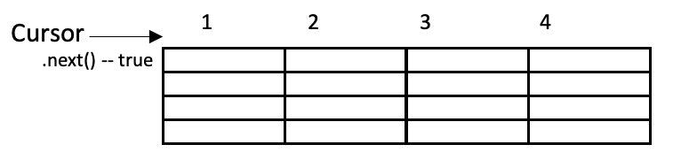

# 4. Clase `ResultSet`.

Ahora que estamos conectados a la base de datos, es hora de empezar a pedir información a DBMS. Esta información se proporcionará en forma de consultas (SQL) u otros métodos, pero casi el 90% de las veces, como en el caso de las consultas SQL, la información devuelta se encuentra en un formato tabular. Los formatos tabulares son bien conocidos porque programas como MySQL Workbench o DBeaver muestran los datos de esta forma.

En Java, la clase que permite trabajar con datos en formato tabular provenientes de bases de datos se llama `Resultset`. Un `Resultset` está compuesto por una tabla (filas y columnas) y un puntero en una fila, llamado **cursor**.

{width=90%}


1. Cuando recuperamos datos de las bases de datos, la información se guarda en la tabla y el cursor apunta a una fila imaginaria vacía llamada `beforeFirst`.
2. `Resultset` contiene un método especial llamado `next()`, que realiza dos acciones: 
1. Devuelve `true` si hay una fila de datos después de la fila actual apuntada por el cursor y `false` de lo contrario. 
2. Avanza el cursor y apunta a la siguiente fila, sólo si había una.
3. Cuando el cursor de un `Resultset` devuelve `false`, significa que se han visitado todas las filas y ahora el cursor apunta a otra fila imaginaria llamada `afterLast`.

Cuando el cursor apunta a una fila real, es cuando podemos recuperar los datos de las columnas de la fila actual. Podemos utilizar un método especial y sobrecargado, de la siguiente forma:

- `getXXX(int posiciónColumna)` →  devuelve los datos, donde `XXX` es un tipo de datos (Int, Float, Double, String, etc.) de la posición de la columna, empezando por 1.
- `getXXX(String nombreColumna)` →  devuelve los datos, donde `XXX` es un tipo de datos (Int, Float, Double, String, etc.) de la columna con el nombre proporcionado.

!!! danger "Peligro" 

Tenga en cuenta: 

- Las columnas comienzan en 1 en lugar de 0, a diferencia de los arrays. 
- Si no conoce el tipo de datos de una columna, puede utilizar `getObject` y éste devolverá un `Object` genérico. 
- Estos métodos pueden generar una `SQLException` si el rango o el nombre de la columna está fuera de rango o no existe.

## 4.1. ResulSetMetaData

Los ResultSets de una consulta también tienen un conjunto de metadatos. Estos metadatos se pueden obtener utilizando `ResultSetMetaData`. Los métodos más relevantes de esta clase son:

- `int getColumnCount()` → Obtiene el número de columnas en el ResultSet.
- `String getColumnName(index)` →  Obtiene el nombre de la columna indicada en el índice (recuerda que el primero es 1).
- `String getColumnTypeName(index)` →  Obtiene el tipo de la columna.

ResulSetMetaData se obtiene de cada ResultSet generado previamente, con el método `getMetaData()`.

## 4.2. Algoritmo ResultSet

Independientemente del contenido de datos de tu ResultSet, la forma en que debemos trabajar es la siguiente:

```java
// Connect to DB
Connection conn = ...;

// recover data
ResultSet rst=con...

// while data available exists
while (rst.next()){ 
//process the current row
}
```

Sé consciente de que:

- Dentro del bucle while no es necesario llamar `next()` de nuevo. Se salta una fila de lo contrario.
- Cuando se han procesado las últimas filas, `next()` devuelve `false` y el bucle finaliza.

## 4.3. Ejemplo

En este blog de código, vamos a ver un ejemplo breve para ejecutar una consulta (`Select * from table`). Veremos otras consultas en las siguientes secciones.

```java
//with a previous connection
String tabla="Juegos";
ResultSet rst = con.createStatement().executeQuery("SELECT * FROM " +mesa);
System.out.println(Colores.Cyan);
System.out.println("");
System.out.println("Contenido de " + tabla);
System.out.println("******************************");

ResultSetMetaData rsmdQuery = rst.getMetaData();

// print the columns name
for (int i = 1; y <= rsmdQuery.getColumnCount(); i++) 
System.out.print(String.format("%-25.25s",rsmdQuery.getColumnName(i)));

System.out.println();
System.out.println(Colores.Reset);

// print the values
while (rs.next()) { 
for (int i = 1; y <= rsmdQuery.getColumnCount(); i++) 
System.out.print(String.format("%-25.25s ",rst.getString(i))); 
System.out.println();
}
```