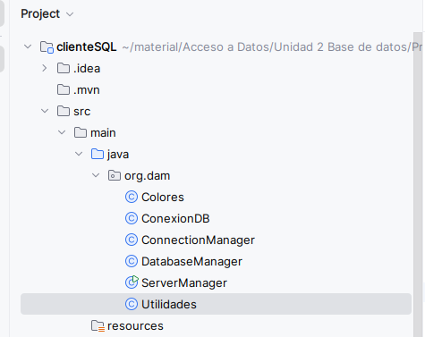

# Actividad Cliente MySQL

Vamos a crear un cliente de SGBD, como MySQL Workbench, pero en una versión de consola con una shell y un prompt. Nuestro cliente nos permite conectarnos a un servidor, seleccionar una base de datos y por último ejecutar varias consultas SQL.

## 1.1. Modo de servidor

Al iniciar nuestro programa, pedirá los datos del servidor.

```sh
java -jar cliente
...
$ Server: 127.0.0.1
$ Port: 3308
$ Username: root
$ Password:
$ (root) on 127.0.0.1:3308>
```

Como puede ver en la última línea, el prompt es `(usuario) on IP:port>`. Nuestro cliente muestra siempre dónde estamos conectados.

La lista de órdenes que nuestro cliente aceptará cuando esté conectado es (**modo servidor**):

- `show database` o `show db` → muestra una lista con todas las bases de datos de nuestro SGBD.
- `info` → muestra información sobre el SGBD y la configuración de la conexión.
- `import nombre_del_script` → permite cargar un script SQL desde un archivo.
- `use nombre_de_la_bd` → cambia nuestro programa al modo base de datos.
- `quit` → finaliza nuestro programa.


## 1.2. Mode de Base de Dades

Una vez que estemos conectados a un servidor y hayamos seleccionado una base de datos, nuestro cliente entrará en el modo de base de datos:

```sh
$ (root) on 127.0.0.1:3308>use instituto
$ (root) on 127.0.0.1:3308[instituto]>
```


Puedes ver que el nombre de la base de datos se añade al prompt y ahora el programa está esperando comandos para la base de datos. Tienes que implementar estos comandos:

- `sh tables` → muestra todas las tablas de la base de datos seleccionada.
- `describe nombre_de_la_tabla` → muestra la descripción de esta tabla: campos, tipos de datos y claves primarias como mínimo.
- `insert Nombre_de_la_Tabla` → de forma interactiva, pide al usuario el valor de cada campo e inserta una nueva fila.
- `sql` → ejecuta cualquier consulta en la base de datos seleccionada.
- `quit` → vuelve al modo SGBD.


# 2. Estructura del proyecto y consejo

El proyecto contiene las siguientes clases:

{width=75%}

Vamos a revisar las funciones de clase

## 2.1. ServerManager

Contiene _main_, y cuando se inicia, pide al usuario la información del servidor. A continuación, inicia la clase `ConnectionManager` con los valores proporcionados.

## 2.2. ConnectionManager

Gestiona la consola principal del programa y tiene como atributos:

```java
String server;
String port;
String user;
String pass;
```


y como métodos:

- `ConnectionManager()` → constructor por defecto.
- `ConnectionManager(String server, String port, String user, String pass)` → constructor general.
- `public Connection connectDBMS()` → inicia y devuelve una conexión.
- `public void showInfo()` → muestra la información del servidor.
- `public void showDatabases()` → mostra les taules del servidor.
- `public void importScript(String script)` → carga y ejecuta un script.
- `public void startShell()` → inicia la consola del servidor. Esta consola está ya implementada.

## 2.3. Gestor de Base de Datos

Gestiona la consola del modo base de datos y necesita un atributo adicional respecto al Gestor de Conexión:

```java
String server;
String port;
String user;
String pass;
String dbname;
```


y como métodos:

- `DatabaseManager()` → constructor por defecto.
- `DatabaseManager(String server, String port, String user, String pass,String dbname)` → constructor general.
- `public Connection connectDatabase()` → inicia y devuelve una conexión a la base de datos actual.
- `public void insertIntoTable(String table)` → inicia el asistente de inserción para la tabla dada.
- `public void showDescTable(String table)` → muestra los metadatos de la tabla.
- `public void executeSelect(String query)` → ejecuta una consulta dada (de cualquier tipo) y muestra los resultados en la pantalla, si los hubiere.
- `public void startShell()` → inicia la consola del modo base de datos. Tienes que realizar una implementación completa.

# 3. Inserciones a las tablas.

El método `insertIntoTable` es probablemente el más difícil de la tarea, ya que es necesario pedir primero los metadatos de la tabla para conocer los campos y los tipos de datos de la tabla, y después pedir al usuario los valores y los formatos.

El consejo que se dará es crear tres listas con:

1. Lista de campos a insertar.
2. Lista de valores que se asignarán.
3. Lista de tipos de cada campo.

Además, es necesario generar una lista o cadena de marcadores de posición con tantos `?` como sea necesario.


!!! tip "Consejo"

    Recuerda que, al pedir los metadatos de la tabla, las columnas que necesitas son: 
    
    - Columna 4: nombre de la columna 
    - Columna 6: tipos de datos de la columna 
    - Columna 18: nullable o no. Este campo es obligatorio si no es nullable. 
    - Columna 23: incremental o no. No necesitas ese campo si es incremental. 
    
    Por último, verifica el ajuste de los placeholders, ya que dependen del tipo de datos. Tener en cuenta que: 
    
    - Los datos `int` utilizarán `setInt()` 
    - Los datos `datetime` utilizarán `setDate()`, con un casting en `java.sql.Date` en lugar de `java.Date` 
    - Por defecto el `setString` y confiar en que el casting automático haga su trabajo.


Disponemos del paquete `ClienteSQL_alu` el siguiente [enlace](./clienteSQL_alu.zip).
