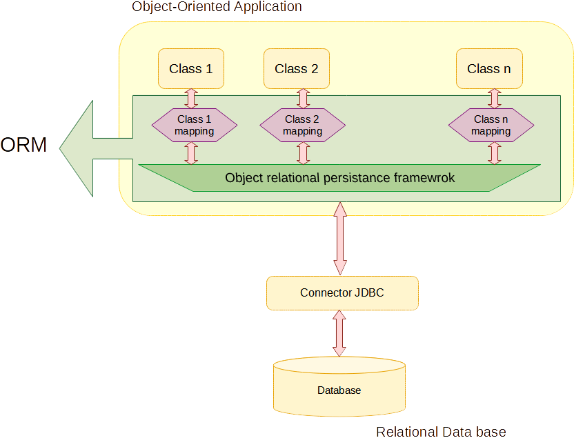

## 1. Introducción. Técnicas de mapeo.

En unidades anteriores hemos estudiado el acceso de nuestros programas a los ficheros y bases de datos relacionales. Como hemos visto, el gran problema es que nuestros programas manipulan objetos, mientras que las bases de datos manipulan tablas, lo que provoca el uso de modelos diferentes y termina en el ya citado **vacío objeto-relacional**.

El mapeo objeto-relacional viene a llenar el vacío entre estos dos modelos, evitando que gastemos tiempo en nuestro código convirtiendo entre los resultados de las operaciones y nuestros objetos. Con el uso de un ORM (**Object Relational Mapping**), una vez establecida la correspondencia entre los modelos, en nuestros programas sólo trabajaremos con un modelo, el modelo orientado a objetos. De esta forma conseguimos evitar que nuestros programas caigan en ese vacío, centrándonos en la lógica de negocio.

Las técnicas ORM (**Object-Relational Mapping Tools**) son las encargadas, mediante un conjunto de descripciones y metadatos (datos que describen los datos), de hacer una correspondencia entre los datos primitivos de ambos modelos y sus estructuras: entre tablas y objetos, campos y atributos, sus identificadores y sus claves primarias. Esta correspondencia no siempre será sencilla y tendrán que estar disponibles metadatos que puedan expresar una mayor complejidad.

Por ejemplo:

- Quizás encontraremos que a veces puede ser interesante almacenar una propiedad en más de una columna, o varias propiedades en una sola columna.
- En otras ocasiones, puede haber propiedades que no se almacenen, o campos de la base de datos que no aparezcan en los objetos.
- Utilice atributos con tipos de datos no primitivos que necesitan ser convertidos en otras tablas, y decida qué campos serán claves externas que apunten a las nuevas tablas.

Al igual que la definición de los datos, necesitaremos un mecanismo de persistencia de objetos, de modo que los objetos puedan ser "rastreados" en la memoria y cuando se reflejen cambios en ellos, se reflejen directamente en la base de datos.

## 1.2. Mapeo

<figure markdown="span">
  { width="700" }
  <figcaption>ORM</figcaption>
</figure>

Con estas herramientas de mapeo conseguiremos:

- Reducir el tiempo de desarrollo
- Olvidarnos de nuestro SGBD subyacente
- Trabajar con objetos, atributos y métodos. No necesita saber nada sobre tablas y relaciones.

Todas las herramientas de mapeo se basan en estas tres bases sólidas.

### 1.2.1. Técnicas de mapeo

Destacamos dos técnicas de mapeo objeto-relacional:

- Aquellas que incrustan las definiciones dentro del código de las clases y están vinculadas al lenguaje, como macros de C++ o **anotaciones** de PHP y Java.
- Aquellas que guardan las definiciones en archivos independientes del código, generalmente en **XML** o **JSON**.

Estas técnicas no son exclusivas, puesto que ambas están disponibles en la mayoría de entornos e incluso pueden coexistir en la misma aplicación.

### 1.2.2. Lenguaje de consulta

Dado que los SGBD incluyen SQL como lenguaje de consulta, la mayoría de los ORM incluyen su propio lenguaje, basado en OQL (**Object Query Language**). Como en SQL, podemos pedir información, pero basada en objetos en lugar de tablas.

### 1.2.3. Sincronización

Los ORM incluyen varios procesos centrados en:

- Seguir y descubrir los cambios que experimentan los objetos durante su ciclo de vida para almacenarlos.
- Crear e iniciar nuevas instancias de objetos a partir de los datos almacenados en la base de datos.
- A partir de los objetos, extraer su información para reflejarla en las tablas de la base de datos.

!!! note 
Estudiaremos el ciclo de vida de los objetos cuando se cargan y guardan de la base de datos.