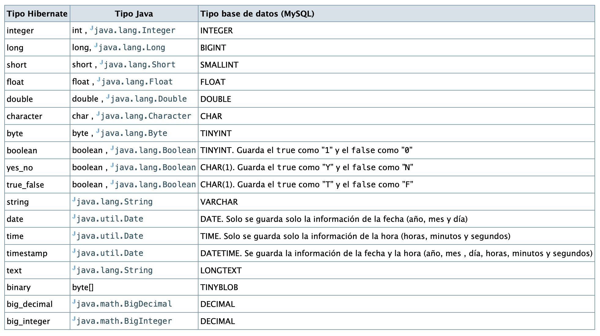

# 3. Mapeo de Entidades. Beans

Una vez estudiada la configuración inicial, es momento de mapear nuestras entidades y relaciones. Partiendo del modelo relacional, usaremos la entidad `Peli`:

```sql
CREATE dTABLE `Peli` (
`idPeli` int(11) NOT NULL AUTO_INCREMENT,
`titulo` varchar(45) NOT NULL,
`anyo` varchar(45) NOT NULL,
`director` varchar(45) NOT NULL,.
PRIMARY KEY (`idPeli`)
) ENGINE=InnoDB DEFAULT CHARSET=utf8
```

Aquí hay un script [DBCine.sql](./DBCine1.sql) con el que trabajar. La clase que encapsula la película será algo como:

```java
package Model;

import java.io.Serializable;

/**
*
* @author joange
*/
public class Peli implements Serializable{

private Long idPeli;
private String titulo;
private int anyo;
private String elDirector;

public Peli() {
}

public Peli(String titulo, int anyo, String elDirector) {
this.titulo = titulo;
this.anyo = anyo;
this.elDirector = elDirector;
}
// Próximamente
}
```

!!! consejo "Recordatorio"
Recuerda que puedes usar la biblioteca `Lombok` para crear beans más rápido.

## 3.1. Mapeo de archivos

El bean creado en la sección anterior aún no se puede persistir. Para ello, necesitamos crear un archivo externo a la clase, con la extensión `hbm.xml` y el mismo nombre que la clase (**Mapeo de Hibernate**). La ubicación del archivo no importa, pero conviene mantener las clases del modelo en un lugar y los archivos de mapeo en otro.

Por lo tanto, crearemos un paquete `orm` y, dentro de él, el archivo `Peli.hbm.xml`. Lo explicaremos con un ejemplo, ya que la sintaxis es bastante extensa.

```xml
<?xml version="1.0" encoding="UTF-8"?>
<!DOCTYPE hibernate-mapping PUBLIC "-//Hibernate/Hibernate Mapping DTD 3.0//EN"
"http://www.hibernate.org/dtd/hibernate-mapping-3.0.dtd">
<hibernate-mapping>
<class name="Model.Peli" table="Peli" >
<id column="idPeli" name="idPeli" type="int">
<generator class="native"/>
</id>
<property name="titulo" type="string"/>
<property name="anyo" />
<property column="director" name="elDirector" />
</class>
</hibernate-mapping>
```

Vea los conceptos básicos:

- Las líneas 1-3 son el encabezado XML, que apunta a Archivo DTD con la gramática para comprobar que el archivo esté bien formado.
- `<hibernate-mapping>` $\rightarrow$ indica que este archivo es una asignación.
- `<class>` $\rightarrow$ es la etiqueta para especificar la clase que estamos asignando y tiene dos atributos:
- `name="Model.Peli"` $\rightarrow$ apunta a la clase (archivo Java), sin extensión.
- `table="Peli"` $\rightarrow$ aquí escribimos el nombre de la tabla en la base de datos que contendrá los datos.
- Es necesario especificar los campos de la clase y sus respectivas columnas. Distinguimos entre:
- `<property>` $\rightarrow$ para campos normales. Puede tener varios atributos:
- `name` $\rightarrow$ (**obligatorio**) es el nombre del campo dentro de la clase.
- `column` $\rightarrow$ es el nombre de la columna correspondiente en la tabla. Si no se especifica `column`, Hibernate asumirá que es el mismo que el atributo `name`.
- `type` $\rightarrow$ es el tipo de dato Java de la columna. Por defecto, Hibernate usará el mismo que el especificado por la clase, pero es necesario indicarlo para resolver campos ambiguos (véase la figura a continuación, especialmente en formatos de fecha y hora).
- `<id>` $\rightarrow$ (**obligatorio**) es el campo que se usará como clave principal y también puede tener los atributos `name`, `column` y `type`. Es posible que la clave principal la genere el sistema de gestión de bases de datos (SGBD), y lo indicaremos con:
- `<generator>` $\rightarrow$ configura el motor para generar la clave principal, que puede especificarse de varias maneras. Con `native` usamos el mismo método que la base de datos subyacente. En este tutorial puede encontrar ejemplos completos [link](https://www.javatpoint.com/generator-classes)

!!! Importante: "Atención"

- Debe guardar este archivo para que sea accesible en nuestro proyecto. Una buena opción es crear una carpeta `resources` dentro de `src/main` y guardar estos archivos allí.
- Hibernate necesita métodos `get/set` para acceder a los campos de nuestros objetos. Sin embargo, puede que no desee crear ningún método, pero Hibernate sí los necesita. La solución es agregar un nuevo atributo `access=field` que permita a Hibernate acceder a los campos sin métodos `getters` ni `setters`.

<figure markdown="span">
  { width="700" }
  <figcaption>Hibernate types</figcaption>
</figure>


!!! Nota: "Atención"
Estudiaremos más opciones como claves foráneas en las siguientes secciones.

Ahora estudiaremos un pequeño programa:

```java
// obtener una sesión e iniciar una transacción
Session laSesion=HibernateUtil.getSessionFactory().getCurrentSession();

laSesion.getTransaction().begin();

// Crear nuevo objeto
Peli p=new Peli("Piratas del Caribe", 2003, "Gore Verbinsky");
System.out.println("Sin guardar: "+ p);

// Guardarin the database
Long idNueva=(Long)laSesion.save(p);

// Get the saved object (with another varaible)
Pele q=laSesion.get(Peli.class, idNueva);

System.out.println("Saved: " + q);

//close all
laSesion.getTransaction().commit();
laSesion.close();
```

Comentarios:

- Hay que tener en cuenta que para guardar un objeto (por ejemplo, insertar una fila en la base de datos), basta con ejecutar `Session.save(Object)`.
- Para obtener un objeto de la base de datos, existe una manera sencilla, conociendo la clase y la clave primaria del objeto. El método es `Session.get(class,ID)`, y obtenemos un objeto de esta clase con esa ID.
- Hay que tener en cuenta que cuando creamos un objeto nuevo, no tiene un ID (recuerda que es generada automáticamente), pero cuando lo guardamos, se le asigna una nueva ID.

!!! importante "Recuerda" 

Si elegimos `create` en la propiedad `hbm2ddl.auto`, como ya supondrás, la base de datos estará vacía. Es una buena idea crear un archivo llamado `imports.sql` con algunos datos necesarios para probar nuestros programas.


## 3.2. Mapeando clases. Anotaciones.

Antes de empezar a anotar clases, dejamos que le muestre esto:

- **JDO (Java Data Objects)** es un estándar de persistencia desarrollado por Apache, que incluye un marco de trabajo de persistencia basado en post-compilación. A pesar de intentar conseguir una técnica más eficiente, existen pocas iniciativas comerciales que siguen este estándar.

- La alternativa es **JPA (Java Persistance API)**, un estándar de persistencia incorporado a JDK 5, con varias librerías que lo soportan, y basado en el principio de la reflexión, que utiliza metadatos así como información sobre las clases y la estructura para que la máquina virtual pueda acceder a la información recopilada de los objetos para invocar sus métodos. Las dos ORM más implementadas en Java: **Hibernate** y **EJB** utilizan este estándar.

Mapear clases es fácil, y sólo es necesario emparejar cada campo con cada columna. El inconveniente es que necesitamos mantener dos archivos: clases y archivos de mapeo. Por este motivo, podemos unir ambos elementos, añadiendo dentro de las clases las anotaciones específicas para realizar el emparejamiento. La interfaz JPA nos permite realizar esta tarea.

Vamos a mostrar una clase con anotaciones y compararla con los archivos de mapeo. Además, utilizaremos Lombok para crear la clase, que también utiliza anotaciones ;).

```java
@Fecha
@NoArgsConstructor
@Entity
@Table(name = "Car")
public class Car implements Serializable {

public Car(String plate, String brand, int year) { 
this.plate = plate; 
this.brand = brand; 
this.year = year;
}

static final long serialVersionUID = 137L;

@Id
@GeneratedValue(strategy = GenerationType.IDENTITY)
private long idCar;

@Column
private String plate;

@Column(name = "marca")
private String brand;

@Column
private int year;
}
```

!!! info "Información" 
Hibernate primero creó las anotaciones del paquete `org.hibenate.annotations`, pero desde la versión 4 está depreciado, y debe importarse desde `javax.persistence`

Vamos a ver las principales anotaciones, aunque tendrás muchas más en la [documentación de JPA](https://docs.oracle.com/javaee/7/api/javax/persistence/package-summary.html):

- `@Entity` para indicar que esta clase representa una **entidad** en nuestra base de datos. Además, debemos asociar esta entidad a una `@Table` con el nombre correcto.
- Para definir los campos de la base de datos, debemos utilizar `@Column`. Puedes especificar más opciones, especialmente si el nombre de la columna es distinto del nombre del campo. Consulta la siguiente imagen para más opciones. Una opción interesante es establecer un valor generado automáticamente con `@GeneratedValue`. Si no especificas la opción `name`, se supone que es lo mismo.
- Para marcar un campo como clave primaria, necesitas `@Id`. En este caso, no es necesario especificarlo con `@Column`.

## 3.3. Componentes

Vamos a revisar un patrón de diseño especial, que es la agregación. Este patrón se utiliza cuando necesitamos una entidad que sólo tiene sentido dentro de otra, por ejemplo, una rueda no tiene sentido fuera de un coche. Si la entidad puede existir por sí sola, es cuando utilizamos una **relación**, y lo estudiaremos en la siguiente sección.

La clase agregada también se conoce como **component**.

!!! info "Cuenta" 
Estos componentes también pueden sustituirse por una relación 1:1 con una restricción de existencia, cuando en el proceso de normalización se juntan en la misma tabla.

Para crear un componente, la clase agregada debe definirse con `@Embeddable` (y, obviamente, sin `@Entity`). Esta anotación indica a Hibernate que la existencia de estos objetos debe estar dentro de otros objetos. Dentro de estos objetos, como campos, los objetos deben marcarse con `@Embedded`. Vamos a ver un ejemplo:

**Un componente** `Roda` (Wheel

```java
@Embeddable
@Fecha
@AllArgsConstructor
@NoArgsConstructor
public class Wheel { 

@Column 
int diameter; 
@Column 
char speedCode;
}
```

**An aggregation** `CarWheel`

```java
@Fecha
@NoArgsConstructor
@Entity
@Table(name = "Car")
public class CarWheel implements Serializable { 

public CarWheel(String plate, String brand, int year, Wheel wheel) { 
this.plate = plate; 
this.brand = brand; 
this.year = year; 
this.wheel = wheel; 
} 

static final long serialVersionUID = 137L; 

@Id 
@GeneratedValue(strategy = GenerationType.IDENTITY) 
private long idCar; 

@Column 
private String plate; 

@Column(name = "marca") 
private String brand; 

@Column 
private int year; 

@Embedded 
private Wheel wheel;

}
}
```

Cuando Hibernate crea la tabla, debe tenerse en cuenta que no se creará ninguna tabla `Wheel`. En cambio, todos los campos están dentro de CarWheel. Los dos últimos campos son propiedades de la clase Wheel.

```sql
Hibernate:
create table Car ( 
idCar bigint not null auto_increment, 
marca varchar(255), 
plate varchar(255), 
year integer, 
diameter integer, 
speedCode char(1), 
primary key (idCar)) engine=InnoDB
```

**Atención** Puede aparecer un problema cuando intentas guardar dos componentes incrustados, por ejemplo dos _direcciones_ de un _empleado_, ya que Hibernate crea campos a partir de la clase del componente y los nombres de los campos se duplicarán. Para evitar este inconveniente, la solución es cambiar el nombre de los campos de la clase del componente, como se muestra a continuación (dentro de la clase agregada):

```java
@Embedded
private Wheel wheel1;

@Embedded
@AttributeOverrides({ 
@AttributeOverride(name="diameter", column = @Column(name="diameter2") ), 
@AttributeOverride(name="speedCode", columna = @Column(name="speedCode2") )
})
private Wheel wheel2;
```

Observa que:

- El primer campo incrustado no necesita nada especial.
- En el segundo, debemos sobreescribir los nombres de los atributos, comenzando con `@AttributeOverrides` con varios `@AttributeOverride`, indicando el nombre antiguo y el nuevo nombre de la columna.

!!! tip "Pero..." 
Esta situación no es habitual, pero es importante resolverla cuando sea necesario.


## 3.4. Ejercicio

Realiza la siguiente tarea:

- Crea un proyecto Maven y añade todas las dependencias que necesites.
- Crea dos clases por ti mismo, pero pensando que estarán relacionadas en un futuro. Por ejemplo, Profesor y Tema, o Conductor y Coche, o Mascota y Veterinario. En este momento no hace falta que crees ninguna relación.
- Cada clase debe tener un ID y al menos 4 campos, con varios tipos de datos (no es necesario que todos sean campos de tipo String).
- Mapea las dos clases: 
- Una con un archivo XML externo. 
- La otra con anotaciones JPA.
- Crea una aplicación principal donde pidas al usuario los datos y los almacene (y los guardes) en la misma base de datos.