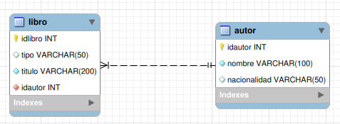
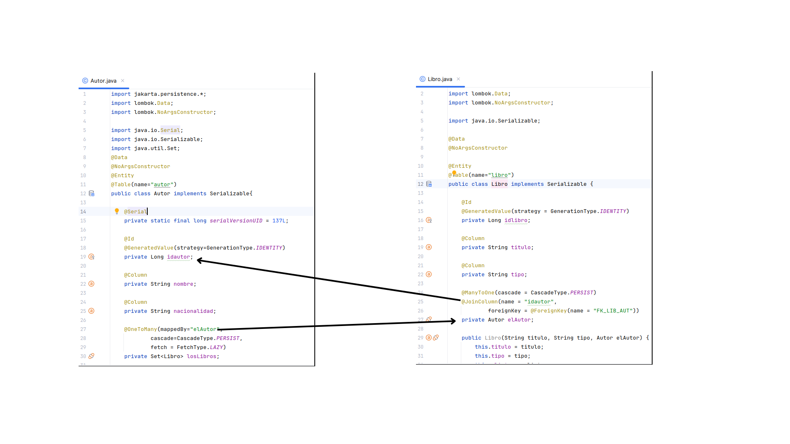
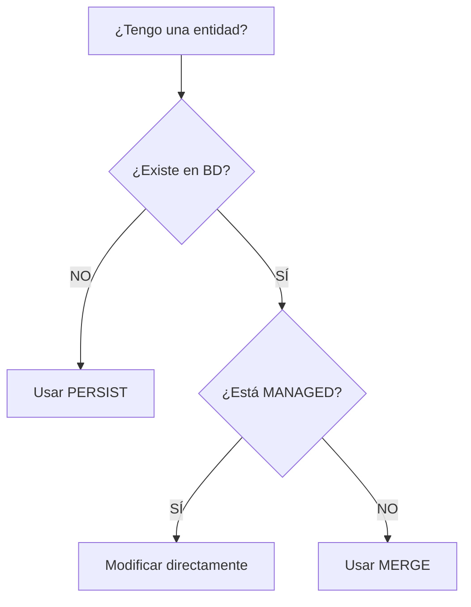

# 4. Mapeando Relaciones

Como mencionamos en la introducción, analizaremos cómo mapear los diferentes tipos de relaciones. Antes de empezar a discutir la cardinalidad de las relaciones, debemos considerar el significado de estas relaciones, y revisaremos el concepto de direccionalidad de las relaciones.

- **Unidireccional** → Diremos que una relación es unidireccional cuando accedamos al objeto relacionado (componente) desde otro objeto (propietario). Por ejemplo, si montamos un _motor_ en un _coche_, lo lógico es que el propietario sea el _coche_, y desde éste obtendremos el _motor_. En este caso, dentro del objeto _Coche_ aparecerá un objeto _Motor_, y _Motor_ no tendrá una existencia propia.
- **Bidireccional** → Son relaciones en las que los elementos relacionados suelen tener el mismo peso o entidad. Por ejemplo, un _Grupo_ de un instituto y un _Tutor_. Desde un grupo tiene sentido conocer al tutor, y también podemos desde un profesor (el tutor) acceder al grupo que tutoriza. En este caso, dentro del objeto _Grupo_ tenemos una referencia al objeto _Tutor_ y viceversa.

!!! warning "Aviso" 
    En este tipo de referencias, como puede deducirse, existe una recursión intrínseca. Por tanto, cuando gestionamos este tipo de relaciones bidireccionales, tenga mucho cuidado de no causar bucles, ya que incluso algo tan sencillo como imprimir puede hacer que nuestro programa se bloquee y aparezca la conocida `StackOverflowException`.

A partir de ahora podríamos estudiar todas las representaciones con JPA.


## 4.1. Relaciones Uno a Uno

Para la explicación de los ejemplos, veremos el diseño y la implementación en la base de datos de cada caso y cómo se ve en Hibernate. Para este ejemplo representaremos una relación 1:1 entre Grupo y Profesor, donde puede verse que un Grupo tiene un Tutor, y un Tutor sólo puede tutorizar un Grupo.

<figure markdown="span">
  { width="700" }
  <figcaption>one to one<figcaption>
</figure>

En primer lugar, la clase que es apuntada por la clave foránea. Muy fácil porque no necesitamos hacer nada.


```java
import jakarta.persistence.*;
import lombok.Data;
import lombok.NoArgsConstructor;

import java.io.Serializable;

@Data
@NoArgsConstructor
@Entity
@Table(name="Profesor")
public class Profesor implements Serializable {

    static final long serialVersionUID = 1L;

    @Id
    @GeneratedValue(strategy=GenerationType.IDENTITY)
    private int idProfesor;

    @Column
    private String nombre;

    public Profesor(String nombre) {
        this.nombre = nombre;
    }
}
```

Y ahora, la clase que contiene la clave ajena. Aquí debemos marcar que un `Grupo` necesita un `Profesor` como tutor. Veámoslo:

```java
import jakarta.persistence.*;
import lombok.Data;
import lombok.NoArgsConstructor;

import java.io.Serializable;

@Data
@NoArgsConstructor
@Entity
@Table(name = "Grupo")
public class Grupo implements Serializable {

    static final long serialVersionUID = 137L;

    @Id
    @GeneratedValue(strategy = GenerationType.IDENTITY)
    private long idGrupo;

    @Column
    private String nivel;

    @Column
    private String curso;

    @Column
    private int anyo;

    @OneToOne(cascade = CascadeType.ALL)
    @JoinColumn(
            name="id_tutor",
            referencedColumnName = "idProfesor",
            unique=true,
            foreignKey = @ForeignKey(name = "FK_GRP_TEACH"))
    private Profesor tutor;

    public Grupo(String nivel, String curso, int anyo) {
        this.nivel = nivel;
        this.curso = curso;
        this.anyo = anyo;
    }

}
```
Tenga en cuenta que la clase `Grupo` contiene un campo llamado `tutor` de la clase `Profesor`, y:

- `@OneToOne(cascade = CascadeType.ALL)` marcamos esta relación como 1:1. Además, especificamos el atributo cascada, que es el más importante. El cascading es la forma de decir que cuando realizamos alguna acción sobre la entidad objetivo (`Grupo`), la misma acción se aplicará a la entidad asociada (`Profesor`). Revisamos las opciones más relevantes: 
- `CascadeType.ALL` propaga todas las operaciones. La misma operación que realizamos en el objetivo se realizará en el asociado. 
- `CascadeType.PERSIST` propaga sólo la operación de persistencia en la base de datos (guardar). 
- `CascadeType.SAVE_UPDATE` es de Hibernate, no de JPA, y propaga el método `saveOrUpdate()`. Es muy similar a persisto. 
- `CascadeType.REMOVE` o `CascadeType.DELETE` propaga la eliminación de entidades. Tenga mucho cuidado con esta opción para evitar perder datos.
- En el `@JoinColumn` establecemos: 
- el nombre de la columna en nuestra base de datos 
- el nombre de la columna referenciada en la entidad objetivo `Profesor` 
- `unique=true` para asegurar que la relación es 1:1 (un profesor no puede estar relacionado con ningún otro grupo) 
- [opcional] para establecer el nombre de la restricción de clave foránea, en caso de que desee cambiarlo o eliminarlo en operaciones futuras.

Más información en la siguiente web[baeldung](https://www.baeldung.com/jpa-cascade-types)

### 4.1.1. Uno a Uno bidireccional

Si queremos almacenar en Profesor los grupos que está tutorizando, necesitamos añadir una referencia al Grupo. Como hemos hecho la clave foránea en Grupo, será muy fácil:

```java
@OneToOne(mappedBy= "tutor")
private Grupo elGrupo;
```

Con `mappedBy="tutor"` estamos diciendo que en la clase `Grupo` existe un campo llamado `tutor` con toda la información sobre la relación. Tenga en cuenta que no se añadirán campos aadicionales a `Profesor`, porque la información sobre la relación se encuentra en la tabla `Grupo`.

## 4.2. Uno a Muchos

Para esta explicación empezaremos con el siguiente modelo, en el que un **Libro** tiene un **Autor** que lo ha escrito, y un Autor puede haber escrito varios Libros. En el esquema relacional, la relación es desde `idAutor` en Libros, que es clave foránea en la tabla Autor (ID).

<figure markdown="span">
  { width="700" }
  <figcaption>one to many<figcaption>
</figure>
Primero, podemos decidir quién es el propietario de la relación. Realmente no importa, pero en varios diseños es muy claro, por ejemplo entre `Estudiante` y `Email`, donde obviamente el propietario es `Estudiante`. Normalmente debería ser la clase con cardinalidad **muchos** el propietario. Veamos el ejemplo.

```java
import jakarta.persistence.*;
import lombok.Data;
import lombok.NoArgsConstructor;

import java.io.Serializable;

@Data
@NoArgsConstructor

@Entity
@Table(name="libro")
public class Libro implements Serializable {

    @Id
    @GeneratedValue(strategy = GenerationType.IDENTITY)
    private Long idlibro;

    @Column
    private String titulo;

    @Column
    private String tipo;

    @ManyToOne(cascade = CascadeType.PERSIST)
    @JoinColumn(name = "idautor",
            foreignKey = @ForeignKey(name = "FK_LIB_AUT"))
    private Autor elAutor;

    public Libro(String titulo, String tipo, Autor elAutor) {
        this.titulo = titulo;
        this.tipo = tipo;
        this.elAutor = elAutor;
    }
}
```
En este ejemplo, un `Libro` tiene un autor (único). Lo implementamos almacenando una referencia a un objeto Autor, llamado `elAutor` dentro de nuestro Libro. Debemos escribir la información de la relación en este campo:

- Debemos marcar este campo como `@ManyToOne`, porque Libro está al lado de los muchos de la relación (recuerde que un Autor puede escribir varios Libros)
- La clave foránea será anotada con la etiqueta `@JoinColumn`, con varios atributos: 
- Puesto que `elAutor` es el punto inicial de la clave foránea, que apunta a la tabla `Autor`, necesitamos decir el nombre de la clave primaria en esta clase. Este atributo es opcional pero es una buena opción para mejorar nuestro código. 
- Opcionalmente, podemos llamar la restricción de la clave foránea, con un nombre bien estructurado, con el atributo `foreignKey`

```java
import jakarta.persistence.*;
import lombok.Data;
import lombok.NoArgsConstructor;

import java.io.Serial;
import java.io.Serializable;
import java.util.Set;
@Data
@NoArgsConstructor
@Entity
@Table(name="autor")
public class Autor implements Serializable{

    @Serial
    private static final long serialVersionUID = 137L;

    @Id
    @GeneratedValue(strategy=GenerationType.IDENTITY)
    private Long idautor;

    @Column
    private String nombre;

    @Column
    private String nacionalidad;

    @OneToMany(mappedBy="elAutor",
            cascade=CascadeType.PERSIST,
            fetch = FetchType.LAZY)
    private Set<Libro> losLibros;

    public Autor(String nombre, String nacionalidad, Set<Libro> losLibros) {
        this.nombre = nombre;
        this.nacionalidad = nacionalidad;
        this.losLibros = losLibros;
    }
}
```

La clase `Autor` está en el lado _un_, y esto significa que puede escribir _muchos_ `Libros`. Por esta razón, almacenamos todos los libros que ha escrito en un 'Set' de libros. Las anotaciones serán:

- Puesto que un Autor puede escribir muchos libros, marcamos el Set de libros como `@OneToMany`. Como hemos escrito la especificación de la relación en Libro, podríamos decir que la relación está mapeada en el campo `elAutor` dentro de la clase `Libro`, con `mappedBy="elAutor"` fácilmente.

!!! nota "Decisión" 
    En lugar de almacenar libros en un Set, se pueden almacenar en una Lista. La principal diferencia es responder a esta pregunta: _¿es importante el orden?_. Si respondes _sí_, debes utilizar una Lista. Si la respuesta es _no_, debes utilizar un Set.

!!! importante "Espacio" 

    La relación `1:N` que hemos explicado es bidireccional. Esto significa que desde un Autor podemos obtener todos los Libros que ha escrito, y desde un Libro podemos obtener el Autor. 

<figure markdown="span">
  { width="700" }
  <figcaption>one to many bidirectional<figcaption>
</figure>

Puede encontrar varias páginas y libros que explican las relaciones unidireccionales `1:N`. Esto significa que con este tipo de implementación sólo podemos viajar en una dirección. En este caso, debemos almacenar sólo dentro de un Libro quien es el autor, porque el Libro es el propietario. Debemos eliminar el conjunto de libros en el autor para obtener una relación unidireccional.

### 4.2.1. Tipo de Carga **Fetch**

Este atributo suele aparecer cuando tenemos una relación `1:N` o `N:M` en una clase que tiene una colección de clases relacionadas (también puede especificarse con un `1:1` pero es menos común). Cuando Hibernate carga un objeto, cargará sus atributos generales (nombre, nacionalidad, etc...), pero ¿qué ocurre con los Libros que ha escrito, los carga o no?

- `DateType.EAGER` → Literalmente traducido como **ansioso**. No podemos esperar, y cuando se carga al Autor, Hibernate resolverá la relación y cargará todos los libros con todos los datos internos de cada libro. Tenemos todos los datos en el momento.
- `DateType.LAZY` → Literalmente como **perezoso** (vago), pero más representativo como _carga perezosa_. Si cargamos al Autor, Hibernate sólo carga los atributos propios del Autor, sin cargar sus Libros. Cuando intentamos acceder a sus libros desde nuestro programa, Hibernate se _activa_ y los carga. Es decir, en modo LAZY, los datos se cargan **cuando se necesitan**.

**¿Qué haremos?**

¿Qué es mejor o peor? La respuesta no es sencilla, ya queAmbos tienen ventajas y desventajas:

- En `EAGER` solo se realiza un acceso, mientras que en `LAZY` se realizan dos o más.

- En `EAGER` se cargan todos los datos, incluso los innecesarios; en `LAZY` solo se carga lo necesario.

El programador debe evaluar y equilibrar la cantidad de información requerida en un momento dado y el coste de acceso a la base de datos.

## 4.3. Muchos a Muchos

En esta sección, finalizaremos con el último tipo de relación que podemos encontrar en el modelo E/R: las relaciones muchos a muchos. Pueden aparecer otras relaciones con cardinalidades más altas, como las relaciones ternarias, pero, como se estudió en el primer año, todas ellas pueden modelarse con transformaciones binarias.

Dentro de las relaciones binarias, podemos encontrar dos posibilidades:

- Relaciones que simplemente indican la relación (por ejemplo, que un personaje puede o no portar cierto tipo de arma en un juego de rol) o

- Relaciones que, además de indicarla, añaden nuevos atributos. Por ejemplo, un actor participa en una película interpretando un tipo de papel: principal, secundario, etc.

En el modelo relacional, ambos casos se modelan como una nueva tabla (con o sin el atributo). Si nos encontramos en el segundo caso, se debe modelar una nueva tabla con los atributos que posee mediante una clase, por lo que la relación «N:M» entre dos tablas se convertirá en «dos relaciones uno a muchos 1:N y N:1» (actor-actuación y actuación-película). Nos centraremos en el primer caso, ya que estamos listos para resolver el segundo.

!!! Nota "Mejora"
    En la segunda parte, este tutorial explica cómo crear [N_M con atributos](https://thorben-janssen.com/hibernate-tip-many-to-many-association-with-additional-attributes/). Se recomienda implementar un ejemplo.

Modelemos el caso típico de un profesor que imparte varios módulos, que pueden ser impartidos por varios profesores. El esquema es el siguiente:

<figure markdown="span">
  { width="700" }
  <figcaption>one to many bidirectional<figcaption>
</figure>

### 4.3.1 Muchos a Muchos con 4 clases

Como podemos ver, se mantiene la tabla central típica de la relación `N:M`. Para implementar este caso vamos a necesitar 4 clase que se podrán ver ahora:

Las clases Módulo y Profesor son las siguientes:


```java
package modelo;

import lombok.Data;
import lombok.NoArgsConstructor;
import lombok.AllArgsConstructor;

import jakarta.persistence.*;
import java.util.ArrayList;
import java.util.List;

@Entity
@Table(name = "Profesor")
@Data
@NoArgsConstructor
@AllArgsConstructor
public class Profesor {

    @Id
    @GeneratedValue(strategy = GenerationType.IDENTITY)
    @Column(name = "idProfesor")
    private Long idProfesor;

    @Column(name = "nombre")
    private String nombre;

    @OneToMany(mappedBy = "profesor", cascade = CascadeType.ALL, fetch = FetchType.LAZY)
    private List<Docencia> docencias = new ArrayList<>();
}
```
```java
package modelo;

import lombok.Data;
import lombok.NoArgsConstructor;
import lombok.AllArgsConstructor;

import jakarta.persistence.*;
import java.util.ArrayList;
import java.util.List;

@Entity
@Table(name = "Modulo")
@Data
@NoArgsConstructor
@AllArgsConstructor
public class Modulo {

    @Id
    @GeneratedValue(strategy = GenerationType.IDENTITY)
    @Column(name = "idModulo")
    private Long idModulo;

    @Column(name = "nombre")
    private String nombre;

    @OneToMany(mappedBy = "modulo", cascade = CascadeType.ALL, fetch = FetchType.LAZY)
    private List<Docencia> docencias = new ArrayList<>();

}
```

Esta es la especificación más compleja, vamos:

- En ambas clases, la asignación es `@OneToMany`
- En ambos casos, indicamos cómo gestionamos las operaciones en cascada (`cascade`) y la carga de objetos relacionados desde la otra clase (`fetch`).
- En la clase propietaria (`Profesor`), se asignará un `List<Docencia>` con la relación que comenzará desde mi clase actual `Profesor` → `Docencia` → `Modulo` (el tipo base del Set).

En este apartado como podemos ver sólo hemos mapeado 2 entidades, Profesor y Módulo. Estas se encuetran relacionadas por la tabla docencia. Puesto que esta tabla docencia no tiene más atributos, podríamos prescindir de crear una clase llamada `Docencia` de tal manera que mapearamos directamente. En este apartado vamos a ver con 4 clases y entender el motivo de realizar esta implementación.

Clase `DocenciaId`

```java
package modelo;

import lombok.Data;
import lombok.NoArgsConstructor;
import lombok.AllArgsConstructor;

import jakarta.persistence.Column;
import jakarta.persistence.Embeddable;
import java.io.Serializable;
import java.util.Objects;

@Embeddable
@Data
@NoArgsConstructor
@AllArgsConstructor
public class DocenciaId implements Serializable {

    private static final long serialVersionUID = 1L;

    @Column(name = "idProfesor")
    private Long idProfesor;

    @Column(name = "idModulo")
    private Long idModulo;

    @Override
    public boolean equals(Object o) {
        if (this == o) return true;
        if (o == null || getClass() != o.getClass()) return false;
        DocenciaId that = (DocenciaId) o;
        return Objects.equals(idProfesor, that.idProfesor) &&
                Objects.equals(idModulo, that.idModulo);
    }

    @Override
    public int hashCode() {
        return Objects.hash(idProfesor, idModulo);
    }
}
```
!!! question "¿Por qué necesitamos la clase DocenciaId?"
    - Porque la tabla Docencia tiene dos atributos como clave que son claves ajenas a su vez.
    - **JPA** requiere que las claves primarias compuestas se representen como una clase separada que implemente Serializable.
    - `@Embeddable`marca una clase cuyas instancias se almacenan como parte de una entidad dueña, en lugar de tener su propia identidad en la base de datos.

Una vez se dispone de la clase `DocenciaId`implementaremos la clase `Docencia`

```java
package modelo;

import lombok.Data;
import lombok.NoArgsConstructor;
import lombok.AllArgsConstructor;

import jakarta.persistence.*;

@Entity
@Table(name = "Docencia")
@Data
@NoArgsConstructor
@AllArgsConstructor
public class Docencia {

    @EmbeddedId
    private DocenciaId id;

    @ManyToOne(fetch = FetchType.LAZY)
    @MapsId("idProfesor")
    @JoinColumn(name = "idProfesor")
    private Profesor profesor;

    @ManyToOne(fetch = FetchType.LAZY)
    @MapsId("idModulo")
    @JoinColumn(name = "idModulo")
    private Modulo modulo;
}

```

!!! info

    - `@EmbeddedId` A través de este decorador indicamos la uniciddad de la clave primaria. Es más apto para consultas con JPL.
    - `@MapsId` se usa para indicar que una relación JPA comparte la clave primaria con la entidad dueña. Específicamente, mapea una relación `@ManyToOne` o `@OneToOne` para que use la misma columna que forma parte de la clave primaria embebida.


Este sería un ejemplo de programa principal

```java
import modelo.*;
import jakarta.persistence.EntityManager;
import jakarta.persistence.EntityManagerFactory;
import jakarta.persistence.EntityTransaction;
import jakarta.persistence.Persistence;
import java.time.LocalDateTime;

public class Main{

    public static void main(String[] args) {
        EntityManagerFactory emf = Persistence.createEntityManagerFactory("DocenciaConsultasPU");
        EntityManager em = emf.createEntityManager();
        EntityTransaction tx = em.getTransaction();

        try {
            tx.begin();

            // Crear un nuevo profesor y asignarle múltiples módulos
            Profesor nuevoProfesor = new Profesor();
            nuevoProfesor.setNombre("Jose Manuel Romero");
            em.persist(nuevoProfesor);

            // Asignar módulos al nuevo profesor
            Modulo modulo1 = em.find(Modulo.class, 3L); // EIE
            Modulo modulo2 = em.find(Modulo.class, 6L); // ACD


            // Primera asignación
            Docencia docencia1 = new Docencia();
            docencia1.setId(new DocenciaId(nuevoProfesor.getIdProfesor(), modulo1.getIdModulo()));
            docencia1.setProfesor(nuevoProfesor);
            docencia1.setModulo(modulo1);
            em.persist(docencia1);

            // Segunda asignación
            Docencia docencia2 = new Docencia();
            docencia2.setId(new DocenciaId(nuevoProfesor.getIdProfesor(), modulo2.getIdModulo()));
            docencia2.setProfesor(nuevoProfesor);
            docencia2.setModulo(modulo2);
            em.persist(docencia2);

//            // Crear un nuevo alumno y agregarle exámenes
//            Alumno nuevoAlumno = new Alumno();
//            nuevoAlumno.setNombre("Marta");
//            nuevoAlumno.setApellidos("Rodriguez Santos");
//            nuevoAlumno.setEdad(23);
//            nuevoAlumno.setRepetidor(true);
//            em.persist(nuevoAlumno);
//
//            // Agregar exámenes al alumno
//            Examen examen1 = new Examen();
//            examen1.setFecha(LocalDateTime.of(2024, 1, 15, 10, 0));
//            examen1.setNota(7.0);
//            examen1.setAlumno(nuevoAlumno);
//            examen1.setModulo(modulo1);
//            em.persist(examen1);
//
//            Examen examen2 = new Examen();
//            examen2.setFecha(LocalDateTime.of(2024, 1, 20, 9, 0));
//            examen2.setNota(5.5);
//            examen2.setAlumno(nuevoAlumno);
//            examen2.setModulo(modulo2);
//            em.persist(examen2);

            tx.commit();
            System.out.println("Inserción compleja completada:");
            System.out.println("- Profesor: " + nuevoProfesor.getNombre() + " (ID: " + nuevoProfesor.getIdProfesor() + ")");
//            System.out.println("- Alumno: " + nuevoAlumno.getNombre() + " " + nuevoAlumno.getApellidos());
//            System.out.println("- Módulos asignados: " + modulo1.getNombre() + ", " + modulo2.getNombre());
//            System.out.println("- Exámenes creados: 2");

        } catch (Exception e) {
            if (tx.isActive()) {
                tx.rollback();
            }
            e.printStackTrace();
        } finally {
            em.close();
            emf.close();
        }
    }
}

```

Puedes acceder a este proyecto desde [aquí](./jakartaDocencia.zip)

### 4.3.2 Muchos a Muchos con 2 clases

La diferencia con respecto al método anterior es a nivel del clases y fichero `persistence.xml` en el cual se omitirán las clases de las que no se hace uso, `Docencia` y `DocenciaId`

Clase `Modulo`

```java
package modelo;

import lombok.Data;
import lombok.NoArgsConstructor;
import lombok.AllArgsConstructor;
import jakarta.persistence.*;
import java.util.ArrayList;
import java.util.List;

@Entity
@Table(name = "Modulo")
@Data
@NoArgsConstructor
@AllArgsConstructor
public class Modulo {

    @Id
    @GeneratedValue(strategy = GenerationType.IDENTITY)
    @Column(name = "idModulo")
    private Long idModulo;

    @Column(name = "nombre")
    private String nombre;

    @ManyToMany(mappedBy = "modulos")
    private List<Profesor> profesores = new ArrayList<>();

    @OneToMany(mappedBy = "modulo", cascade = CascadeType.ALL, fetch = FetchType.LAZY)
    private List<Examen> examenes = new ArrayList<>();
    @Override
    public String toString() {
        return "Modulo{" +
                "idModulo=" + idModulo +
                ", nombre='" + nombre + '\'' +
                ", profesoresCount=" + (profesores != null ? profesores.size() : 0) +
                '}';
    }
}

```
!!! info "Detalle de la clase Modulo"

    - `@ManyToMany(mappedBy = "modulos")` 
        - `@ManyToMany`: Indica una relación muchos-a-muchos entre `Modulo` y `Profesor`
        - `mappedBy = "modulos"`: Esta entidad es el lado inverso de la relación
            - El dueño de la relación está en la clase `Profesor`, campo `modulos`
            - Esta clase es el lado **esclavo/pasivo**
    - Responsabilidades:
        - **NO crea la tabla intermedia** (ya la crea el lado dueño)
        - **NO define** `@JoinTable` (eso lo hace el lado dueño)
        - **Solo refleja** la relación que ya existe del otro lado

 

Clase `Profesor`

```java
package modelo;

import lombok.Data;
import lombok.NoArgsConstructor;
import lombok.AllArgsConstructor;
import jakarta.persistence.*;
import java.util.ArrayList;
import java.util.List;

@Entity
@Table(name = "Profesor")
@Data
@NoArgsConstructor
@AllArgsConstructor
public class Profesor {

    @Id
    @GeneratedValue(strategy = GenerationType.IDENTITY)
    @Column(name = "idProfesor")
    private Long idProfesor;

    @Column(name = "nombre")
    private String nombre;

    @ManyToMany
    @JoinTable(
            name = "Docencia",
            joinColumns = @JoinColumn(name = "idProfesor"),
            inverseJoinColumns = @JoinColumn(name = "idModulo")
    )
    private List<Modulo> modulos = new ArrayList<>();

    @Override
    public String toString() {
        return "Profesor{" +
                "idProfesor=" + idProfesor +
                ", nombre='" + nombre + '\'' +
                ", modulosCount=" + (modulos != null ? modulos.size() : 0) +
                '}';
    }
}
```

!! info "Detalle de la clase Profesor"

    - `@JoinTable` en el lado dueño 
        - `name = "Docencia"`: Nombre de la tabla intermedia en la BD
        - `joinColumns = @JoinColumn(name = "idProfesor")`:
            - Columna que referencia al **dueño** de la relación (Profesor)
        - `inverseJoinColumns = @JoinColumn(name = "idModulo")`:
            - Columna que referencia al otro lado de la relación (Modulo)


### Relaciones ManyToMany: Lado Dueño vs Lado Inverso

#### Diferencias entre lado dueño y lado inverso

| Aspecto          | Lado Dueño (Profesor)               | Lado Inverso (Modulo)                    |
| :--------------- | :---------------------------------- | :--------------------------------------- |
| **Anotación**    | `@ManyToMany` + `@JoinTable`        | `@ManyToMany(mappedBy)`                  |
| **Responsable**  | Crea/define la tabla intermedia     | Solo refleja la relación                 |
| **Persistencia** | Los cambios se persisten desde aquí | Los cambios NO se persisten directamente |
| **Consultas**    | Puede hacer operaciones de join     | Opera a través del lado dueño            |


#### Estructura de la tabla `Docencia`

La configuración con `@JoinTable` crea exactamente esta estructura en la base de datos:

```sql
CREATE TABLE Docencia (
    idProfesor BIGINT,  -- FK a Profesor (joinColumns)
    idModulo   BIGINT,  -- FK a Modulo (inverseJoinColumns)
    PRIMARY KEY (idProfesor, idModulo)
);
```

​	

### Ejemplo práctico de uso

#### Persistencia (siempre desde el lado dueño)

```java
// CORRECTO - Desde el lado dueño
Profesor profesor = new Profesor();
Modulo modulo = new Modulo();
profesor.getModulos().add(modulo);  // ← Cambio en el lado dueño
em.persist(profesor);

// INCORRECTO - Desde el lado inverso  
Modulo modulo = new Modulo();
Profesor profesor = new Profesor();
modulo.getProfesores().add(profesor);  // ← NO se persistirá
em.persist(modulo);
```


#### Consultas (funcionan en ambos lados)

```java
// Desde Profesor (lado dueño)
Profesor p = em.find(Profesor.class, 1L);
List<Modulo> modulos = p.getModulos();  // ← Funciona

// Desde Modulo (lado inverso)  
Modulo m = em.find(Modulo.class, 1L);
List<Profesor> profesores = m.getProfesores();  // ← También funciona
```


### Reglas importantes

1. **Solo un lado puede ser el dueño** en relaciones bidireccionales
2. **`mappedBy` siempre va en el lado inverso**
3. **La persistencia debe hacerse desde el lado dueño**
4. **Las consultas funcionan en ambos lados** una vez persistido
5. **La tabla intermedia se maneja automáticamente** por JPA


Método `Main`

```java
import jakarta.persistence.EntityManager;
import jakarta.persistence.EntityManagerFactory;
import jakarta.persistence.EntityTransaction;
import jakarta.persistence.Persistence;
import modelo.Modulo;
import modelo.Profesor;

import java.util.List;

public class Main {

    public static void main(String[] args) {
        EntityManagerFactory emf = Persistence.createEntityManagerFactory("DocenciaConsultasPU");
        EntityManager em = emf.createEntityManager();
        EntityTransaction tx = em.getTransaction();

        try {

            tx.begin();

            // Crear entidades
            Profesor profesor = new Profesor();
            profesor.setNombre("Mariano Faus Perez");

            Modulo modulo = new Modulo();
            modulo.setNombre("BBDD");

            // Establecer relación desde el LADO DUEÑO
            profesor.getModulos().add(modulo);

            // Persistir
            em.persist(profesor);
            em.persist(modulo);

            tx.commit();

            // Consultar desde cualquier lado
            List<Modulo> modulosDelProfesor = profesor.getModulos();  // ✓ Funciona
            List<Profesor> profesoresDelModulo = modulo.getProfesores();  // x No funciona porque no se sincroniza
            System.out.println("Los modulos son:");
            modulosDelProfesor.forEach(System.out::println);
            // No mostrara los profesores
            System.out.println("Los profesores son:");
            profesoresDelModulo.forEach(System.out::println);
        } catch (Exception e) {
            if (tx.isActive()) {
                tx.rollback();
            }
            e.printStackTrace();
        } finally {
            em.close();
            emf.close();
        }
    }
}

```
Si lo ejecutamos vamos a ver que no muestra los profesores. El problema es que cuando persistes desde el lado dueño (Profesor), JPA no actualiza automáticamente el lado inverso (Modulo). Necesitas mantener sincronizadas ambas partes manualmente.

Para ello vamos a definir un par de métodos en cada una de las clases que nos permitirán persistir los datos, de los cuales haremos uso:


Clase `Modulo`

```java
package modelo;

import lombok.Data;
import lombok.NoArgsConstructor;
import lombok.AllArgsConstructor;
import jakarta.persistence.*;
import java.util.ArrayList;
import java.util.List;

@Entity
@Table(name = "Modulo")
@Data
@NoArgsConstructor
@AllArgsConstructor
public class Modulo {

....

    public void anyadirProfesor(Profesor profesor) {
        if (profesor != null) {
            this.profesores.add(profesor);
            profesor.getModulos().add(this); // Sincroniza el lado dueño
        }
    }

    public void eliminarProfesor(Profesor profesor) {
        if (profesor != null) {
            this.profesores.remove(profesor);
            profesor.getModulos().remove(this); // Sincroniza el lado dueño
        }
    }
}

```

Clase `Profesor`

```java
package modelo;

import lombok.Data;
import lombok.NoArgsConstructor;
import lombok.AllArgsConstructor;
import jakarta.persistence.*;
import java.util.ArrayList;
import java.util.List;

@Entity
@Table(name = "Profesor")
@Data
@NoArgsConstructor
@AllArgsConstructor
public class Profesor {

...

    public void anyadirModulo(Modulo modulo) {
        if (modulo != null) {
            this.modulos.add(modulo);
            modulo.getProfesores().add(this); // Sincroniza el lado inverso
        }
    }

    public void eliminarModulo(Modulo modulo) {
        if (modulo != null) {
            this.modulos.remove(modulo);
            modulo.getProfesores().remove(this); // Sincroniza el lado inverso
        }
    }
}

```

Ahora vamos a ver cuando usar `persist`o cuando usar `merge`

### Ejemplo completo de `persist()` y `merge()` en Main

#### **Código completo para tu proyecto**

```java
import jakarta.persistence.EntityManager;
import jakarta.persistence.EntityManagerFactory;
import jakarta.persistence.EntityTransaction;
import jakarta.persistence.Persistence;
import modelo.Profesor;
import modelo.Modulo;
import java.util.List;

public class Main {

    public static void main(String[] args) {
        EntityManagerFactory emf = Persistence.createEntityManagerFactory("DocenciaConsultasPU");
        EntityManager em = emf.createEntityManager();

        try {
            System.out.println("=== INICIO DEMOSTRACIÓN PERSIST vs MERGE ===\n");

            // Primero: mostrar estado actual
            mostrarEstadoActual(em);

            // Ejemplo 1: Crear nuevas entidades con PERSIST
            Persist(em);

            // Ejemplo 2: Modificar entidades existentes (evitando duplicados)
            ModificacionManaged(em);

            // Ejemplo 3: Usar MERGE con entidades detached
            MergeDetached(em);

            // Ejemplo 4: Consultas finales
            mostrarEstadoFinal(em);

            System.out.println("\n=== FIN DEMOSTRACIÓN ===");

        } catch (Exception e) {
            System.err.println("Error durante la demostración: " + e.getMessage());
            e.printStackTrace();
        } finally {
            em.close();
            emf.close();
        }
    }

    /**
     * Mostrar estado actual de las relaciones
     */
    private static void mostrarEstadoActual(EntityManager em) {
        System.out.println(" ESTADO ACTUAL DE LA BASE DE DATOS");

        EntityTransaction tx = em.getTransaction();
        try {
            tx.begin();

            // Consultar todos los profesores y sus módulos
            List<Profesor> profesores = em.createQuery("SELECT p FROM Profesor p", Profesor.class).getResultList();

            for (Profesor profesor : profesores) {
                System.out.println(profesor.getNombre() + " (ID: " + profesor.getIdProfesor() + ")");
                System.out.println("Módulos asignados:");
                if (profesor.getModulos().isEmpty()) {
                    System.out.println("- Ninguno");
                } else {
                    profesor.getModulos().forEach(modulo ->
                            System.out.println("      - " + modulo.getNombre() + " (ID: " + modulo.getIdModulo() + ")")
                    );
                }
                System.out.println();
            }

            tx.commit();

        } catch (Exception e) {
            if (tx.isActive()) tx.rollback();
            throw e;
        }
    }

    /**
     * EJEMPLO 1: PERSIST - Para entidades NUEVAS que no existen en la BD
     */
    private static void Persist(EntityManager em) {
        System.out.println("1. USO DE PERSIST() - CREAR NUEVAS ENTIDADES");
        EntityTransaction tx = em.getTransaction();

        try {
            tx.begin();

            // Crear un nuevo profesor (entidad NUEVA)
            Profesor nuevoProfesor = new Profesor();
            nuevoProfesor.setNombre("Carlos Martínez");

            // Crear un nuevo módulo (entidad NUEVA)
            Modulo nuevoModulo = new Modulo();
            nuevoModulo.setNombre("Blockchain");

            // USO CORRECTO DE PERSIST: para entidades NUEVAS
            em.persist(nuevoProfesor);
            em.persist(nuevoModulo);

            // Crear relación entre ellos
            nuevoProfesor.anyadirModulo(nuevoModulo);

            tx.commit();

            System.out.println("   PERSIST exitoso:");
            System.out.println("      - Nuevo Profesor: " + nuevoProfesor.getNombre() + " (ID: " + nuevoProfesor.getIdProfesor() + ")");
            System.out.println("      - Nuevo Módulo: " + nuevoModulo.getNombre() + " (ID: " + nuevoModulo.getIdModulo() + ")");
            System.out.println("      - Relación establecida correctamente\n");

        } catch (Exception e) {
            if (tx.isActive()) tx.rollback();
            throw e;
        }
    }

    /**
     * EJEMPLO 2: Modificación de entidades MANAGED (EVITANDO DUPLICADOS)
     */
    private static void ModificacionManaged(EntityManager em) {
        System.out.println("2. MODIFICACIÓN DE ENTIDADES MANAGED (SIN DUPLICADOS)");
        EntityTransaction tx = em.getTransaction();

        try {
            tx.begin();

            // Obtener entidades EXISTENTES
            Profesor profesor = em.find(Profesor.class, 1L); // Mariano Faus
            // Buscar un módulo que NO esté asignado a este profesor
            Modulo moduloNoAsignado = encontrarModuloNoAsignado(em, profesor);

            if (profesor != null && moduloNoAsignado != null) {
                // Modificar propiedades
                String nombreOriginal = profesor.getNombre();
                if (!nombreOriginal.contains("[Actualizado]")) {
                    profesor.setNombre(nombreOriginal + " [Actualizado]");
                }

                // Establecer relación SOLO si no existe
                if (!existeRelacion(profesor, moduloNoAsignado)) {
                    profesor.anyadirModulo(moduloNoAsignado);

                    tx.commit();

                    System.out.println("   Modificación exitosa:");
                    System.out.println("      - Profesor: " + profesor.getNombre());
                    System.out.println("      - Nuevo módulo agregado: " + moduloNoAsignado.getNombre());
                    System.out.println("      - No se necesitó merge()\n");
                } else {
                    tx.rollback();
                    System.out.println("     Relación ya existe, no se realizaron cambios\n");
                }
            } else {
                tx.rollback();
                System.out.println("     No se encontraron entidades para modificar\n");
            }

        } catch (Exception e) {
            if (tx.isActive()) tx.rollback();
            throw e;
        }
    }

    /**
     * EJEMPLO 3: MERGE - Para entidades DETACHED (evitando duplicados)
     */
    private static void MergeDetached(EntityManager em) {
        System.out.println("3.  USO DE MERGE() - ENTIDADES DETACHED");

        Profesor profesorDetached = null;

        // Paso 1: Obtener entidad y cerrar transacción (se vuelve DETACHED)
        EntityTransaction tx1 = em.getTransaction();
        try {
            tx1.begin();
            profesorDetached = em.find(Profesor.class, 2L); // Anna Marto
            tx1.commit();
        } catch (Exception e) {
            if (tx1.isActive()) tx1.rollback();
            throw e;
        }

        // Ahora profesorDetached está DETACHED

        EntityTransaction tx2 = em.getTransaction();
        try {
            tx2.begin();

            // Buscar un módulo que NO esté asignado a este profesor
            Modulo moduloNoAsignado = encontrarModuloNoAsignado(em, profesorDetached);

            if (moduloNoAsignado != null) {
                // Modificar la entidad DETACHED
                String nombreOriginal = profesorDetached.getNombre();
                if (!nombreOriginal.contains("[Modificado]")) {
                    profesorDetached.setNombre(nombreOriginal + " [Modificado]");
                }

                // Agregar relación SOLO si no existe
                if (!existeRelacion(profesorDetached, moduloNoAsignado)) {
                    profesorDetached.anyadirModulo(moduloNoAsignado);
                }

                // ✅ USO CORRECTO DE MERGE: para entidades DETACHED
                Profesor profesorReattached = em.merge(profesorDetached);

                tx2.commit();

                System.out.println("   MERGE exitoso:");
                System.out.println("      - Entidad DETACHED modificada y reattached");
                System.out.println("      - Nuevo nombre: " + profesorReattached.getNombre());
                if (moduloNoAsignado != null) {
                    System.out.println("      - Nuevo módulo: " + moduloNoAsignado.getNombre() + "\n");
                }
            } else {
                tx2.rollback();
                System.out.println("   No hay módulos disponibles para asignar\n");
            }

        } catch (Exception e) {
            if (tx2.isActive()) tx2.rollback();
            throw e;
        }
    }

    /**
     * Mostrar estado final
     */
    private static void mostrarEstadoFinal(EntityManager em) {
        System.out.println("4. ESTADO FINAL DE LA BASE DE DATOS");

        EntityTransaction tx = em.getTransaction();
        try {
            tx.begin();

            // Consultar todos los profesores y sus módulos
            List<Profesor> profesores = em.createQuery("SELECT p FROM Profesor p", Profesor.class).getResultList();

            for (Profesor profesor : profesores) {
                System.out.println( profesor.getNombre() + " (ID: " + profesor.getIdProfesor() + ")");
                System.out.println("   Módulos asignados (" + profesor.getModulos().size() + "):");
                profesor.getModulos().forEach(modulo ->
                        System.out.println("      - " + modulo.getNombre() + " (ID: " + modulo.getIdModulo() + ")")
                );
                System.out.println();
            }

            tx.commit();

        } catch (Exception e) {
            if (tx.isActive()) tx.rollback();
            throw e;
        }
    }

    /**
     * Método auxiliar: Encontrar un módulo NO asignado a un profesor
     */
    private static Modulo encontrarModuloNoAsignado(EntityManager em, Profesor profesor) {
        try {
            // Obtener todos los módulos
            List<Modulo> todosModulos = em.createQuery("SELECT m FROM Modulo m", Modulo.class).getResultList();

            // Buscar un módulo que NO esté en la lista del profesor
            for (Modulo modulo : todosModulos) {
                if (!existeRelacion(profesor, modulo)) {
                    return modulo;
                }
            }

            // Si todos están asignados, devolver null
            return null;

        } catch (Exception e) {
            return null;
        }
    }

    /**
     * Método auxiliar: Verificar si existe relación entre profesor y módulo
     */
    private static boolean existeRelacion(Profesor profesor, Modulo modulo) {
        return profesor.getModulos().stream()
                .anyMatch(m -> m.getIdModulo().equals(modulo.getIdModulo()));
    }
}
```


#### **Dependencias necesarias en tus entidades**

Asegúrate de que tus entidades tengan los métodos helper:

**En Profesor.java:**

```java
public void anyadirModulo(Modulo modulo) {
    if (modulo != null && !this.modulos.contains(modulo)) {
        this.modulos.add(modulo);
        modulo.getProfesores().add(this); // Sincronizar lado inverso
    }
}

    // Método para verificar si tiene un módulo
    public boolean tieneModulo(Long idModulo) {
        return this.modulos.stream()
                .anyMatch(modulo -> modulo.getIdModulo().equals(idModulo));
    }
```


**En Modulo.java:**

```java
public void anyadirProfesor(Profesor profesor) {
    if (profesor != null && !this.profesores.contains(profesor)) {
        this.profesores.add(profesor);
        profesor.getModulos().add(this); // Sincronizar lado dueño
    }
}
```


Este código puedes agregarlo directamente a tu proyecto y ejecutarlo. Te mostrará ejemplos prácticos de cuándo usar `persist()` vs `merge()` con casos reales de tu base de datos.

### Explicación: `persist()` vs `merge()` en JPA

#### **Conceptos Fundamentales**

##### **Estado de las Entidades JPA**

| Estado        | Descripción                        | Contexto                      |
| :------------ | :--------------------------------- | :---------------------------- |
| **TRANSIENT** | Entidad nueva, no asociada a la BD | Sin ID                        |
| **MANAGED**   | Entidad gestionada por JPA         | En Persistence Context        |
| **DETACHED**  | Entidad desconectada               | Fuera del Persistence Context |
| **REMOVED**   | Entidad marcada para eliminar      | En proceso de borrado         |

### **PERSIST() - Para entidades NUEVAS**

#### **¿Cuándo usar `persist()`?**

```java
// ✅ CASOS CORRECTOS para PERSIST:

// 1. Entidad completamente nueva
Profesor nuevo = new Profesor();
nuevo.setNombre("Nuevo Profesor");
em.persist(nuevo); // ✅

// 2. Primera vez que se guarda en BD
Modulo modulo = new Modulo();
modulo.setNombre("Nuevo Módulo");
em.persist(modulo); // ✅
```


##### **Comportamiento de `persist()`**

- **Asigna ID** automáticamente (si es `@GeneratedValue`)
- **Convierte** entidad TRANSIENT → MANAGED
- **NO inmediato** en BD (hasta commit/flush)
- **Lanza excepción** si la entidad ya existe

####  **MERGE() - Para entidades EXISTENTES o DETACHED**

##### **¿Cuándo usar `merge()`?**

java

```
// ✅ CASOS CORRECTOS para MERGE:

// 1. Entidades DETACHED (fuera del contexto)
Profesor detached = obtenerProfesorDeServicioExterno();
detached.setNombre("Modificado");
em.merge(detached); // ✅

// 2. Entidades de otras capas/servicios
Profesor profesor = servicioExterno.obtenerProfesor(1L);
em.merge(profesor); // ✅
```


#### **Comportamiento de `merge()`**

- **Devuelve copia** MANAGED de la entidad
- **Sincroniza** cambios con la BD
- **No modifica** la entidad original (si es DETACHED)
- **Útil** en aplicaciones web/multicapa

###  **CASOS COMUNES DE ERROR**

#### **Error 1: Usar `persist()` en entidades existentes**

java

```
Profesor existente = em.find(Profesor.class, 1L);
em.persist(existente); // ❌ Lanza excepción!
```


#### **Error 2: Usar `merge()` innecesariamente**

java

```
Profesor managed = em.find(Profesor.class, 1L);
managed.setNombre("Nuevo nombre");
em.merge(managed); // ❌ INNECESARIO - ya está MANAGED
```


#### **Error 3: No usar `merge()` cuando es necesario**

java

```
Profesor detached = obtenerProfesorDetached();
detached.setNombre("Cambio");
// em.merge(detached); // ❌ FALTÓ - cambios no se guardan
```


###  **REGLA PRÁCTICA DECISORIA**




#### **Flujo de trabajo recomendado**


```java
public void guardarProfesor(Profesor profesor) {
    EntityTransaction tx = em.getTransaction();
    tx.begin();
    
    if (profesor.getIdProfesor() == null) {
        // Entidad NUEVA - usar PERSIST
        em.persist(profesor);
    } else {
        // Entidad EXISTENTE - verificar estado
        if (!em.contains(profesor)) {
            // Entidad DETACHED - usar MERGE
            profesor = em.merge(profesor);
        }
        // Si está MANAGED, modificar directamente
    }
    
    tx.commit();
}
```


### **DIFERENCIAS CLAVE RESUMEN**

| Aspecto         | `persist()`       | `merge()`                |
| :-------------- | :---------------- | :----------------------- |
| **Propósito**   | Insertar nuevo    | Actualizar existente     |
| **Entrada**     | Entidad TRANSIENT | Entidad DETACHED/MANAGED |
| **Salida**      | Entidad MANAGED   | Copia MANAGED            |
| **ID**          | Lo genera         | Ya debe tenerlo          |
| **BD**          | INSERT            | UPDATE                   |
| **Rendimiento** | Más rápido        | Más overhead             |

### **MEJORES PRÁCTICAS**

1. **Usa `persist()`** solo para entidades nuevas
2. **Modifica directamente** entidades MANAGED
3. **Usa `merge()`** solo para entidades DETACHED
4. **Verifica el estado** con `em.contains()`
5. **Maneja el retorno** de `merge()` (es una copia)

###  **PATRÓN RECOMENDADO**


```java
@Entity
public class ProfesorService {
    
    @PersistenceContext
    private EntityManager em;
    
    public Profesor guardarOActualizar(Profesor profesor) {
        if (profesor.getIdProfesor() == null) {
            em.persist(profesor);
            return profesor;
        } else {
            return em.merge(profesor);
        }
    }
}
```

El proyecto de este segundo ejemplo lo tienes [aquí](./jakartaDocencia2Relations.zip)