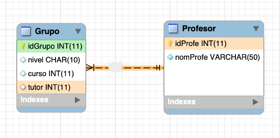

# 4. Mapeando Relaciones

Como mencionamos en la introducción, analizaremos cómo mapear los diferentes tipos de relaciones. Antes de empezar a discutir la cardinalidad de las relaciones, debemos considerar el significado de estas relaciones, y revisaremos el concepto de direccionalidad de las relaciones.

- **Unidireccional** → Diremos que una relación es unidireccional cuando accedamos al objeto relacionado (componente) desde otro objeto (propietario). Por ejemplo, si montamos un _motor_ en un _coche_, lo lógico es que el propietario sea el _coche_, y desde éste obtendremos el _motor_. En este caso, dentro del objeto _Coche_ aparecerá un objeto _Motor_, y _Motor_ no tendrá una existencia propia.
- **Bidireccional** → Son relaciones en las que los elementos relacionados suelen tener el mismo peso o entidad. Por ejemplo, un _Grupo_ de un instituto y un _Tutor_. Desde un grupo tiene sentido conocer al tutor, y también podemos desde un profesor (el tutor) acceder al grupo que tutoriza. En este caso, dentro del objeto _Grupo_ tenemos una referencia al objeto _Tutor_ y viceversa.

!!! warning "Aviso" 
En este tipo de referencias, como puede deducirse, existe una recursión intrínseca. Por tanto, cuando gestionamos este tipo de relaciones bidireccionales, tenga mucho cuidado de no causar bucles, ya que incluso algo tan sencillo como imprimir puede hacer que nuestro programa se bloquee y aparezca la conocida `StackOverflowException`.

A partir de ahora podríamos estudiar todas las representaciones con JPA.


## 4.1. Relaciones Uno a Uno

Para la explicación de los ejemplos, veremos el diseño y la implementación en la base de datos de cada caso y cómo se ve en Hibernate. Para este ejemplo representaremos una relación 1:1 entre Grupo y Profesor, donde puede verse que un Grupo tiene un Tutor, y un Tutor sólo puede tutorizar un Grupo.

<figure markdown="span">
  { width="700" }
  <figcaption>one to one<figcaption>
</figure>

En primer lugar, la clase que es apuntada por la clave foránea. Muy fácil porque no necesitamos hacer nada.


```java
@Fecha
@NoArgsConstructor
@Entity
@Table(name="Profesor")
public class Profesor { 

static final long serialVersionUID = 1L; 

@Id 
@GeneratedValue(strategy=GenerationType.IDENTITY) 
private int idTeacher; 

@Column 
private String name; 

public Profesor(String name) { 
this.name = name; 
}
}
```

Y ahora, la clase que contiene la clave ajena. Aquí debemos marcar que un `Grupo` necesita un `Profesor` como tutor. Veámoslo:

```java
@Fecha
@NoArgsConstructor
@Entity
@Table(name = "Grupo")
public class Grupo implements Serializable { 

static final long serialVersionUID = 137L; 

@Id 
@GeneratedValue(strategy = GenerationType.IDENTITY) 
private long idGroup; 

@Column 
private String level; 

@Column 
private String course; 

@Column 
private int year; 

@OneToOne(cascada = CascadeType.ALL) 
@JoinColumn( 
name="id_tutor", 
referencedColumnName = "idTeacher", 
unique=true, 
foreignKey = @ForeignKey(name = "FK_GRP_TEACH")) 
private Profesor tutor; 

public Grupo(String level, String course, int year) { 
this.level = level; 
this.course = course; 
this.year = year; 
}

}
```
Tenga en cuenta que la clase `Grupo` contiene un campo llamado `tutor` de la clase `Profesor`, y:

- `@OneToOne(cascade = CascadeType.ALL)` marcamos esta relación como 1:1. Además, especificamos el atributo cascada, que es el más importante. El cascading es la forma de decir que cuando realizamos alguna acción sobre la entidad objetivo (`Grupo`), la misma acción se aplicará a la entidad asociada (`Profesor`). Revisamos las opciones más relevantes: 
- `CascadeType.ALL` propaga todas las operaciones. La misma operación que realizamos en el objetivo se realizará en el asociado. 
- `CascadeType.PERSIST` propaga sólo la operación de persistencia en la base de datos (guardar). 
- `CascadeType.SAVE_UPDATE` es de Hibernate, no de JPA, y propaga el método `saveOrUpdate()`. Es muy similar a persisto. 
- `CascadeType.REMOVE` o `CascadeType.DELETE` propaga la eliminación de entidades. Tenga mucho cuidado con esta opción para evitar perder datos.
- En el `@JoinColumn` establecemos: 
- el nombre de la columna en nuestra base de datos 
- el nombre de la columna referenciada en la entidad objetivo `Profesor` 
- `unique=true` para asegurar que la relación es 1:1 (un profesor no puede estar relacionado con ningún otro grupo) 
- [opcional] para establecer el nombre de la restricción de clave foránea, en caso de que desee cambiarlo o eliminarlo en operaciones futuras.

Más información en la siguiente web[baeldung](https://www.baeldung.com/jpa-cascade-types)

### 4.1.1. Uno a Uno bidireccional

Si queremos almacenar en Profesor los grupos que está tutorizando, necesitamos añadir una referencia al Grupo. Como hemos hecho la clave foránea en Grupo, será muy fácil:

```java
@OneToOne(mappedBy= "tutor")
private Grupo elGrupo;
```

Con `mappedBy="tutor"` estamos diciendo que en la clase `Grupo` existe un campo llamado `tutor` con toda la información sobre la relación. Tenga en cuenta que no se añadirán campos aadicionales a `Profesor`, porque la información sobre la relación se encuentra en la tabla `Grupo`.

## 4.2. Uno a Muchos

Para esta explicación empezaremos con el siguiente modelo, en el que un **Libro** tiene un **Autor** que lo ha escrito, y un Autor puede haber escrito varios Libros. En el esquema relacional, la relación es desde `idAutor` en Libros, que es clave foránea en la tabla Autor (ID).

<figure markdown="span">
  { width="700" }
  <figcaption>one to many<figcaption>
</figure>

Primero, podemos decidir quién es el propietario de la relación. Realmente no importa, pero en varios diseños es muy claro, por ejemplo entre `Estudiant` y `Email`, donde obviamente el propietario es `Estudiant`. Normalmente debería ser la clase con cardinalidad **muchos** el propietario. Veamos el ejemplo.

```java
@Entity
@Table(name="Libro")
public class Libro implements Serializable { 

@Id 
@GeneratedValue(strategy=GenerationType.IDENTITY) 
private Long idLibro; 

@Column 
private String título; 

@Column 
private String tipo; 

@ManyToOne(cascade=CascadeType.PERSIST) 
@JoinColumn(name="idAutor", 
foreignKey = @ForeignKey(name = "FK_LIB_AUT" )) 
private Autor elAutor;
```
En este ejemplo, un `Libro` tiene un autor (único). Lo implementamos almacenando una referencia a un objeto Autor, llamado `elAutor` dentro de nuestro Libro. Debemos escribir la información de la relación en este campo:

- Debemos marcar este campo como `@ManyToOne`, porque Libro está al lado de los muchos de la relación (recuerde que un Autor puede escribir varios Libros)
- La clave foránea será anotada con la etiqueta `@JoinColumn`, con varios atributos: 
- Puesto que `elAutor` es el punto inicial de la clave foránea, que apunta a la tabla `Author`, necesitamos decir el nombre de la clave primaria en esta clase. Este atributo es opcional pero es una buena opción para mejorar nuestro código. 
- Opcionalmente, podemos llamar la restricción de la clave foránea, con un nombre bien estructurado, con el atributo `foreignKey`

```java
@Entity
@Table(name="Libro")
public class Autor implements Serializable{ 

static final long serialVersionUID = 137L; 

@Id 
@GeneratedValue(strategy=GenerationType.IDENTITY) 
private Long ydAutor; 

@Column 
private String nombre; 

@Column 
private String nacionalidad; 

@OneToMany(mappedBy="elAutor", 
cascade=CascadeType.PERSIST, 
fetch = FetchType.LAZY) 
private Set<Libro> losLibros; 

// resto de la clase
```

La clase `Autor` está en el lado _un_, y esto significa que puede escribir _muchos_ `Libros`. Por esta razón, almacenamos todos los libros que ha escrito en un 'Set' de libros. Las anotaciones serán:

- Puesto que un Autor puede escribir muchos libros, marcamos el Set de libros como `@OneToMany`. Como hemos escrito la especificación de la relación en Libro, podríamos decir que la relación está mapeada en el campo `elAutor` dentro de la clase `Libro`, con `mappedBy="elAutor"` fácilmente.

!!! nota "Decisión" 
En lugar de almacenar libros en un Set, se pueden almacenar en una Lista. La principal diferencia es responder a esta pregunta: _¿es importante el orden?_. Si respondes _sí_, debes utilizar una Lista. Si la respuesta es _no_, debes utilizar un Set.

!!! importante "Espacio" 

La relación `1:N` que hemos explicado es bidireccional. Esto significa que desde un Autor podemos obtener todos los Libros que ha escrito, y desde un Libro podemos obtener el Autor. 

<figure markdown="span">
  { width="700" }
  <figcaption>one to many bidirectional<figcaption>
</figure>

Puede encontrar varias páginas y libros que explican las relaciones unidireccionales `1:N`. Esto significa que con este tipo de implementación sólo podemos viajar en una dirección. En este caso, debemos almacenar sólo dentro de un Libro quien es el autor, porque el Libro es el propietario. Debemos eliminar el conjunto de libros en el autor para obtener una relación unidireccional.

### 4.2.1. Tipo de Carga **Fetch**

Este atributo suele aparecer cuando tenemos una relación `1:N` o `N:M` en una clase que tiene una colección de clases relacionadas (también puede especificarse con un `1:1` pero es menos común). Cuando Hibernate carga un objeto, cargará sus atributos generales (nombre, nacionalidad, etc...), pero ¿qué ocurre con los Libros que ha escrito, los carga o no?

- `DateType.EAGER` → Literalmente traducido como **ansioso**. No podemos esperar, y cuando se carga al Autor, Hibernate resolverá la relación y cargará todos los libros con todos los datos internos de cada libro. Tenemos todos los datos en el momento.
- `DateType.LAZY` → Literalmente como **perezoso** (vago), pero más representativo como _carga perezosa_. Si cargamos al Autor, Hibernate sólo carga los atributos propios del Autor, sin cargar sus Libros. Cuando intentamos acceder a sus libros desde nuestro programa, Hibernate se _activa_ y los carga. Es decir, en modo LAZY, los datos se cargan **cuando se necesitan**.

**¿Qué haremos?***

¿Qué es mejor o peor? La respuesta no es sencilla, ya queAmbos tienen ventajas y desventajas:

- En `EAGER` solo se realiza un acceso, mientras que en `LAZY` se realizan dos o más.

- En `EAGER` se cargan todos los datos, incluso los innecesarios; en `LAZY` solo se carga lo necesario.

El programador debe evaluar y equilibrar la cantidad de información requerida en un momento dado y el coste de acceso a la base de datos.

## 4.3. Muchos a Muchos

En esta sección, finalizaremos con el último tipo de relación que podemos encontrar en el modelo E/R: las relaciones muchos a muchos. Pueden aparecer otras relaciones con cardinalidades más altas, como las relaciones ternarias, pero, como se estudió en el primer año, todas ellas pueden modelarse con transformaciones binarias.

Dentro de las relaciones binarias, podemos encontrar dos posibilidades:

- Relaciones que simplemente indican la relación (por ejemplo, que un personaje puede o no portar cierto tipo de arma en un juego de rol) o

- Relaciones que, además de indicarla, añaden nuevos atributos. Por ejemplo, un actor participa en una película interpretando un tipo de papel: principal, secundario, etc.

En el modelo relacional, ambos casos se modelan como una nueva tabla (con o sin el atributo). Si nos encontramos en el segundo caso, se debe modelar una nueva tabla con los atributos que posee mediante una clase, por lo que la relación «N:M» entre dos tablas se convertirá en «dos relaciones uno a muchos 1:N y N:1» (actor-actuación y actuación-película). Nos centraremos en el primer caso, ya que estamos listos para resolver el segundo.

!!! Nota "Mejora"
En la segunda parte, este tutorial explica cómo crear [N_M con atributos](https://thorben-janssen.com/hibernate-tip-many-to-many-association-with-additional-attributes/). Se recomienda implementar un ejemplo.

Modelemos el caso típico de un profesor que imparte varios módulos, que pueden ser impartidos por varios profesores. El esquema es el siguiente:

<figure markdown="span">
  { width="700" }
  <figcaption>one to many bidirectional<figcaption>
</figure>


Como podemos ver, se mantiene la tabla central típica de la relación `N:M`. Como se mencionó anteriormente, la tabla "Enseñanza" no existirá en el modelo OO, ya que solo sirve para relacionar los elementos.

Las clases Módulo y Profesor son las siguientes (solo se muestra la parte relacionada con la relación), eligiendo en este caso Profesor como propietario de la relación:

```java
// en Profesor, un conjunto de Módulo
@ManyToMany(cascade=CascadeType.PERSIST,
fetch=FetchType.LAZY)
@JoinTable(name="Docencia",
joinColumns = {@JoinColumn(
name="idProfesor",
foreignKey = @ForeignKey(name = "FK_DOC_PROF" ))},
inverseJoinColumns = {@JoinColumn(
name="idModulo",
foreignKey = @ForeignKey(name = "FK_DOC_MOD" ))})
private Set<Modulo> losModulos=new HashSet<>(); ```

```java
// en Módulo... un conjunto de Profesores
@ManyToMany(cascade = CascadeType.PERSIST,
fetch = FetchType.LAZY,
mappedBy = "losModulos")
private Set<Professor> losProfesores=new HashSet<>();; ```

Esta es la especificación más compleja, vamos:

- En ambas clases, la asignación es `@ManyToMany`
- En ambos casos, indicamos cómo gestionamos las operaciones en cascada (`cascade`) y la carga de objetos relacionados desde la otra clase (`fetch`).
- En la clase propietaria (`Professor`), se asignará un `Set<Module>` con la relación que comenzará desde mi clase actual `Professor` $\rightarrow$ teaching $\rightarrow$ `Modulo` (el tipo base del Set).
- Con `@JoinTable` se indica que la relación enlaza a una tabla llamada `Teaching`, donde:
- Se enlazará (`joincolumns`), y el enlace es con `@JoinColumn`:
- Comienza desde el campo `idProfessor` dentro de la tabla `Teaching`
- Termina en la clave primaria de `Professor`,
- La clave principal se llama `foreignKey = @ForeignKey(name = "FK_DOC_PROF" )`.
- Tenga en cuenta que los nombres dentro de @JoinTable son nombres de la tabla Docencia (que solo existen en la base de datos).
- Se asigna de la tabla Docencia a la entidad fuente Módulo de forma inversa (desde el punto hasta el origen de la flecha):
- Esto se logra con `inverseJoinColumns`:
- Mediante la vinculación desde el campo `idModule` (`@JoinColumn`).
- También asignamos un nombre a la FK.
- En la clase relacionada (`Modulo`), que no es la propietaria, simplemente indicamos que el propietario es Profesor mediante `mappedBy="losModulos"`.

Un ejemplo de código sería el siguiente:

```java
Profesor p1 = new Profesor("Mario Benedé");
Profesor p2 = new Profesor("Jose Fernandez");

Módulo m1 = new Módulo("Acceso a Datos");
Módulo m2 = new Módulo("Bases de Datos");
Módulo m3 = new Módulo("Programación");
Módulo m4 = new Módulo("Diseño de Interfaz");

// añadir módulos a p1
p1.addModule(m3);
p1.addModule(m1);

// añadir módulos a p2
p2.addModule(m2);
p2.addModule(m3);
p2.addModule(m4);

// guardar
laSession.persist(p1);
laSession.persist(p2);
```

y la salida de Hibernate será similar a:

```sh
Hibernate: eliminar tabla si existe Módulo
Hibernate: eliminar tabla si existe Profesor
Hibernate: crear table Docencia ( 
idProfesor bigint not null, 
idModulo bigint not null, 
primary key (idProfesor, idModulo)) engine=InnoDB
Hibernate: create table Modulo ( 
idModulo bigint not null auto_increment, 
número varchar(255), 
primary key (idModulo)) engine=InnoDB
Hibernate: create table Profesor ( 
idProfe bigint not null auto_increment, 
nombreProfe varchar(255), 
primary key (idProfe)) engine=InnoDB
Hibernate: alter table Docencia add constraint FK_DOC_MOD 
foreign key (idModulo) references Modulo (idModulo)
Hibernate: alter table Docencia add constraint FK_DOC_PROF 
foreign key (idProfesor) references Profesor (idProfe)
Hibernate: insert into Profesor (nombreProfe) values (?)
Hibernate: insert into Modulo (número) values (?)
Hibernate: insert into Modulo (número) values (?)
Hibernate: insert into Profesor (nombreProfe) values (?)
Hibernate: insert into Modulo (número) values (?)
Hibernate: insert into Modulo (número) values (?)
Hibernate: insert into Docencia (idProfesor, idModulo) values (?, ?)
Hibernate: insert into Docencia (idProfesor, idModulo) values (?, ?)
Hibernate: insert into Docencia (idProfesor, idModulo) values (?, ?)
Hibernate: insert into Docencia (idProfesor, idModulo) values (?, ?)
Hibernate: insert into Docencia (idProfesor, idModulo) values (?, ?)
```

Después de crear las tablas, Hibernate creará las claves ajenas, y entonces insertará los registros. Primero `Profesor` y `Módulo` y seguidamente la relación entre ellos de `Docencia`