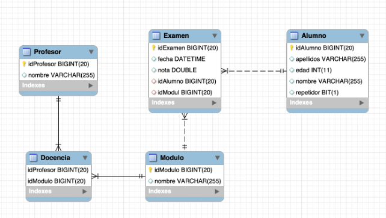
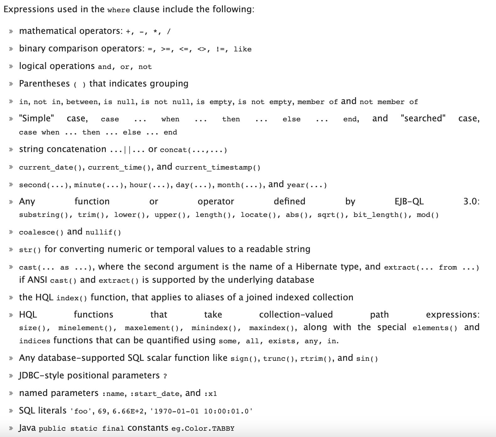
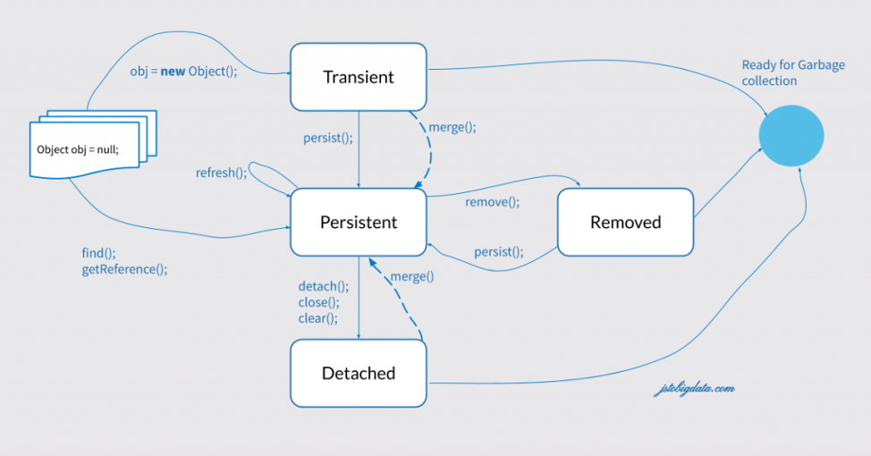

# 5. Hibernate Query Language

La documentación completa se puede encontrar aquí:

- In [spanish](https://docs.jboss.org/hibernate/core/3.6/reference/es-ES/html/queryhql.html)
- In [english](https://docs.jboss.org/hibernate/core/4.3/manual/en-US/html/ch16.html)

El lenguaje HQL (Hibernate Query Language) nació con el objetivo de preservar el modelo relacional, ya que es un superset de SQL (extensión de SQL que incluye SQL). La primera consideración es que, por defecto, su funcionalidad es recuperar objetos de la base de datos, no tablas como hacíamos en el lenguaje SQL a través de `ResultSet`. Las consultas con HQL se realizarán desde una interfaz **Query**, que será el lugar donde especificaremos qué queremos obtener. Opcionalmente, podemos añadir a la consulta los parámetros necesarios para su ejecución, para evitar consultas con código duro.

En primer lugar, la consulta será preparada. Al crearla, debemos tener en cuenta dos opciones, con cuatro combinaciones posibles:

- Devolverá un resultado o más de uno y,
- Devolverá el resultado encapsulado en objetos o de forma compuesta.

Dependiendo de la respuesta obtenida, en el segundo paso escogeremos una de las cuatro opciones vistas a continuación.

```java
1 Query q=session.createQuery("HQL statement");

2.1 List<Object> resultsObjects=q.list();

2.2 List<Object []>mixedresults=q.list();

2.3 Object result=q.uniqueResult();

2.4 Object[] result=q.uniqueResult();

1. // process information obtained
```

1. In first option the query returns a collection of objects (several rows, on object in a row).
2. Esta opción regresa a la colección s composite of objects and another types: for example a Student en number of topics and number of teachers.
3. Las opciones más recientes son, instead de la colección, las respuestas a un object/composite.

!!! note "Apunte..." 

- `session.createQuery` → permite escribir una consulta HQL, con o sin parámetros. 
- `Query.list()` → obtiene todos los objetos (como una Lista) de la base de datos que satisfacen la consulta. 

- `Query.uniqueResult()` → obtiene un único objeto de la base de datos.

Antes de los detalles, aquí encontrarás algunas ideas generales:

- Podemos eliminar el `Select*`, para indicar que queremos todos los atributos.
- Hay una sensibilidad media a las mayúsculas y minúsculas: las palabras reservadas de HQL no distinguen entre mayúsculas y minúsculas, pero las referencias a los objetos (sus nombres) sí lo hacen: no importa poner `From` o `fROm`, pero un `Student` no es lo mismo que un `student`. Se recomienda escribir las sentencias en minúsculas para distinguirlas de las clases.
- Después de `from`, aparece el nombre de una clase (o clases), no de tablas.
- Asignar sobrenombre es altamente recomendable. Podemos utilizar joins de forma similar a SQL.
- Luego puede aparecer el `where`, con sus condiciones similares a SQL.
- Las constantes de texto se cierran entre comillas simples.
- Podemos consultar colecciones que aparecen dentro de los objetos (por ejemplo, el conjunto de estudiantes de un profesor).
- No hay operador `limite`.
- `order by` se utiliza de forma similar a SQL.
- `group by` está permitido, y las funciones agregadas son: COUNT, AVG, SUM, MIN y MAX.

## 5.1. Recuperando objetos

A partir de ahora, los ejemplos se basan en este esquema [Docencia](./DocenciaConsultas.sql)


<figure markdown="span">
  { width="700" }
  <figcaption>Docencia HQL<figcaption>
</figure>

!!! tip "Consejo" 
Ahora es un buen momento para intentar realizar un enfoque de ingeniería inversa para construir tu proyecto a partir de la base de datos.


## 5.2. Consultas

### 5.2.1. Obteniendo objetos simples

Estas consultas son las que queremos recuperar un objeto o una colección de éstos de la base de datos (una o más filas, en comparación con ResultSet). Cada resultado es un único objeto de una tabla de la base de datos. Se caracterizarán porque la palabra Select puede no aparecer o simplemente indicar el sobrenombre de la clase que tenemos. Veamos los ejemplos.

El siguiente ejemplo muestra a todos los estudiantes:

```java
// complete and polite
Query<Alumno> q=laSesion.createQuery("Select a from Alumno a");

// ORO

// in a quick way
Query<Alumno> q=laSesion.createQuery("from Alumno");

// quickest (without type)
Query q=laSesion.createQuery("from Alumno");

List<Student> losAlumnos=q.list();

for (Alumno alumno : losAlumnos) { 
System.out.println(alumno); 
}
```

Si queremos filtrar o buscar a cualquier estudiante, necesitamos utilizar la cláusula `where`, como en una consulta SQL normal. Las expresiones pueden ser:

<figure markdown="span">
  { width="700" }
  <figcaption>Where<figcaption>
</figure>


Cuando el filtro `where` sólo devuelve un objeto, podríamos almacenarlo en una lista y después acceder a él, pero es mejor obtener el objeto directamente, como sigue:

```java
Query<Alumno> q = laSesion.createQuery("Select from Alumno a where a.idAlumno=1");
Alumno alumno = q.uniqueResult();
System.out.println(alumno);
```
ten en cuenta que creamos nuestra consulta con el operador diamante, indicando que devolverá un estudiante. Entonces, la consulta devuelve obviamente al estudiante. La alternativa es realizar un casting del objeto devuelto de `uniqueResult`:

```java
Query q = laSesion.createQuery("Select from Alumno a where a.idAlumno=1");
Alumno alumno = (Alumno)q.uniqueResult();
System.out.println(alumno);
```

!!! warning "Atención" 

Tenga cuidado cuando recupere un objeto único y la consulta devuelve varios. 

```java 
Query q=laSesion.createQuery("Select from Student a where a.age=24"); 
Alumno a=(Studente) q.uniqueResult(); 
// org.hibernate.NonUniqueResultException: query did not return a unique result: 2 
```

Cuando tenemos muchos resultados, no es conveniente recuperarlos todos a la vez, sino acceder a ellos de 10 en 10 o similar, al igual que las páginas de búsqueda de Google o Amazon. Podemos conseguirlo lanzando consultas más pequeñas repetidamente, aplicando a la consulta:

- `Q.setFirstResult(int start)` → indica el primer objeto (fila) a devolver.
- `Q.setMaxResult(int howMany)` → indica cuántas filas devolverá.

Con un algoritmo diseñado adecuadamente, podemos realizar un bucle, desplazando el inicio en cada iteración, incrementándolo por el número de filas recuperadas en la iteración anterior. Esto implicaría muchas consultas pequeñas en lugar de una grande.

### 5.2.2. Obteniendo objetos compuestos

Si necesitamos obtener más (o menos) datos que un objeto entero, debemos hacerlo en la parte `select` de la cláusula, pero cuando obtenemos los datos no los podemos almacenar en un Object. Por esta razón, y utilizando la propiedad de polimorfismo de Java, obtenemos los resultados en un array genérico de objetos. Por tanto, debemos ser muy cuidadosos con el tipo de cada celda, así como el tamaño de este array, ya que estará fuertemente ligado a la consulta en sí. Veamos la siguiente consulta: _Muestra el nombre y la edad de los estudiantes_:

```java
Query q = laSesion.createQuery("Select a.número,a.edad from Alumno a");

List<Object[]> result = q.list();

for (Object[] objects : result) { 
System.out.print("Alumno: "); 
for (int i = 0; y < objects.length; i++) { 
System.out.print(objects[i] + " "); 
} 
System.out.println();
}
```

Ten en cuenta que si sólo quieres imprimir la información, no es necesario realizar ningún trabajo extra, ya que (casi) todos los objetos se pueden convertir a String. Si quieres utilizarlos de otra manera, tenga mucho cuidado al convertirlos al tipo de dato adecuado.

**Colecciones**

Vamos a comprobar el nombre de los estudiantes y cuántos exámenes han realizado. Esta información se encuentra en el conjunto de Exámenes, así que necesitaremos manipular esta colección:

```java
Query q = laSesion.createQuery("Select a.número,size(a.exámenes) from Alumno a");
List<Object[]> result = q.list();

for (Object[] alu : result) { 
System.out.println("Alumno: " + alu[0] + " has done " + alu[1] + " exams.");
}
```

Como puede ver, hemos aplicado la función `size()` a la colección para ver su tamaño. Por tanto, podemos aplicar:

- `size(collection)` → recuperar el tamaño de la colección.
- `collection is empty` | `collection is not empty` → para determinar si está vacía. Es equivalente a comparar el tamaño con 0.
- Los operadores `in`, `all` se pueden combinar utilizando el operador `elements(collection)`.

Como consulta avanzada, puede utilizar `exists` y `not exists` en sus consultas.

## 5.3. Parámetros y Consultas Nominales (con nombre)

Normalmente, la mayoría de las consultas necesitarán algunos parámetros, generalmente para el filtrado de objetos en la cláusula where. Los beneficios de parametrizar las consultas para evitar la inyección de SQL o problemas similares se discutieron ya en la unidad anterior.

La gestión de los parámetros se realiza de la misma forma que con las sentencias preparadas (`preparedStatements`), y se puede realizar mediante parámetros posicionales o nominales. Veamos algunos ejemplos:

### 5.3.1. Parámetros posicionales

Debemos añadir espacios reservados dentro de nuestra consulta, pero en lugar de `?` añadimos un número después del signo de interrogación. Después debemos configurar el parámetro según el número de espacio reservado que hemos establecido antes, de la siguiente forma:

```java
Query<Alumno> q = laSesion.createQuery("Select from Alumno a where a.edad=?1");
q.setParameter(1, 24);
List<Alumno> losAlumnos = q.list();

for (Alumno alumno : losAlumnos) { 
System.out.println(alumno);
}
```
!!! tip "Consejo" 

Ten en cuenta que el método `setParameter` está sobrecargado para establecer todo tipo de datos.

### 5.3.2. Parámetros nominales

Las posiciones están bien, pero si podemos indicar los parámetros de forma nominal, el programa será mucho más legible. Los parámetros se indican con `:nombreDelParametro` y se asignarán con el método `setParameter(nombreDelParametro, valor)`, indicando el nombre del parámetro (sin los dos puntos):

### 5.3.3. Consultas con nombre

Podemos escribir consultas en nuestros métodos según las necesitemos. Sin embargo, es una buena práctica crear las consultas más importantes o que prevemos que serán las más utilizadas junto con la misma clase,a través del mecanismo que se presenta a continuación. En esta sección creamos y etiquetamos nuestras consultas, dentro de una colección de consultas, y después las podemos llamar. Es como si creáramos una biblioteca de consultas.

Fuera de la definición de la clase, se creará una colección `@NamedQueries`, que contendrá un array (indicado por claves) de elementos `@NamedQuery`, cada uno de ellos con un **nombre** y una definición de **consulta**.

Para invocarlas, en lugar de crear un objeto `Query`, lo crearemos a través de una `NamedQuery`, indicando su nombre y asignando parámetros, si los hubiere.

En la clase Alumno:

```java
@Entity
@Table(name = "Alumno", catalogo = "DocenciaConsultas")
@NamedQueries({ 
@NamedQuery(name="Repetidores", 
query="select from Student en where a.repeater=true "), 
@NamedQuery(name="AlumnosEntre", 
query="select en Student en where a.age between :min and :max"), 
@NamedQuery(name="AlumnosDescAge", 
query="select a from Student a order by a.age desc")
})
public class Alumno implements java.io.Serializable { 
static final long serialVersionUID=13L; 
...
```

Cuando queremos utilizarlo, en lugar de crear una `Query` debemos crear una `NamedQuery`, de la siguiente manera:

```java
Query<Alumno> q = laSesion.createNamedQuery("Repetidores", Alumno.class);
System.out.println("Alumnos repetidores: ");
List<Alumno> losAlumnos = q.list();

q = laSesion.createNamedQuery("AlumnosEntre", Alumno.class);
q.setParameter("min", 23);
q.setParameter("max", 28);

q = laSesion.createNamedQuery("AlumnosDescAge", Alumno.class);
System.out.println("Alumnos de mayor a menor: ");
```

## 5.4. CRUD

Por último, analizaremos el resto de las operaciones CRUD. Cabe destacar que estas operaciones se pueden realizar directamente sobre los objetos, por lo que se explican como complementarias más que principales.

### 5.4.1. Crear (Create - Insert)

Si queremos insertar un nuevo objeto en la base de datos, es muy fácil, como podemos recordar en las primeras secciones de esta unidad.

```java
Alumno a=new Alumno();
a.setApellidos("Hamilton");
a.setNúmero("Lewis");
a.setEdad(42);
a.setRepetidor(false);

laSesion.persist(a);
```

Simplemente creamos un nuevo objeto, establecemos sus valores, mediante setters o constructor con todos los argumentos, y finalmente lo almacenamos en la base de datos con el método `persist`. Puede utilizar `save` o `saveOrUpdate` indistintamente. Puede ver algunas diferencias entre ellos [aquí](https://javatute.com/hibernate/difference-between-save-and-persist-in-hibernate/). Ambos ejecutan una instrucción `insert sql`.

Al igual que SQL, podríamos insertar en una tabla con el resultado de una consulta, como sigue:


```sql
insert into class(properties) select_hql;
```

### 5.4.2. Actualización (Update)

Para cambiar el valor de una o más propiedades de un objeto, podemos cargar el objeto de la base de datos, cambiar los valores mediante los métodos getters y después guardar los cambios.

```java
Alumno en = laSesion.get(Alumno.class, 7L);
a.setEdad(44);
a.setRepetidor(true);

laSesion.update(a);
System.out.println(a);
```

Si queremos establecer una actualización masiva, que afecte a varios registros en la base de datos, podríamos utilizarlo de la misma manera que en SQL:

```java
Query q=laSesion.createQuery("Update from Alumno a siete a.edad=a.edad+1 where a.repetidor=true");
int howMany=q.executeUpdate();

System.out.println(howMany + "alumnos actualizados");
```

### 5.4.3. Eliminación (Delete)

Como en las secciones anteriores, podríamos eliminar un único objeto o conjunto de registros que cumplan una condición. En el caso de un único objeto, necesitamos cargarlo y después eliminarlo:

```java
Alumno en = laSesion.get(Alumno.class, 7L);
laSesion.delete(a);

System.out.println(a);
```

Ten en cuenta que el objeto permanece en memoria o hasta el final del método, pero cuando la sesión se confirma, el objeto pasará a estar `detached`. El estado `detached` significa que este objeto está fuera de cualquier tipo de seguimiento. No tenemos la posibilidad de guardar o actualizar ese objeto de nuevo.

Para realizar una eliminación masiva, al igual que SQL:

```java
Query q=laSesion.createQuery("delete from Alumno a where a.repetidor=true");
int howMany=q.executeUpdate();

System.out.println(howMany + "alumnos borrados");
```

!!! tip "Consejo" 

Recuerda estos consejo generales: 

- Estas sentencias pueden contener parámetros (en sentencias que contienen la cláusula `where`). 
- El `where` es opcional, pero eliminará o actualizará todo si falta. 
- Estas consultas se ejecutan todas utilizando `executeUpdate()`, para que cambien el estado de la base de datos, y devolverá un entero con el número de filas afectadas.

Tienes que prestar atención a las eliminaciones, ya que dependiendo de cómo hemos definido las relaciones (eliminaciones en cascada, dejando filas huérfanas, etc.) pueden o no ocurrir, y arrojar `java.sql.SQLIntegrityConstraintViolationException`.

Como comentario final en esta sección, recuerda lo que se ha dicho anteriormente: en la manipulación de objetos (eliminaciones, modificaciones, etc.) tenemos herramientas suficientes para hacerlo sin consultas HQL. Estas consultas son más adecuadas para procesar grandes volúmenes de información sin cargar esta información en nuestro programa para procesarla.


## 5.5. Apéndice, Estado de los objetos

Como hemos dicho a lo largo de esta unidad, los objetos se cargan y controlan por el gestor de sesiones. Cada objeto podría tener un estado dentro de la sesión, siendo interesante conocer todas las posibilidades. En esta imagen, puede ver todos los diferentes estados y el método para cambiar el estado del objeto.

<figure markdown="span">
  { width="700" }
  <figcaption>Object Status<figcaption>
</figure>

- **transient** → El objeto tiene identidad (existe en memoria), pero no tiene una identidad persistente, o clave primaria.
- **persistente** → El objeto ha estado marcado para ser guardado (persistido), y la identidad en memoria está relacionada con la identidad de la base de datos. Cuando cargamos un objeto de la base de datos, éste es el estado inicial.
- **detached** → El objeto ha sido persistido recientemente, pero este contexto está cerrado, con el método `detach()`. Las operaciones cuando está desconectado no se reflejarán en la base de datos.
- **removed** → El objeto ha sido marcado para ser eliminado (pero todavía no se ha efectuado). Cuando la sesión se cierre, será eliminado efectivamente, pero podemos volver a cargarlo y ponerlo en un contexto persistente.

Puede obtener más información [aquí](https://www.baeldung.com/hibernate-session-object-states).

<!--

http://www.cursohibernate.es/doku.php


-->
