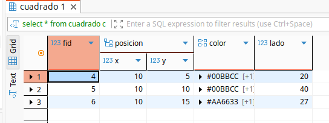

## 1. Base de datos Objeto-Relacional

En esta sección trabajaremos con la **base de datos PostgreSQL**. Como el sistema de gestión de bases de datos objeto-relacional de código abierto, que ha tenido el mayor impacto, siendo un rival directo del gran **Oracle**.

Nos centraremos en las novedades que ofrece Postgres frente a MySQL, como una extensión de los conceptos del primer año.


!!! importante "Importante" 

    Será interesante: 

    - Instalar tu propio servidor PostgreSQL. Se recomienda utilizarlo mediante un [contenedor Docker](https://www.datacamp.com/es/tutorial/postgresql-docker). 
    - Instalar un cliente para mostrar su base de datos. Recomendamos DBeaver.


Trabajaremos con este conocido ejemplo:

{width=90%}

## 2. Definición de tipos

En PostgreSQL existen los tipos habituales que se encuentran en los modernos SGBD. Además, destacan tipos especiales para almacenar direcciones de Internet (Tipo de Dirección de Red), XML y JSON para guardar y procesar estos formatos, tipos propios y colecciones. Con ello, podemos observar los grandes avances de PostgreSQL, que de forma relajada podríamos considerar como Objeto-Relacional y Documental.

### 2.1. Enumeración

Los tipos enumerados son tipos que sólo permiten valores específicos, generalmente también conocidos como dominios. En PostgreSQL podemos crearlos de la siguiente manera:

```sql
CREATE TYPE enum_name AS ENUM 
( [ 'valor' [, ... ] ] );
```

por ejemplo:

```sql
create type basic_colors as enum('#FF0000','#00FF00','#0000FF');
create type street_kind as enum ('Calle','Avenida','Partida');
```

Esta forma de definir este tipo evitará las comprobaciones de valores (cláusulas CHECK) existentes en algunos SGBD relacionales.

### 2.2. Tipos estructurados

Los tipos estructurados son los precursores de los objetos en sí. Si recordamos, en la programación estructurada, a partir de los tipos básicos, podíamos crear estructuras de datos:

- Donde todos los elementos son iguales (vectores, arrays y colecciones)
- Donde sus elementos podrían ser de distintos tipos. Estas estructuras evolucionaron hacia los objetos actuales añadiendo comportamiento y otras características.

En el modelo relacional, al tener que respetar la atomicidad de los datos, no podíamos generar estas estructuras. En Postgres podemos crear estos nuevos tipos de datos estructurados con la siguiente sintaxis, muy similar a la creación de una tabla:

```sql
CREATE TYPE type_name AS( 
attribute_name data_type 
[, ... ]-- one or more
);
```

por ejemplo:

```sql
create type Punto as( 
x integer, 
Y integer
);
```

o, utilizando uno una enumeración, de las vistas antes:

```sql
create type Address as( 
Type street_kind, 
street varchar, 
number int
);
```

y finalmente crearíamos la siguiente tabla:

```sql
create table person( 
idPerson serial primary key, 
name varchar, 
direction Address
);

insert into person(name) values ​​('manu');
insert into person(name,address) values('manu',null);
insert into person(name,address) values('manu',('Street','Vinalesa  ',1));

select direction from person;
select (address).street from person;

```

!!! info "Recordatorio" 

    - No se pueden aplicar restricciones NOT NULL, DEFAULT o CHECK en los campos que pertenecen a los tipos creados. 
    - La tipificación tiene sentido en datos que no existen por sí mismos, que necesitan ser *incrustados* en otras estructuras o tablas. 
    - Cuando se utiliza dentro de una tabla y se manipula la inserción, se realizará en un bloque, entre paréntesis, ya que determina una estructura. 
    - Para seleccionar un subtipo, debemos rodear el tipo general entre paréntesis, de lo contrario Postgres lo confunde con una tabla y genera un error.


## 3. Clases (¿o realmente tablas?)

Vamos a crear una clase `Figura`, que será el punto de partida de una herencia del modelo presentado en el inicio de la unidad. Veamos qué incorpora respecto a las implementaciones del modelo relacional. Figura contiene una clave primaria, y contendrá un Punto para localizarla en el plano. Además contiene una colección de colores, para hacer posibles degradados, guardados como un array. Guardar colecciones es también una capacidad añadida que no soporta el modelo relacional, dada la ausencia de valores multivaluados.

Se crea una clase con la misma sintaxis que una tabla, puesto que, a efectos prácticos, desde un punto de vista estructural es lo mismo. Posteriormente, la herencia distingue que una tabla "hereda" de otra.

```sql
create table Figura ( 
fID serial primary key, -- identifier 
Punto position, -- position he occupies 
color TEXTO[ ] -- color(s) of the figure
);
```

Para insertar nuevos registros, ten en cuenta que:

- Los elementos de tipo `Punto` deben almacenarse utilizando un constructor que crea una `fila` abstracta, llamada `ROW` o entre paréntesis.
- Para los arrays, también necesitamos un constructor llamado `ARRAY`, con una lista de elementos.

```sql
insert into Figura(position,color) 
values(ROW(0,0),ARRAY['#FFFFFF','#00CC00']);
```

A partir de aquí, crearemos nuevas clases para representar a los círculos, cuadrados
y rectángulos de `Figura` utilizando la herencia. La sintaxis es la siguiente:

```sql
create table sub_table( 
-- definition of table attributes
) inherits (super_table);
```

Como podemos ver, simplemente añadimos `inherits` para crear la relación de herencia. Por el diseño que teníamos anteriormente:

```sql
create table Rectángulo( 
height int, 
width int
) inherits (Figure);

create table Cuadrado( 
side int
) inherits (Figure);

create table Círculo( 
radio int
) inherits (Figure);
```

Insertamos algunas filas, teniendo en cuenta que también debemos incluir los atributos de la superclase.

```sql
insert into Cuadrado(position,color,side) values ​​(ROW(10,10),ARRAY['#00BBCC','#BBCC00'],40);
insert into Cuadrado(position,color,side) values(ROW(10,fifteen),ARRAY['#AA6633','#CCFF00'],27);
insert into Círculo(position,color,radius) values(ROW(30,25),ARRAY['#BBCC','#CCCC00'],20);
insert into Círculo(position,color,radius) values(ROW(10,-10),ARRAY['#00BBCC','#CCCC00'],20);
insert into Rectangle(position,color,height,width) values(ROW(10,5),ARRAY['#00BBCC','#CCCC00'],20,50);
insert into Rectangle(position,color,height,width) values(ROW(30,-10),ARRAY['#00BBCC','#CCCC00'],20,50);
```

Si ejecutamos varios `Select * from`, obtenemos a DBeaver:

{width=90%}

{width=90%}

{width=90%}

{width=90%}

Como es lógico, es posible pensar que cuando seleccionemos datos de la tabla general (`Select * from Figura`) aparecerán todos los elementos de las subclases. Si quisiéramos seleccionar sólo aquellos que son Figura, podríamos hacerlo con (`Select * from ONLY Figura`).

Vamos a completar el ejemplo creando un dibujo con todas las figuras almacenadas. Guardaremos el dibujo en una nueva clase que contiene la identificación del dibujo, y guardaremos una colección con los identificadores de las figuras que componen el dibujo.

```sql
drop table if exists Dibujo;
create table Dibujo(
	idDibujo serial primary key,
	elementos int[]
);


insert into Dibujo (elementos) values(ARRAY[2,4,5,6]); 
insert into Dibujo (elementos) values(array(select fid from figura)); 
```

Comentar que la selección de los identificadores de `Figura` puede ser directa, o seleccionando aquéllos que queremos, mediante una consulta incrustada dentro del constructor ARRAY. Esto puede hacerse cuando el select devuelve una sola columna.

Obtenemos los dibujos que tenemos, esta colección de figuras se muestra. Pero si queremos descomponer el vector, para acceder a cada una de las figuras existentes, podemos hacerlo con la función `unnest`.

Fichero de configuración de [PostGres](./Postgres18.txt)
Fichero de base de datos de [Figuras](./Figuras.sql)
