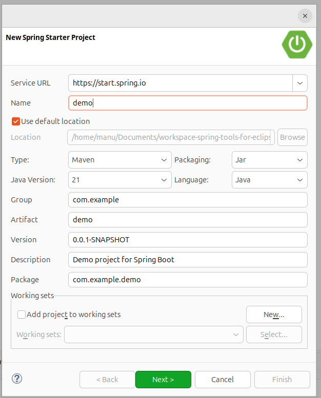
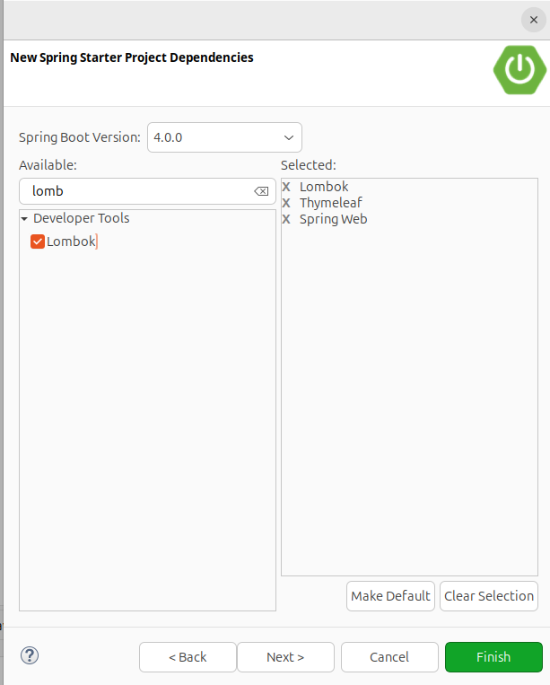

## 1. Spring y Spring Boot

Spring Framework simplifica el desarrollo de aplicaciones Java, independientemente de si son aplicaciones web ordinarias o aplicaciones web fuera de línea. Sus mayores ventajas son un código fuente más simplificado y menos dificultad en los ajustes. Para ofrecer estas comodidades al programador, el framework se basa en los siguientes principios:

- **Inyección de dependencias** (DI): técnica o patrón de diseño utilizado como una de las formas de inversión de control (IOC) para promover un acoplamiento débil. Es decir, cuando una clase necesita otra clase (dependencia), en lugar de crear el objeto dentro de la propia clase, Spring lo suministra o lo inyecta. Esta forma de IOC sigue el principio de Hollywood (no nos llames, ya te llamaremos) en el que la aplicación toma el control en lugar del código, proporcionando los siguientes beneficios: 

- Proporciona modularidad. 
- Escalabilidad de la aplicación sin necesidad de modificar las clases. 
- Evita la dependencia entre clases.

- Desarrollo sencillo con **POJOs** (Plain Old Java Objects).
- Minimiza el código boilerplate.
- Simplifica el acceso a los datos gracias a la ORM (**Object Relational Mapping**).
- **Programación Orientada a Aspectos** (AOP): Permite una modularización mucho más alta para hacer una separación muy clara de las diferentes tareas que cada clase debe realizar en nuestra aplicación.

### 1.1. Módulos principales del Spring Framework

Gracias a su estructura modular para el desarrollo de las aplicaciones más diversas en Java, Spring es la elección perfecta, ya que puedes elegir libremente cuáles de los componentes necesitas utilizar para tus aplicaciones y cuáles no. En la arquitectura estándar, los distintos módulos se dividen en seis categorías principales:

{width=95%}

- **Core Container**: El contenedor principal proporciona los módulos básicos: 

- **Core** y **Beans** forman el esqueleto del framework, conteniendo la función de inyección de dependencias y apoyando los objetos POJO. Hay que aclarar que un Bean es un POJO, aunque tiene algunas características adicionales. 
- **Context** hereda sus características del módulo Beans y se puede complementar con funciones para la internacionalización o la carga de recursos. Además, apoya características de Java Enterprise como EJB y JMX (Java Management Extensions). Context-support facilita la integración de bibliotecas de otros proveedores en Spring. 
- Spring-expression contiene Spring Expression Language (*SPeL*), una extensión del Unified Expression Language de la especificación JSP-2.1 (Java Server Pages).

- **AOP** e instrumentación: Para permitir la programación orientada a aspectos, el Spring Framework contiene el módulo spring-aop. El componente spring-instrument proporciona soporte para la implementación de carga de objetos y clases de manipulación para su uso en algunos servidores.
- **Mensajería**: Para servir como base para aplicaciones basadas en mensajes, Spring Framework se basa en algunas de las funciones de encriptación del proyecto Spring Integration, como _Message_, _MessageChannel_ o _MessageHandler_. Este módulo tiene el nombre de spring-messaging.
- **Acceso a Datos/Integración**: Los módulos de esta categoría están diseñados para dar a las aplicaciones Java las herramientas para interactuar con otras aplicaciones, así como controlar el acceso a los datos. 

- _spring-jdbc_ proporciona una capa de abstracción que define la forma en que un cliente accede a la base de datos y ahorra la codificación complicada típica de JDBC. 
- _spring-orm_ ofrece capas de integración para acceder a bases de datos relacionales en interfaces ORM populares. 
- _spring-tx_ (apoya la gestión de transacciones programáticas para todas las clases y POJOs). 
- _spring-oxm_ (capa de abstracción para el mapeo de objetos o XML). 
- _spring-jms_, un módulo con funciones para la producción y procesamiento de mensajes.

- **Web**: en esta categoría se encuentran los módulos específicos para aplicaciones web: spring-web, spring-webmvc y spring-websocket. Además, esta aplicación Java ha añadido funciones de integración típicas orientadas a la web como una función de carga multiparte o un cliente HTTP. El módulo spring-webmvc también es conocido como web servlet y es el que contiene las implementaciones de Spring para la ejecución del patrón de arquitectura modelo-vista-controlador (MVC) y servicios web REST.
- Test: el módulo spring-test permite comprobar la funcionalidad de los componentes de tu aplicación Java. Así, con ayuda de frameworks adicionales como JUnit o TestNG, puedes realizar pruebas unitarias (centradas en un solo componente) así como pruebas de integración.

## 2. Spring vs Spring Boot

Spring Boot apareció hace unos años con la idea de complementar a Spring, es decir, añadir a Spring, no con la idea de sustituirlo. Como se puede interpretar en la siguiente imagen, Spring Boot realmente funciona con Spring por debajo, pero de una manera más fácil.

{width=75%}

Podríamos definir Spring Boot como un acelerador para la creación de proyectos Spring, basado principalmente en el concepto de convención antes de la configuración. Otra forma de definir Spring Boot podría ser como un acelerador de creación de proyectos Spring. Por tanto, el objetivo es crear proyectos Spring, pero de una manera más ágil, a través de una serie de convenciones que prevalecen sobre la configuración. Ahorrándonos tener que perder tiempo haciendo configuraciones pesadas en archivos.

Cabe destacar que Spring Boot no se considera un Framework como tal, sin embargo, Spring sí tiene el privilegio de categorizarse como tal. Con Spring Boot, podemos hacer lo mismo que con Spring. Pero de una forma más rápida que si desarrollamos exclusivamente con Spring sólo. Pero con ambos, podríamos tener el mismo desarrollo, aunque la diferencia entre ambos sería el tiempo invertido.

{width=95%}

Para explicar las diferencias entre ambos, es esencial introducir el concepto de convención de configuración, que juega un papel tan importante en el campo de la ingeniería de software.

### 2.1. ¿Qué es la convención de configuración?

Este principio especifica/detalla una serie de convenciones (conjunto de reglas) que estarán por encima de la configuración, a menos que se especifique lo contrario. Es decir, se aplicarán por defecto si no especificamos lo contrario.

Un ejemplo de una convención antes de la configuración podría ser cuando creamos una aplicación MVC con Spring, debemos llevar a cabo muchas configuraciones, incluido el puerto. Por otro lado, si creamos la aplicación utilizando Spring Boot, gracias a la convención de configuración, el puerto por defecto de la aplicación al iniciarla será 8080. Pero si queremos cambiarlo, sólo tenemos que modificar un archivo y añadir una sola instrucción donde detallaremos el puerto, por ejemplo, 8888. De esta forma, realizaremos un desarrollo más queramos modificar la configuración de alguna convención.

## 3. Requisitos e Instalación

Spring funciona con muchas tecnologías integradas (a continuación), así que aconsejamos tener lo siguiente para asegurarnos de que todo funcione correctamente. Los requisitos son:

- Java instalado, es aconsejable tener la versión 8, debido a su estabilidad. Y que Spring no soporta algunas de las versiones más novedosas de Java.
- Apache Maven instalado.
- Un IDE compatible (en este caso será **Spring Tool Suite**).

**Spring Tool Suite 4**, que es el proporcionado desde el sitio web de Pivotal (página oficial de los creadores y mantenedores de Spring). Se puede descargar desde <https://spring.io/tools>.

## 4. Primer proyecto y ejecución

Para crear un proyecto Spring, podemos hacerlo de dos maneras:

- Crear un proyecto desde _Spring Boot Initializer_, la herramienta web proporcionada por Pivotal aquí <https://start.spring.io>. Este asistente genera un archivo zip con la estructura del proyecto maven. Necesitamos importar este archivo zip a nuestro IDE para empezar a programar.
- Crear el proyecto desde el IDE utilizando la herramienta de línea de pedidos (CLI), en nuestro caso el IDE escogido será Spring Tool Suite 4. No necesitamos pasos adicionales para empezar a programar.

### 4.1. Inicializar

Visitamos <https://start.spring.io> y rellenamos el formulario:

{width=95%}

En la parte de dependencias, deberíamos añadir los aspectos de nuestro programa. Inicialmente aplicación web, pero podríamos añadir Lombok, Thymeleaf y otros aspectos.

Aquí encontrará varias capturas de pantalla con el proceso. Desde STS, crea un nuevo proyecto: File/New/Spring Starter Project:


{width=95%}

Seleccione un proyecto maven, la versión de Java instalada y escriba información sobre la versión del artifact y otros datos:

{width=95%}

Y finalmente seleccione las dependencias. En nuestro proyecto inicial, seleccione Spring web.

{width=95%}

Y cuando el proceso termine, encontrará una estructura de proyecto con un _pom.xml_ configurado.

{width=95%}


### 4.2. Primera ejecución

Veamos qué archivos se han creado en nuestro proyecto. Como puede ver, sólo una clase con una función principal:

```java
importe org.springframework.boot.SpringApplication;
import org.springframework.boot.autoconfigure.SpringBootApplication;

@SpringBootApplication
public class HelloSpringApplication { 

public static void main(String[] args) { 
SpringApplication.run(HelloSpringApplication.class, args); 
}

}
```

Se ejecutará una `SpringApplication`, al igual que se ejecuta un `Thread`. Esta clase inicializa y lanza la aplicación Spring, con argumentos, si los hubiere.

!!! tip "Consejo" 
Spring como aplicación web, no interactúa con el usuario, y esperará y servirá a muchos clientes. Por esta razón, no es una buena idea realizar programas interactivos con usuarios.


Para ejecutar nuestra aplicación Spring:

{width=95%}


Y aparecerá en la consola un registro similar a:

{width=95%}

Lo primero que debe ver es el puerto en el que el servidor Tomcat está escuchando. Por defecto es el puerto 8080:

```sh
... Tomcat started on port(s): 8080 (http) with context path ''
```

Y cuando detenemos nuestro programa:

{width=95%}

!!! tip "Consejo" 
Recuerde que es muy útil leer todos estos mensajes, especialmente cuando algo no funciona como se espera


Para mostrar que nuestro programa funciona correctamente, necesitamos probar el puerto específico, y después ir a nuestro navegador y escribir `http://localhost:8080`.

{width=95%}

El mensaje de error que obtenemos `Whitelabel Error Page`, no es un error en absoluto, puesto que no hemos programado ningún controlador, es decir, el servidor está funcionando, pero no está sirviendo nada.

### 4.3. El archivo `application.properties`

Este archivo contiene muchas configuraciones útiles que estableceremos a lo largo de nuestro ciclo de desarrollo. Las estudiaremos a medida que aparezcan, pero todas las configuraciones que establecimos en el archivo `hibernate.cfg.xml` en la unidad 3 se configurarán en este archivo.

{width=60%}

Este archivo, como todos los archivos de propiedades, tiene una estructura de pareja atributo-valor. El primer valor importante es cambiar el puerto que escucha nuestro servidor. Este archivo se encuentra en la carpeta `src/main/resources`. Debemos añadir, por ejemplo:

```sh
# puerto de escucha
server.port = 8090
```

Si volvemos a ejecutar nuestra aplicación, debemos cambiar el puerto en el navegador para acceder a nuestro servidor.

!!! tip "Consejo" 

Puede ver (casi) todas las propiedades visitante [esta página web](https://docs.spring.io/spring-boot/docs/current/reference/html/application-properties.html)


Podríamos añadir cualquier valor que queramos utilizar, como constantes a utilizar en nuestros programas. Luego podemos cargarlo en nuestros programas. Por ejemplo:

```sh
# App name
spring.application.name=demo
```

para cargarlo en nuestros programas, necesitamos utilizar la anotación `@Value`:

```java
@Value("${app.name}")
private String appName;

@Value("${developer.name}")
private String devName;
```

### 4.4. Anotación `@SpringBootApplication`

En Spring Boot, es muy común aplicar múltiples decoradores a la clase principal. Pero comúnmente, la mayoría de los desarrolladores principalmente aplican 3 decoradores.

- `@Configuration`: Disponible desde la versión 3 de Spring, nos ofrece la posibilidad de realizar una anotación que se encargará de definir la clase que la posee como una clase de configuración. Esta configuración para el framework Spring se basará en apuntes. Y no como en sus orígenes, que se basaba en XML, lo que lo hacía más complejo. Otro propósito de esa anotación será permitir la inyección de dependencias.
- `@EnableAutoConfiguration`: La configuración automática de Spring Boot intenta configurar automáticamente tu aplicación Spring en función de cualquier dependencia jar que hayas añadido. Si, por ejemplo, si pones un **HSQLDB** (sistema de gestión de bases de datos) en tu classpath, y no has configurado manualmente ningún bean de conexión a la base de datos, Spring Boot configura automáticamente una base de datos en memoria.
- `@ComponentScan`: Se utiliza junto con `@Configuration` para decir a Spring dónde buscar los componentes, y será dentro del paquete que hemos anotado. Sólo debiendo escribirlo una vez, pudiendo hacer que todos los paquetes sean hijos del paquete de la clase padre (la que contiene el main). Básicamente, esto dice en Spring donde debe buscar todos los componentes.

Para poder utilizar este paquete de tres anotaciones, Spring Boot nos ofrece `@SpringBootApplication` como la unión de las tres anotaciones explicadas anteriormente.

## 5. MVC con Spring

### 5.1. Controladores

Un controlador es responsable de responder a eventos. Normalmente, estos eventos son acciones (más técnicamente conocidas como solicitudes) que suelen ser realizadas por el usuario, aunque también pueden ser solicitudes más automatizadas como API, páginas frontales Ajax, etc.

En un contexto de la vida real, un controlador es como un camarero; Él o ella está esperando detrás de la barra hasta que llegue un cliente. El cliente pide una coca-cola, y el camarero, si la tiene, la servirá. Luego llega otro cliente, y pide un café, y entonces el camarero le sirve. Otro cliente llega, y pide un té verde, y el camarero dice que no puede servirlo, porque no tiene. Una y otra vez... El camarero servirá todo lo que el cliente quiera, si puede.

{width=95%}

Volviendo a Spring debemos añadir a nuestro programa un módulo que funcione como un controlador, escuchando todas las solicitudes de los clientes, y respondiendo (si puede) con los datos que el cliente solicita.

{width=95%}

Recuerde el error en la primera ejecución de Spring: la aplicación Spring funciona bien, pero todavía no tenemos un controlador. Vamos.

### 5.2. Paquete `controllers`

Vamos a crear un controlador, pero primero, debemos crear un paquete que contenga ese controlador. Antes hablábamos de la anotación `@SpringBootApplication` que dijimos que era equivalente a tener 3 anotaciones. Una de ellas era `@ComponentScan`. Si no queremos tener que decirle que escanee varios paquetes (que normalmente es la mejor idea), normalmente ponemos toda la estructura de paquetes dentro del paquete `padre`, que será el paquete donde tenemos el main.

Para ello, haga clic derecho sobre el paquete que contiene el main. De esta forma, cuando vamos a poner el nombre directamente nos aparecerá el com.example y sólo deberemos añadir un `.` y el nombre del paquete hijo. Si no, deberíamos escribir el nombre completo del paquete. Como puede ver, el paquete blanco nos indica que es un paquete vacío en lugar del paquete marrón.

{width=65%}

Vamos a crear una clase sencilla que controle el índice de nuestra aplicación. Por esta razón, debemos nombrar a nuestra clase como `indexController.java`. Recuerde que índice se refiere al dominio principal de nuestro servidor/app.

!!! tip "Consejo" 
Es una buena práctica establecer nombres de clase siguiendo reglas sencillas para entender el comportamiento de la clase. Así, una clase llamada `clientController` es el controlador que mapeo información sobre `Client`, y `filmController.java` trata sobre `Films`.

Una vez nuestra clase ha sido creada, dentro del paquete controlador, debemos configurarla. Veamos un ejemplo de `indexController.java`:

```java
package com.example.demo.controllers;

import org.springframework.stereotype.Controller;
import org.springframework.web.bind.annotation.GetMapping;
import org.springframework.web.bind.annotation.ResponseBody;

@Controller
public class indexController { 

@GetMapping("/") 
@ResponseBody 
public String helloWorld() { 
	return "Hello from Spring"; 
}

}
```

Vea nuestras anotaciones: 

- `@Controller` → dice a Spring que esta clase es un controlador. Es una especialización de `@Component`, y dado que Spring explora todo el classpath, se detecta automáticamente. 
- `@GetMapping("/")` → es el controlador. Definimos un camino (`"/"`) en nuestro servidor, y escuchamos el método `GET`. Hablaremos más adelante. 
- `@ResponseBody` → dice al controlador que serialice el valor de retorno (una cadena en nuestro ejemplo) a JSON y lo envíe a través de `http_response` al cliente que llama al controlador.


Ahora, si intentamos recargar la página en el navegador, en lugar de un mensaje de error, obtendremos el valor devuelto por el controlador:

=== "Antes del controlador"

{width=95%}

=== "Después del controlador"

{width=95%}

Otra forma de obtener el mismo resultado sería:

```java
package com.example.demo.controllers;

import org.springframework.web.bind.annotation.GetMapping;
import org.springframework.web.bind.annotation.RestController;

@RestController
public class indexController { 

@GetMapping("/") 
public String helloWorld() { 
return "Hello from Spring"; 
}

}
```

dónde: 

- `@RestController` → indica que en esta clase todos los métodos incluyen la anotación `@ResponseBody`. Ten cuidado, ya que todos los métodos devolverán un objeto JSON, y en algunos casos (cuando enviamos datos a vistas en otro formato), puede ser una mala idea.

### 5.3. Solicitudes y Parámetros

!!! info "Atención" 

Para probar nuestra solicitud, a partir de ahora utilizaremos POSTMAN <https://www.postman.com/downloads/>. Existe un apéndice sobre el uso de postman.

Añadimos un poco de inteligencia a una ruta del controlador, dándole algo de dinamismo a través del paso de parámetros. Estos parámetros serán aceptados gracias a la anotación `@RequestParam`.

El número de parámetros que recibiremos será igual al número de parámetros que hemos definido dentro de la anotación `@RequestParam` del método de la ruta del controlador, de la siguiente forma:

```java
package com.example.demo.controllers;

import org.springframework.stereotype.Controller;
import org.springframework.web.bind.annotation.GetMapping;
import org.springframework.web.bind.annotation.RequestParam;
import org.springframework.web.bind.annotation.ResponseBody;

@Controller
public class indexController { 
	@GetMapping("/hola") 
	@ResponseBody 
	public String hola(@RequestParam String name) { 
		return "Hola "+ name +" desde Spring !!!"; 
	}
}
```

Esto significa que una solicitud de `GET /hola` necesitará un parámetro (`name`) con su valor. Por ejemplo `http://localhost:9090/hola?name=Manu`.

Tenga en cuenta que si no añadimos el parámetro, la solicitud será incorrecta. Podríamos solucionarlo, estableciendo este parámetro como no requerido y un valor por defecto, de la siguiente forma:

```java
@GetMapping("/hola")
@ResponseBody
public String hola(@RequestParam(required = false,defaultValue = "desconocido") String name) { 
return "Hola "+ name +" desde Spring !!!";
}
```

### 5.4. Logger

Una buena idea también es utilizar `Logger` para mostrar qué está pasando en nuestro servidor. Podemos utilizarlo como sugerimos:

```java
package com.example.demo.controllers;

import org.springframework.stereotype.Controller;
import org.springframework.web.bind.annotation.GetMapping;
import org.springframework.web.bind.annotation.RequestParam;
import org.springframework.web.bind.annotation.ResponseBody;

import org.slf4j.Logger;
import org.slf4j.LoggerFactory;


@Controller
public class indexController { 
	private static final Logger myLog=LoggerFactory.getLogger(indexController.class);
	@GetMapping("/hola") 
	@ResponseBody 
	public String hola(@RequestParam(required = false,defaultValue = "desconocido") String name) { 
		// check specific situations
		if (name==null) { 
		myLog.warn("Name parameter dos not exists");
		}
		else { 
		myLog.info(name + " is here");
		}
		
		return "Hola "+ name +" desde Spring !!!"; 
	}
}

```

`Logger` nos ofrece mostrar cada tipo de mensaje:

- `void error(String msg)`
- `void warn(String msg)`
- `void info(String msg)`

### 5.5. Parámetros múltiples

Vamos a estudiar cómo obtener varios parámetros, aunque no se recomienda más de tres o cuatro, porque los psth aumentan mucho, y existen mejores métodos para pasar datos al servidor, como objetos en la solicitud BODY desde formularios o datos dentro de los path. Un ejemplo clásico es el siguiente:


```java
package com.example.demo.controllers;

import org.springframework.beans.factory.annotation.Autowired;
import org.springframework.stereotype.Controller;
import org.springframework.web.bind.annotation.GetMapping;
import org.springframework.web.bind.annotation.RequestParam;
import org.springframework.web.bind.annotation.ResponseBody;
import org.springframework.web.bind.annotation.RestController;

import jakarta.servlet.http.HttpServletRequest;

import java.util.Calendar;

import org.slf4j.Logger;
import org.slf4j.LoggerFactory;


@Controller
public class indexController {
	private static final Logger myLog=LoggerFactory.getLogger(indexController.class);
    
	@Autowired
	private HttpServletRequest context;

	@GetMapping("/born")
	@ResponseBody
	public String born( 
			@RequestParam(required=true,defaultValue = "unknown") String name, 
			@RequestParam(required=true,defaultValue = "1970") int year 
			) { 
		int currentYear = Calendar.getInstance().get(Calendar.YEAR); 
		myLog.info("Request from -> "+context.getRemoteAddr() + " Port->" + context.getRemotePort()); 
		return "" + name + " you have " + (currentYear-year);
	}

}

```

ten en cuenta que:

- Aunque los valores por defecto podrían ser enteros o reales, debemos definirlos como cadenas.
- La variable `HttpServletRequest` definida se utiliza para obtener información adicional sobre la solicitud http recibida.

!!! importante "Importante" 
`@Autowired` es una de las anotaciones más utilizadas. Esta anotación permite realizar la inyección de dependencias. Esto significa que Spring buscará una clase dentro del contexto de la aplicación que coincida con el bean deseado, creará una nueva instancia y la inyectará dentro del bean que posee la inyección.


### 5.6. Solicitud POST

Aparte de GET, podemos hacer solicitudes POST, PUT, DELETE y más en nuestro servidor. Simplemente debemos sustituir `@GetMapping` por `@PostMapping`, con la correspondiente importación. De hecho, como son rutas diferentes, incluso si se llaman igual, podrían estar en el mismo archivo sin ningún problema.

```java
@PostMapping("/born")
@ResponseBody
public String post( 
@RequestParam(required=true,defaultValue = "unknown") String name, 
@RequestParam(required=true,defaultValue = "1970") int year 
) {
```

Dado que las solicitudes POST suelen ser llamadas dentro de un formulario, es una buena idea establecer el parámetro en la sección del cuerpo de la solicitud. Para ello, debemos configurar la sección BODY de POSTMAN, seleccionar `www-form-urlencoded` y establecer los parámetros.

Si queremos un número ilimitado de parámetros, podemos crear una matriz y crear múltiples parámetros en POSTMAN con el mismo nombre:

```java
	@PostMapping("/lotes")
	@ResponseBody
	public String lotes(@RequestParam String [] params) {
	  String res="";
	  myLog.info("POST Request from -> "+context.getRemoteAddr() + " Port->" + context.getRemotePort());
	  if(params==null || params.length==0)
	    res= "A POST request without params.";
	  else {
	    res="The list of params is:\n";
	    for (String param : params) {
	      res+=param+"\n";
	    }
	    res=res.substring(0, res.length()-1);
	  }
	    
	  return res;
	}
```

{width=95%}


### 5.7. Variables en el path

Si queremos obtener un valor específico, en forma de valor en el camino, por ejemplo `GET films/1` en lugar de `GET films?idFilm=1`, la forma es la siguiente:

```java
@GetMapping("/who/{idWho}")
@ResponseBody
public String who(@PathVariable String idWho) { 
	myLog.info("GET Request from -> "+context.getRemoteAddr() + " Port->" + context.getRemotePort()); 
	return "You are looking for " + idWho;
}
```

La petición responde:

{width=95%}

Cómo podemos ver:

- En la aplicación establecemos en el camino el parámetro `idWho`.
- En el controlador definimos el parámetro como String para poder acceder desde nuestro método.
- Al realizar la petición, el valor se asigna desde la petición al parámetro de la función.
