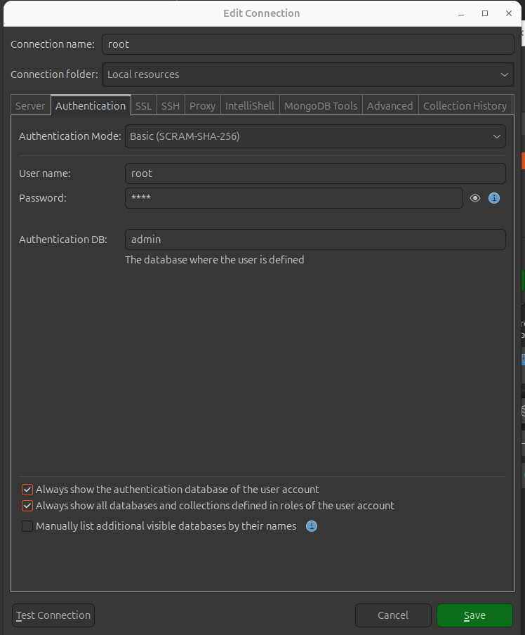
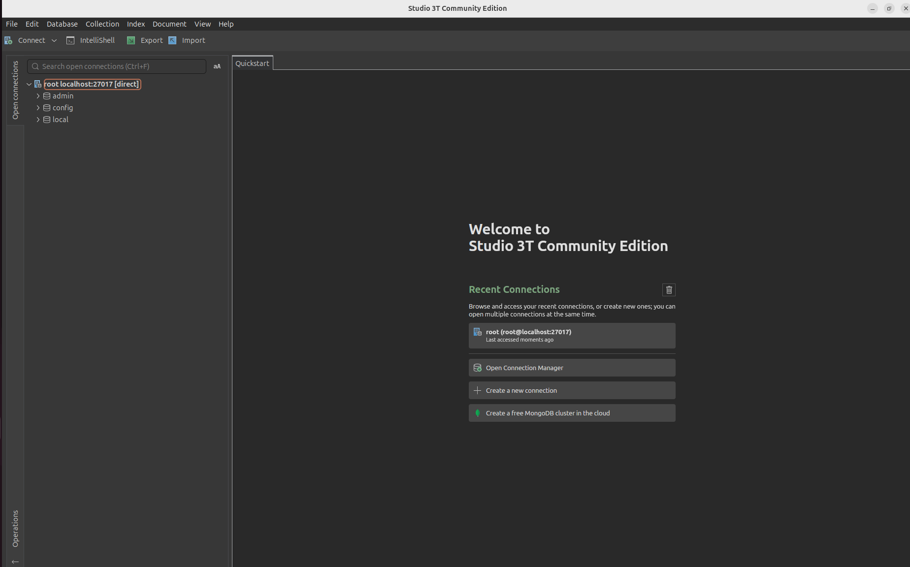
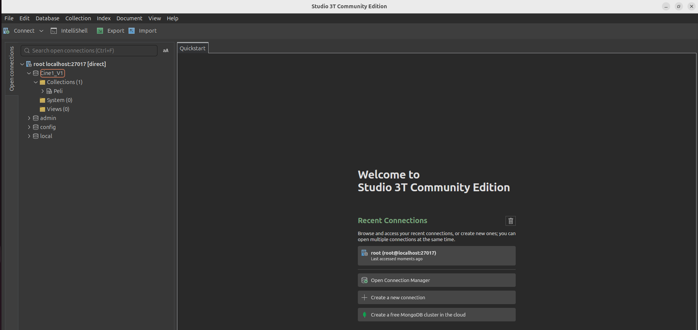

# 2. MongoDB

MongoDB es una base de datos orientada a documentos, basada en el almacenamiento de sus estructuras de datos en documentos de tipo JSON con un esquema dinámico. Aunque empezó a ser desarrollada por la empresa 10gen, hoy es un proyecto de código abierto, con una gran comunidad de usuarios.

Un servidor MongoDB puede contener varias bases de datos, y cada una de ellas está formada por un conjunto de colecciones, que podríamos comparar con las tablas de una base de datos relacional. Cada colección almacena un conjunto de documentos JSON, formados por atributos clave-valor, que serían los registros de una base de datos relacional.

A grandes rasgos, podríamos establecer las siguientes comparaciones:


|Modelo relacional |MongoDB |
|-|-|
|Base de datos relacional| Base de datos orientada a documentos |
|Tabla| Colección|
|Registro/Fila| Documentos JSON|
|Columnas y valores de la tabla|Pares Clave:Valor |

## 2.1. Configuración y primera ejecución

MongoDB cubre una amplia gama de posibilidades, desde servidores de bases de datos locales hasta bases de datos en la nube. En su sitio web <https://www.mongodb.com>, podemos descubrir los diferentes productos y servicios que se ofrecen, entre ellos:

- **Servidor MongoDB**, con sus dos versiones, la Community, versión gratuita y comunitaria, y la Enterprise, su versión comercial orientada al mundo empresarial y con características adicionales que mejoran el rendimiento y el soporte. Además del servidor en sí, también se ofrece el servidor listo para uso en contenedores a través de operadores de Kubernetes. El servidor está disponible en varias plataformas: Linux, Solaris, MacOS X y Windows. 
- Podemos utilizar el **mongo shell** o **compass** o **Studio3T** gráfico como cliente, instalado en nuestro sistema.
- **MongoDB Atlas**, la plataforma MongoDB en la nube (DBaaS o DataBase as a Service), que permite su despliegue en servicios como AWS, Azure o Google Cloud.
- **Realm**, un servicio de datos diseñado para aplicaciones móviles y web, y que incluye, además de DB en la nube, varios servicios de backend totalmente gestionados.

Utilizaremos como curso actual todos los servidores a través de contenedores docker. Podríamos descargar la imagen docker vía:

```sh
docker pull mongo
```

y entonces crear el contenedor con:

```sh
docker run --name mongodb-srv 
-e MONGO_INITDB_ROOT_USERNAME="root" 
-e MONGO_INITDB_ROOT_PASSWORD="toor" 
-p 27017:27017 
-d mongo
```

Entonces ya podemos conectar desde la herramienta elegida. Yo haré uso de Studio3T.

Se puede descargar de aquí: https://studio3t.com/es/free/


## 2.2. Conexión herramienta gráfica

Una vez instalada la aplicación, deberás crear una conexión, previamente tienes que tener levantado el contenedor de mognodb:

```bash
sudo docker start mongodb-srv
```

Debes seleccionar primero la pestaña **Server** en la que configurarás:
- el nombre de la conexión, en mi caso root
- la dirección del servicio, localhost
- puerto de escucha, 27017


Luego la pestaña **Authentication**:

- Authentication Mode: Basic
- User Name: root
- Password: toor
- Authentication DB: admin



Pulsa a Test Connection y si es ok, Save.




Puesto que la herramienta no nos permite cargar ficheros json directamente, lo que vamos a realizar es hacerlo cargando una colección de películas directamente.

Esta colección la podemos descargar es 

Luego nos situaremos en el directorio en el que se encuentre este fichero y desde el terminal lanzaremos el siguiente comando:

```bash
sudo docker cp pelis.json mongodb-srv:/tmp/pelis.json
```
Con este copiamos a un directorio temporal de mongodb el fichero json.

Luego lo importamos así:

```bash
sudo docker exec -it mongodb-srv mongoimport   --username root   --password toor   --authenticationDatabase admin   --db Cine1_V1   --collection Peli   --file /tmp/pelis.json   --jsonArray   --drop

```


Y lo vemos en Studio3T

