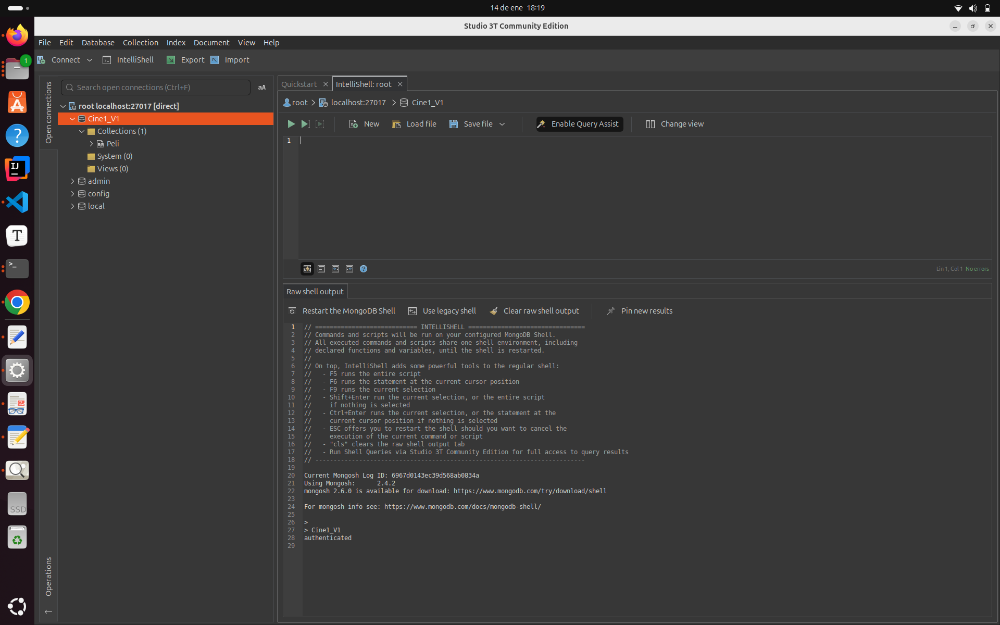

# 3. Trabajando con MongoDB: Operaciones básicas de shell

## 3.1. Colecciones y Documentos

Como ya sabemos, la unidad básica de información con la que trabaja MongoDB es el **documento**, que sería el equivalente a un registro en un modelo relacional. Estos son **documentos JSON**, formados por pares **clave-valor**, y que representan la información de forma bastante intuitiva. Los servidores de MongoDB, por su parte, almacenarán estos datos en formato **BSON** (Binary JSON), un formato de serialización binaria.

En cuanto a los documentos JSON para MongoDB, es necesario tener en cuenta algunos aspectos:

- En cuanto a las claves: 
- No pueden ser nulas. 
- Pueden consistir en cualquier carácter UTF-8, excepto los caracteres `.` o `$`. 
- Son sensibles a mayúsculas y minúsculas. 
- Deben ser únicas dentro del mismo documento.
- En cuanto a los valores: 
- Pueden ser de cualquier tipo permitido.
- En cuanto al documento: 
- Debe tener un campo `_id`, con un valor único, que actuará como identificador del documento. 
- Si no especificamos esta clave, MongoDB la generará automáticamente, con un objeto de tipo `ObjectId`.

Si los documentos son el equivalente a los registros, las colecciones son el equivalente a las tablas, con la diferencia de que las colecciones tienen un esquema dinámico, con el que **los documentos de la misma colección pueden presentar claves o tipos de datos diferentes entre ellos**.

Los nombres de las colecciones estarán sujetos a las siguientes restricciones:

- No pueden ser la cadena vacía (``````), ni el carácter `null`, ni contener el símbolo `$`.
- Podemos utilizar el punto (`.`) en los nombres de las colecciones para añadir prefijos, pero las colecciones no se pueden crear con el prefijo `system.`, ya que éste se utiliza para colecciones internas del _sistema_. Por ejemplo, `db.system.test` no sería válido, pero `db.systema.test` sí lo sería.


Para realizar las pruebas trabajaremos con el Shell que nos ofrece Studio3T.

Una vez conectemos, botón derecho sobre la base de datos que nos interesa y opción de Open Intellishell:


Que nos abrirá el shell a través del cual ejecutar los comandos de mongodb:




## 3.2. Operaciones básicas con MongoDB

A continuación, veremos algunas de las operaciones básicas que podemos realizar en MongoDB:

- `insertOne(documento)` → Añade un documento a la colección: 
- `db.collection.insertOne({ a:1 })`
- `insertMany(documents)` → Añade un conjunto de documentos a la colección: 
- `db.collection.insertMany([{ a:1 },{ a:2 },{ a:3,b:5 }])`
- `find(criteria)` → Obtiene todos los documentos de una colección que coinciden con el patrón especificado. 
- `db.collection.find({a:1})`. Tenga en cuenta que el patrón será también un objeto JSON.
- `findOne(Criterion)` → Obtiene un elemento de la colección que coincide con el patrón. 
- `db.collection.findOne()`
- `updateOne(Criterion, Operation, [options])` y `updateMany(Criterion, Operation, [options])` → Actualiza uno (o varios en el caso de updateMany) documentos de la colección. Requiere dos parámetros: 
- los criterios de búsqueda del documento a actualizar y 
- la operación de actualización. 
- Admite un tercer parámetro opcional para opciones. 
- `db.collection.updateOne({a:1}, {$set: {a:2}})`
- `deleteOne(Criterion)` y `deleteMany(Criterion)` → Elimina los documentos de una colección que coinciden con los criterios. 
- `db.collection.deleteOne({a:1})`

En las siguientes secciones profundizaremos en las distintas operaciones.

## 3.3. Tipo de datos

Los tipos de datos con los que trabaja MongoDB son similares a los que podemos encontrar en JavaScript y Java. MongoDB admite los tipos básicos descritos en la siguiente tabla:

- `null` → Representa tanto el valor nulo como un campo que no existe.
- `boolean` → Permite los valores true y false.
- `number` → Representa valores numéricos de punto flotante. Si queremos utilizar tipos enteros o enteros largos, debemos utilizar nuestras propias clases: NumberInt (32 bits) o NumberLong (64 bits).
- `String` → Representa cualquier cadena de texto UTF-8 válida.
- `Date` → Representa fechas, expresadas en milisegundos.
- `array` → Listas de valores que se representan como vectores.
- `Documentos incrustados` → Los documentos pueden tener otros documentos incrustados en ellos.
- `ObjectId` → Éste es el tipo por defecto para los campos `_id`, y está diseñado para generar fácilmente valores únicos a nivel global.

### 3.3.1. Fecha

Mongo utiliza el tipo `Date` de JavaScript. Cuando generamos un nuevo objeto de tipo Date, debemos utilizar el operador `New`, ya que de lo contrario obtendríamos una representación de la fecha en forma de cadena.
Por ejemplo, si definimos las variables `a` y `b` de la siguiente manera:

```js
test> let a=Date()

test> let b=new Date()
```

los resultados serían bastante diferentes:

```js
test> a
Wed Jan 14 2026 18:23:32 GMT+0100 (hora estándar de Europa central)

test> typeof(a)
string

test>b
ISODate('2026-01-14T17:23:50.465Z')

test> typeof(b)
object
```
### 3.3.2. Arrays

Los arrays pueden utilizarse para representar colecciones ordenadas, como listas o colas, o colecciones desordenadas, como conjuntos. Como en JavaScript, ya diferencia de otros lenguajes, como Java, cada elemento del vector puede tener un tipo de dato diferente, incluidos otros objetos de tipo vector.

Veamos algunos ejemplos sobre vectores en JavaScript y, por tanto, en MongoDB:

```js
// array creation
test> let v={objetos: ["casa", 10, {texto: "hola"}, false] }

// ask for objects components
test> v
{ objetos: [ 'casa', 10, { texto: 'hola' }, false ] }

test> v.objetos
[ 'casa', 10, { texto: 'hola' }, false ]

// ask for array cells
test> v.objetos[1]
10

test> v.objetos[2]
{ texto: 'hola' }

// change values
test> v.objetos[3]=!v.objetos[3]
true

test> v
{ objetos: [ 'casa', 10, { texto: 'hola' }, true ] }
```

### 3.3.3. Documentos incrustados

Un par clave-valor en un documento puede tener otro documento como valor. Esto se conoce como **documentos incrustados** (_embedded_), y sería cuando se utiliza un objeto JSON dentro de otro. Por ejemplo:

```js
> let peli={ 
titulo: "Rogue One. En Star Wars Story.", 
año: 2016, 
director: { 
número: "Gareth", 
cogidos: "Edwards", 
año_nacimiento: 1975, 
nacionalidad: "británica" 
} 
}
```

Como puede verse, el documento en sí mismo contiene información sobre la película y su director. En un modelo relacional, normalmente tendríamos dos tablas relacionadas entre sí. En este caso, es posible que si queremos mantener información específica sobre los directores, acabemos con información redundante.

### 3.3.4. ¿Qué son los OBjetIds?

La clase ObjectId utiliza 12 bytes, organizados de la siguiente manera:

{width=55%}

- **Timestamp** (bytes 0-3) → La marca de tiempo en segundos desde el 1 de enero de 1970.
- **Machine ID** (bytes 4-6) → Identificador único de la máquina, normalmente un hash de su hostname.
- **PID** (bytes 7-8) → Identificador del proceso que genera el ObjectID, para garantizar la unicidad dentro de la misma máquina.
- **Incremento** (bytes 9-11) → Valor auto-incremental, para garantizar la unicidad en el mismo segundo, máquina y proceso.

Como puede verse, es un mecanismo más robusto que un campo auto-incremental como en MySQL. Esto corresponde a la naturaleza distribuida de MongoDB, por lo que los objetos se pueden generar en un entorno multi-host.

## 3.4. Añadiendo información a las colecciones

La forma natural de añadir elementos a la base de datos es a través de los diferentes métodos de inserción, disponibles en todas las colecciones.

### 3.4.1. `insertOne()`

Permite insertar un documento en la colección. Por ejemplo, para insertar el objeto _peli_ creado en la sección anterior, podemos hacer. Para ello antes definiremos la siguiente variable:

```jscript
let peli2={
    "titulo": "Ciudad de Dios",
    "anyo": 2002,
    "director": "Fernando Meirelles",
    "pais": "Brasil",
    "genero": ["Crimen", "Drama"],
    "duracion_minutos": 130,
    "clasificacion": "No recomendada menores de 18 años",
    "actores_principales": ["Alexandre Rodrigues", "Leandro Firmino", "Phellipe Haagensen"],
    "puntuacion_imdb": 8.6,
    "oscars": 4
  }

```


```js
test> db.Peli.insertOne(peli2)

{
  acknowledged: true,
  insertedId: ObjectId('6967d5ac3ec39d568ab0834b')
}

```


Como puede verse, la respuesta es un documento JSON que contiene un valor booleano que indica si la operación ha sido exitosa, y un ObjectID, con el ID asignado automáticamente.


!!! importante "Importante"
Tenga en cuenta:

- Si la colección a la que añadimos un documento no existe, se creará automáticamente.
- En cuanto al campo `_id`, como podemos ver, se generó automáticamente. Sin embargo, podemos indicar este identificador, sin que sea de tipo ObjectId, cuya única restricción es que sea único, para evitar duplicados.
- No hemos utilizado ningún esquema para la colección, puesto que cada documento que insertamos puede tener un esquema diferente.


### 3.4.2. `insertMany()`

Permite añadir varios documentos a una colección. Entonces, debemos proporcionar un array de documentos:

```js
// we create three objects
let peli3={
    "titulo": "Regreso al futuro",
    "anyo": 1985,
    "director": "Robert Zemeckis",
    "pais": "Estados Unidos",
    "genero": ["Aventura", "Comedia", "Ciencia ficción"],
    "duracion_minutos": 116,
    "clasificacion": "Todos los públicos",
    "actores_principales": ["Michael J. Fox", "Christopher Lloyd", "Lea Thompson"],
    "puntuacion_imdb": 8.5,
    "oscars": 1,
    "taquilla_global_millones": 388.8
};
let peli4= {
    "titulo": "El bueno, el feo y el malo",
    "anyo": 1966,
    "director": "Sergio Leone",
    "pais": "Italia",
    "genero": ["Western"],
    "duracion_minutos": 178,
    "clasificacion": "No recomendada menores de 13 años",
    "actores_principales": ["Clint Eastwood", "Eli Wallach", "Lee Van Cleef"],
    "puntuacion_imdb": 8.8,
    "taquilla_global_millones": 38.9
};
let peli5={
    "titulo": "El señor de los anillos: El retorno del rey",
    "anyo": 2003,
    "director": "Peter Jackson",
    "pais": "Nueva Zelanda",
    "genero": ["Aventura", "Drama", "Fantasía"],
    "duracion_minutos": 201,
    "clasificacion": "No recomendada menores de 12 años",
    "actores_principales": ["Elijah Wood", "Viggo Mortensen", "Ian McKellen"],
    "puntuacion_imdb": 9.0,
    "oscars": 11,
    "taquilla_global_millones": 1146.0
};

// insert them, in array way
test> db.Peli.insertMany([peli3, peli4, peli5])
{
  acknowledged: true,
  insertedIds: {
    '0': ObjectId('6967d7a13ec39d568ab0834c'),
    '1': ObjectId('6967d7a13ec39d568ab0834d'),
    '2': ObjectId('6967d7a13ec39d568ab0834e')
  }
}
```

!!! importante "Importante" 
Si se produce un error durante la inserción, ni el documento que provoca el error ni los siguientes documentos se insertarán en la colección.


## 3.5. Eliminando información

Para eliminar documentos de una colección utilizaremos los comandos `deleteOne()`, `deleteMany()` o `findOneAndDelete()`, proporcionándoles como parámetro un JSON con una **condición** que queremos que cumplan el documento o documentos a eliminar.

- El comando **deleteOne** sólo eliminará el primer elemento que coincida con los criterios, así que si queremos eliminar un documento específico, debemos utilizar criterios que correspondan a identificadores únicos, como el `_id`.
- El comando **deleteMany** eliminará todos los documentos que coincidan con los criterios.

Tanto `deleteOne` como `deleteMany` devuelven un documento con un booleano, indicando si la operación se ha realizado, así como el número de elementos eliminados (**deletedCount**).

Por su parte, **findOneAndDelete** también elimina un documento, basándose en criterios de selección y ordenación, pero también devolviendo el documento que ha sido eliminado.

Por ejemplo, creamos unacolección con varios elementos:

```js
db.pruebas.insertMany([{x:1}, {x:2}, {x:3}, {x:4}, {x:5}, {x:6}, {x:7}]);

// to delete one document
test> db.pruebas.deleteOne({})
{ acknowledged: true, deletedCount: 1 }

// as no confition is set, is satisfied by all documentos,
// then first document will be deleted

// to delete several documentos, for instance its x's value greather than 3
test> db.pruebas.deleteMany({x:{$gt:3}})
{ acknowledged: true, deletedCount: 4 }

// delete and return a documento
test> db.pruebas.findOneAndDelete({x:2})
{ _id: ObjectId('6967d8bfb96045836cb0834c'), x: 2 }
```

Si queremos eliminar todos los documentos de una colección, podríamos utilizar el comando `drop` en lugar de eso, pero hay que ir con mucho cuidado, ya que también eliminará alguna metainformación.

```js
test> db.pruebas.drop()
```

## 3.6. Actualización de documentos

Para actualizar documentos, podemos optar por actualizaciones de reemplazo, utilizando el método `replaceOne()`, o realizar modificaciones en los documentos existentes, utilizando los métodos `updateOne()`, `updateMany()` y `findOneAndUpdate()`. Estos métodos recibirán dos argumentos: el primero será los criterios o condiciones que deben cumplir los documentos a actualizar, y el segundo será un documento con el nuevo documento o las actualizaciones a aplicar.

### 3.6.1. Actualización de reemplazo (replace)

La operación de reemplazo, como su nombre indica, reemplaza un documento entero que cumple los criterios de actualización con otro nuevo documento. Por ejemplo, creamos una nueva colección de calendarios, para almacenar contactos, con información sobre teléfonos:

```js
test> db.agenda.insertOne({número:"Jose", telefonos:[{trabajo:"55512345", casa:"555111222"}]})
{
  acknowledged: true,
  insertedId: ObjectId('6967db9ba67922ae4bb0834b')
}
```
Como podemos ver, este método devuelve el `_id` del objeto, a través del cual podremos identificar este documento de forma inequívoca. Así, podríamos reemplazar este documento por otro mediante:

```js
test> db.agenda.replaceOne({"_id":ObjectId("6967db9ba67922ae4bb0834b")}, 
{número: "Jose", 
correos:[{trabajo: "jose@empresa.com"}, 
{personal: "jose@proveedor.com"}]} )

// and the response is
{
  acknowledged: true,
  insertedId: null,
  matchedCount: 1,
  modifiedCount: 1,
  upsertedCount: 0
}

```

Como puede verse, se trata de reemplazar todo el documento, con lo que podemos incluso modificar su estructura.

Como hemos anticipado, las modificaciones se realizan utilizando los métodos `updateOne()`, `updateMany()` y `findOneAndUpdate()`. Similar a las operaciones de eliminación, el método `updateOne()` modificará sólo el primer documento que coincida con los criterios dados y el método `updateMany()`, todos aquellos que coincidan con los criterios. Por su parte, el método `findOneAndUpdate()` modifica el documento y devuelve el _documento original_ por defecto, aunque esto es configurable a través de opciones.

#### 3.6.1.1. Modificadores

Los modificadores son claves especiales que nos permiten especificar operaciones de actualización más complejas. Normalmente, no necesitaremos reemplazar todo el documento, como en el caso anterior, sino añadir o modificar campos específicos:

- `$set` → Asigna un valor a un campo del documento. Si no existe, lo creará. 
- `db.collection.updateOne({criterio}, {$set: {campo:valor} });`
- `$unset` → Elimina un campo de uno o varios documentos. Como necesitamos introducir un par clave-valor, añadiremos un booleano como valor. 
- `db.collection.updateMany({criterio}, {$unset: {campo:true} });`
- `$inc` → Incrementa o decrementa el valor numérico de una clave (no se refiere al identificador), creando una nueva si no existe. 
- `db.collection.updateOne({criterio}, {$inc: {campo:incremento} });`
- `$push` → Añade elementos a un array. Si el array no existe, lo crea con los elementos que indicamos en el push, mientras que si ya existe, los añade al final del mismo. 
- `db.collection.update({criterio}, {$push: {nombre_array:{lista_de_valores} } });`
- `$pull` → Elimina elementos de un array basándose en algún criterio. 
- `db.collection.update({criterio},{$pull:{vector:elemento}})`.
- `$pop` → Elimina elementos de un array tratado como una pila o cola, es decir, eliminando el primer (-1) o último (1) elemento. 
- `db.collection.update({criterio},{$pop:{vector: [ -1 | 1 ] }})`

!!! note "Information" 
Estos modificadores funcionan tanto con `updateOne` como con `updateMany`.


#### 3.6.1.2. Upserts

Cuando no se encuentra ningún documento que coincida con los criterios para una actualización, como es de esperar, no se produce ningún cambio en la colección.
Por otra parte, en ocasiones, podemos desear que si un documento con ciertos criterios no existe cuando queremos modificarlo, se cree. Esto se logra a través de actualizaciones especiales, llamadas `upserts`. Con esta operación, nos ahorramos buscar primero en la colección para saber si debemos realizar una operación de inserción (si no existe) o de modificación (si existe).

Para realizar un upsert, utilizaremos el tercer argumento de las actualizaciones, que consiste en un documento con diferentes opciones en formato clave-valor, añadiendo la clave upsert a true.

```js
db.collection.updateOne({critería},{modification}, {upsert:true});
```
