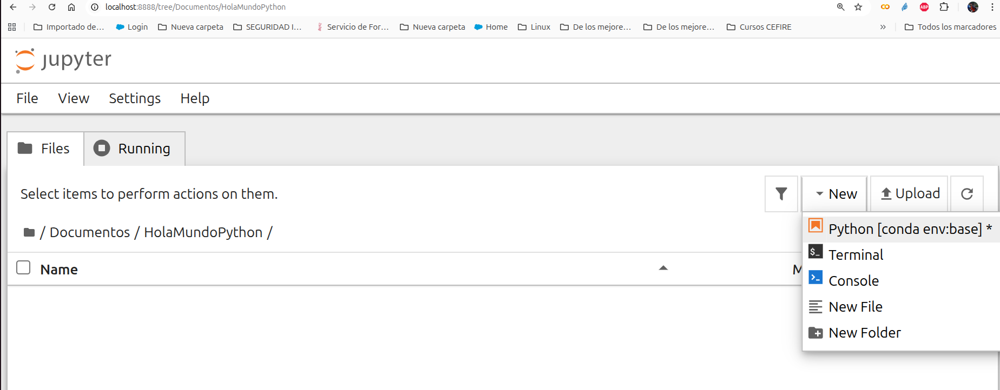

## Configuración del entorno de trabajo

------

A continuación explicaremos como instalar el software necesario para realizar este curso:

- Python3
- Visual Studio Code: El IDE
- Visual Studio Code: Extensiones
- Anaconda: Anaconda Navigator: Jupyter Notebook
- Instalar paquetes de Python


### Instalación de  Python

```bash
sudo apt-get install python python3
```

### Comprobamos que está bien instalado

```bash
python3
```


### Visual Studio Code

```bash
sudo apt-get update
sudo apt-get install apt-transport-https
sudo apt-get install curl
```

Después instalamos el repositorio:

```bash
curl https://packages.microsoft.com/keys/microsoft.asc | gpg --dearmor > microsoft.gpg
sudo install -o root -g root -m 644 microsoft.gpg /etc/apt/trusted.gpg.d/
sudo sh -c 'echo "deb [arch=amd64] https://packages.microsoft.com/repos/vscode stable
main" > /etc/apt/sources.list.d/vscode.list
```

Por último actualizamos el sistema e instalamos el visual code:

```bash
sudo apt-get update
sudo apt-get install code
```


### Visual Studio Code: Extensiones


### Anaconda: Anaconda Navigator: Jupyter Notebook

Para instalar Anaconda, tanto en Ubuntu como en Windows, hace falta registrarse gratuitamente en https://www.anaconda.com/, descargar el instalador y seguir las instrucciones.

Para comprobar si funciona correctamente después de la instalación escribiremos por consola:


```bash
conda list
```

En algunos casos hace falta activar anaconda para futuros arranques poniendo la ruta adecuada según donde tengamos la instalación:

```bash
source /home/manu/anaconda3/bin/activate
```


Tras realizar la instalación podemos lanzar **anaconda-navigator** por consola:

```bash
anaconda-navigator
```


Podemos lanzar **jupyter**.  Jupiter Notebook es un entorno de desarrollo muy sencillo que se utiliza a través del navegador, lo cual facilita muchísimo su uso al no hacer falta instalar ningún componente adicional. Nos va a permitir escribir código en Python, pero además también mezclarlo con
otros componentes interesantes, como pueden ser “texto no ejecutable” para documentar.
También nos permitirá guardar el resultado de la ejecución de ese código en Python para que cuando lo abramos no tengamos que ejecutarlo para ver que hace.


Dentro de Jupyter Notebook podemos navegar por nuestro directorio de carpetas y crear una nueva carpeta. Si queremos crear una nueva carpeta dentro de “**Documentos**” pulsamos en “**New\Folder**” y si queremos cambiarle el nombre por defecto podemos seleccionar la carpeta y pulsar en “**Rename**” para darle el nombre “**HolaMundo**”.
Creemos nuestro primer notebook (“**New\Python [conda env:base]**”) y cambiemosle el nombre a “**HolaMundo**” pulsando sobre el título por defecto:





### Instalar paquetes de Python:

```bash
conda install numpy
conda install pandas
conda install matplotlib
conda install seaborn
conda install scikit-learn
```

