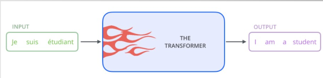
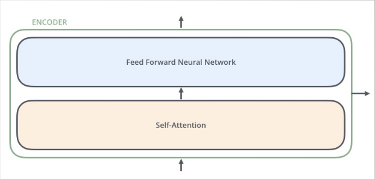
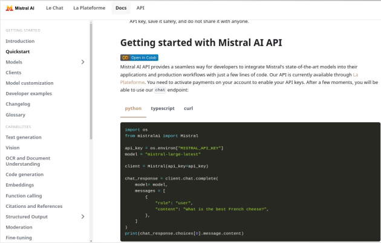
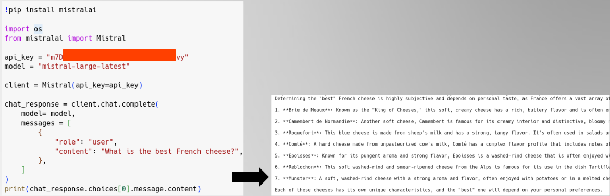

# NLP: Transformers y LLMs

**Ponente:** Jose Ramón Cebolla Cebolla  

**Objetivos de la sesión:**  

En esta sesión aprenderemos a:  

- Comprender cómo la arquitectura **Transformer** y los **Grandes Modelos de Lenguaje (LLMs)** han revolucionado por completo el Procesamiento del Lenguaje Natural.  
- Entender el mecanismo de **atención**, la idea clave que permite a los Transformers capturar el significado y el contexto profundo de un texto.  
- Implementar **ejemplos prácticos en Python** para dominar las distintas variantes de **Transformers (Encoders, Decoders y Encoder-Decoders)** y resolver una gran variedad de tareas, desde clasificación avanzada hasta generación o traducción de texto.  
- Aprender a **interactuar directamente con LLMs de última generación**, como **Mistral**, a través de sus APIs, para poder utilizar todo su potencial en nuestras propias aplicaciones creando una **webapp con Flask** y opcionalmente dockerizándola.  

---

## Evolución del NLP: La Era de los Transformers y LLMs

El procesamiento del lenguaje natural (NLP) ha evolucionado desde enfoques manuales hasta métodos basados en datos y aprendizaje profundo. Esta sesión explora su última etapa para entender en qué situación nos encontramos:

- **Etapa 1:** Sistemas basados en reglas (1950s-1980s)
- **Etapa 2:** Métodos estadísticos y ML clásico (1990s-2010)
- **Etapa 3:** Word embeddings y redes neuronales (2010s)
- **Etapa 4:** Transformers y LLMs (2017-Actualidad)

La IA es capaz de comprender la entrada y responder adecuadamente. En los últimos años la IA está en boca de todos y se ha normalizado el uso de chatbots conversacionales como ChatGPT.

### Futuro del NLP

A nivel laboral está comenzando una era disruptiva con la utilización de la IA generativa para ser más productivo en un sinfín de tareas.

---

## Etapa 4 – Transformers y LLMs (2017-Actualidad)

### Arquitectura Transformer

**¡¡El paper “Attention is all you need” lo cambió todo!!**

**¿Por qué los Transformers son tan buenos?**

Imagina que lees un libro y recuerdas solo las partes importantes sin repetir todo. ¡Eso hace un transformer!

Antes los modelos, como RNN, eran lentos y olvidaban el contexto lejano.

A lo largo de esta práctica intentaremos explicar el motivo, pero por ejemplo, en “Pensaba que sería el mejor día de mi vida, pero cuando vi a Jose me di cuenta que no lo sería”, un transformer llega a entender que la frase es negativa a pesar de que hasta el final de la frase no se dan pistas...

Usan “atención” en lugar de procesar palabras una por una.

---

### Entendiendo cómo funciona la atención en los Transformers

La atención en los modelos Transformer es el mecanismo clave que les permite procesar el lenguaje de manera efectiva, logrando **crear relaciones entre palabras, capturar el contexto dinámico y recordar la información lejana**.

Si nos paramos a pensar, *tener una representación estática de una palabra no refleja toda la riqueza del lenguaje*. Incorporar el resto del contexto en la representación semántica de las palabras nos permite profundizar en el significado real que toma esa palabra en ese contexto concreto.

Técnicamente, funciona a través del mecanismo de **autoatención (Self-Attention)**, que nos permitirá, si nos quedamos con la esencia de las palabras, hacer cosas como traducir textos de entrada de un lenguaje a otro.



---

**Para las explicaciones utilizaré los gráficos de Jay Alammar:**  
[https://jalammar.github.io/illustrated-transformer/](https://jalammar.github.io/illustrated-transformer/)

---

### Funcionamiento de la Autoatención

#### 1. Proyección a vectores ‘Query’, ‘Key’ y ‘Value’

Para cada token (palabra o subpalabra) en la secuencia de entrada, se proyecta su embedding inicial en tres vectores diferentes mediante tres matrices de pesos aprendibles: Query (WQ), Key (WK) y Value (WV).


Veamoslo con la representación de la frase “Thinking Machines”:

---

#### Símil de biblioteca

- **Query (Consulta):** Representa lo que cada palabra está buscando en las demás palabras de la oración. Son como las preguntas que haces en la biblioteca para encontrar información específica. Por ejemplo, podrías preguntar: “¿Dónde puedo encontrar información sobre la Segunda Guerra Mundial?”

- **Key (Clave):** Representa lo que cada palabra ofrece a las demás en términos de información relevante. Son como etiquetas que describen el contenido de cada libro en la biblioteca. Cada libro tiene una serie de etiquetas que indican sobre qué temas trata. Por ejemplo, un libro podría tener las claves “Historia”, “Segunda Guerra Mundial”, “Europa”.

- **Value (Valor):** Contiene la información real que se agregará a la representación de la palabra actual basándose en la atención. *Son el contenido real de los libros, es decir, la información que contienen. Siguiendo con el ejemplo, el valor sería el texto completo de un libro sobre la Segunda Guerra Mundial.*

---

#### ¿Cómo logra la Atención sus objetivos?

1. **Crear y dar fuerza a las relaciones entre palabras en una oración:**
   - El mecanismo de autoatención permite que cada palabra interactúe directamente con todas las demás a través del cálculo de las puntuaciones de relevancia entre sus vectores ‘Query’ y ‘Key’.
   - Cuanto más semánticamente relacionadas sean dos palabras en un contexto dado, mayor será la puntuación de relevancia entre su ‘Query’ y su ‘Key’, lo que resultará en un mayor peso de atención.
   - Al combinar los vectores ‘Value’ ponderados por estos pesos de atención, la representación de cada palabra se enriquece con la información de las palabras con las que tiene relaciones más fuertes.

2. **Capturar el contexto dinámico de las palabras:**
   - A diferencia de los embeddings de palabras estáticos (como Word2Vec) que tienen una representación fija para cada palabra, la autoatención genera embeddings contextualizados. Por eso también se les llama *modelos de embeddings contextualizados*.
   - La representación de cada token se vuelve dependiente del contexto de toda la secuencia porque se calcula considerando su relación con todos los demás tokens.

3. **No olvidar el contexto lejano:**
   - Las capas recurrentes (como LSTMs y GRUs) tienen dificultades para mantener la información de partes lejanas de la secuencia debido al problema de la "memoria a corto plazo".
   - El mecanismo de autoatención, en cambio, permite que cada palabra atienda directamente a cualquier otra palabra en la secuencia, independientemente de su distancia lineal. No hay una dependencia secuencial estricta; la información puede fluir directamente entre palabras lejanas a través de las conexiones de atención.
   - Esto es crucial para entender oraciones largas donde las dependencias semánticas pueden existir entre palabras que están muy separadas.

---

#### Ejemplos prácticos de atención

1. **"Juan esta durmiendo en su habitación tranquilo":**  
   Los transformers entienden que "tranquilo" se refiere a "Juan" aunque esté muy lejos y esté junto a la palabra "habitación".

2. **Diferencias entre "Juan esta sentado en el banco" (mueble) y "Depositó dinero en el banco" (edificio):**  
   Los embeddings contextualizados resultantes para "banco" en ambas frases serán diferentes, reflejando sus distintos significados contextuales. Esto permite al *Transformer diferenciar la polisemia de las palabras*.

3. **"Pensaba que sería el mejor día de mi vida, pero cuando vi a Jose me di cuenta que no lo sería":**  
   Permite al modelo mantener la coherencia semántica y "recordar" el contexto lejano para entender la contradicción implícita.

---

### Resumen del mecanismo de atención

En resumen, el mecanismo de atención del Transformer, a través del cálculo dinámico de la relevancia entre palabras y la creación de embeddings contextualizados, permite capturar complejas relaciones semánticas, adaptarse al contexto cambiante de las palabras y mantener la información relevante incluso a largas distancias dentro de una secuencia.

---

## Tipos de Transformers

Profundicemos a continuación los distintos tipos de Transformers que existen:

- **Encoders**
- **Decoders**
- **Encoders-Decoders**

Muchos de estos transformers pueden funcionar con GPU o con CPU a una velocidad más lenta, lo que les da un valor añadido.

---

### Modelos Encoder

Los modelos Encoder son Transformers que están diseñados para **comprender el texto de entrada codificándolo de forma informativa**, creando una representación enriquecida de la entrada.



#### Ejemplos de modelos Encoder:

- **BERT (Bidirectional Encoder Representations from Transformers)**, lanzado en octubre de 2018.
- **DistilBERT**, una versión destilada de BERT (60% más rápida, 40% más ligera).
- **RoBERTa**, **SpanBERT**, **ALBERT**, **DeBERTa**, **DeBERTa-v2**, **DeBERTa-v3**.

Los modelos Encoder son más aptos para tareas de comprensión de texto (**NLU = Natural Language Understanding**).

#### Tareas típicas de Encoder:

- **Clasificación de texto**
- **Reconocimiento de Entidades Nombradas (NER)**
- **Recuperación de información (IR)**
- Análisis de sentimientos, detección de spam, clasificación de pares de texto.

---

#### Ejemplos prácticos con Encoders
En los siguientes apartados se explicaran los ejemplos de código del [fichero](recursos/03_NLP_Transformers_LLMs.ipynb) Puedes abrirlo en Google Colab e ir probandolo.

##### Clasificación binaria con DistilBERT

```python
from transformers import pipeline

clasificador = pipeline('sentiment-analysis')
print(clasificador.model.name_or_path)
print(clasificador.tokenizer.name_or_path)

mensajeEN = ['Love this product!', "Terrible service, horrible day", ...]
results = clasificador(mensajeEN)

for mensaje, result in zip(mensajeEN, results):
    print(f"Mensaje: {mensaje} -> Sentimiento: {result['label']} (Score: {result['score']:.2f})")

```

##### Clasificación ternaria en español con RoBERTa


```python
clasificador = pipeline('text-classification', model="pysentimiento/robertuito-sentiment-analysis")
```


##### Análisis de sentimiento con BERT multilingüe


```python
classifier = pipeline("sentiment-analysis", model="nlptown/bert-base-multilingual-uncased-sentiment")
```


##### NER con BERT en español


```python
ner_pipeline = pipeline("ner", model="nrm8488/bert-spanish-cased-finetuned-ner")
```


##### Recuperación de información (IR) con DistilBERT


```python
qa = pipeline('question-answering')
```


##### Clasificación multi-etiqueta con RoBERTa


```python
classifier = pipeline(task="text-classification", model="Sambove/roberta-base-go_emotions", top_k=None)
```


##### Clasificación Zero-Shot con DeBERTa


```python
zero_shot_classifier = pipeline("zero-shot-classification", model="MoritzLaurer/mDeBERTa-v3-base-mnli-xnli")
```


------

### Modelos Decoder

Los modelos decoder son Transformers que se centran en *generar texto de forma autoregresiva*, lo que significa que retroceden o predicen el siguiente valor de una secuencia en función de todos los valores anteriores.

#### Ejemplos de modelos Decoder:

- **GPT** (Improving Language Understanding by Generative Pre-Training), junio 2018.
- **GPT-2**, **GPT-3**, **GPT-4**.
- Modelos opensource: *Mistral*, *Phi-2*, *Qwen-1.5*, *Gemma*.

#### Ejemplo práctico: Generación de texto con GPT-2


```python
from transformers import pipeline, set_seed

generador = pipeline("text-generation", model="gpt2")
set_seed(42)
texto = generador("Hello, I'm a language model.", max_length=30, num_return_sequences=5)
```


------

### Modelos Encoder-Decoder

Los modelos encoder-decoder son Transformers que actúan como un *puente entre la comprensión y la generación de texto*. Toman una secuencia de entrada, la codifican en una representación, y luego utilizan un decoder para generar una secuencia de salida. Por ello hay quien los llama también modelos secuencia a secuencia.

#### Ejemplos:

- **BART** (octubre 2019)
- **T5** (Text-to-Text Transformer, octubre 2019)
- **Pegasus** (diciembre 2019)

#### Aplicaciones principales:

- **Traducción automática**
- **Resumen automático**
- **Respuesta generativa a preguntas**

#### Ejemplos prácticos:

##### Traducción de texto con seq2seq


```python
traductor = pipeline("translation_en_to_es", model="Helsinki-NLP/opus-mt-en-es")
```


##### Resumen de texto con BART


```python
resumen = pipeline("summarization", model="facebook/bart-large-cnn")
```


##### Clasificación Few-shot con BART


```python
classifier = pipeline("zero-shot-classification", model="facebook/bart-large-mnli")
```


##### Respuesta generativa a pregunta


```python
qa_pipeline = pipeline("text2text-generation", tokenizer="vgaraujov/t5-base-spanish", model="benjleite/t5s-spanish-qa")
```


------

### Recapitulación de arquitecturas

- **Modelos encoder:** Especializados en tareas que requieren comprender la entrada (clasificación, NER). También conocidos como modelos bidireccionales.
- **Modelos decoder:** Especializados en tareas generativas. También conocidos como modelos generativos.
- **Modelos encoder-decoder:** Buenas para tareas generativas que requieren comprender una entrada para generar una salida (traducción, resumen). También conocidos como modelos seq2seq.

------

## Grandes Modelos del Lenguaje (LLMs)

Los LLMs (Large Language Models) son modelos con *millones de parámetros*. Permiten diálogos naturales y respuestas útiles capaces de traducir y entender lo que se le pide con precisión.

### Usos principales:

- *Generación de texto* (contenido, chatbots, código)
- *Modelos de chat generativos*: ChatGPT, Claude, Gemini, Deepseek, Llama, Mixtral, Grok, etc.

------

### Ejemplo práctico: Mistral AI

Pasos para utilizar la API de Mistral:

1. Crear espacio en https://console.mistral.ai/
2. Configurar plan (gratuito o de pago)

3. Indica que quieres experimentar con un plan gratuito:

4. Suscríbete y verifica tu número de teléfono:

5. Crear una API Key

6. Consultar documentación en https://docs.mistral.ai/getting-started/quickstart/


#### Código de ejemplo:

7. Podemos crear una variable de entorno en nuestro sistema operativo que lea el valor de esa api_key o podemos poner directamente la clave en el valor de la api_key si tenemos un fichero “.py” con el código en local. Si ponemos la clave en Google Colab para probar, acordaros después de borrarla de Mistral por seguridad..



```python
from mistralai import Mistral

api_key = "TU_API_KEY"
model = "mistral-large-latest"

client = Mistral(api_key=api_key)

chat_response = client.chat.complete(
    model=model,
    messages=[{"role": "user", "content": "What is the best French cheese?"}]
)

print(chat_response.choices[0].message.content)
```


------

## Ejercicio guiado: Crear una webapp con Flask

### Objetivos:

- Crear entornos virtuales con conda.
- Desarrollar APIs (Backend) que accedan a la API de Mistral.
- Desarrollar FrontEnd en HTML con Flask.

### Pasos:

#### 1. Crear entorno virtual con Conda


```bash
conda create --name proyectoFlask python=3.11.2
conda activate proyectoFlask
```


#### 2. Instalar dependencias


```bash
pip install flask mistralai python-dotenv markdown
```

Si quisieramos desactivar el entorno:

```bash
conda deactivate
```


#### 3. Estructura del proyecto

Vamos a crear una carpeta ‘chef_mistral_flask’, dentro creamos un fichero “.env” con la clave de mistral :

```bash
echo "MISTRAL_API_KEY=tu_clave_aki">.env

```
El fichero .env nos servirá para leer la clave de mistral sin tener que ponerla directamente en el fichero de Python. Es una muy buena práctica si después queremos subir nuestra webapp a Github o similar, porque en ese caso subiremos todos los ficheros menos el fichero “.env” para evitar estar dando nuestro código a cualquiera que pueda leer nuestros ficheros Python.
Ya podemos abrir la carpeta ‘chef_mistral_flask’ desde VSCode.


- `chef_mistral_flask/`
  - `templates/` (contiene `home.html`)
  - `.env` (clave de Mistral)
  - `utilities_chef.py` (funciones de llamada a Mistral)
  - `app.py` (aplicación Flask principal)

#### 4. Archivo `utilities_chef.py`

Configurar mistral en la webapp: utilities_chef.py:
Copiamos el fichero [utilities_chef.py](./recursos/utilities_chef.py) en la raiz del proyecto. De momento no reconoce la librería mistralai, pero lo solucionamos enseguida:


```python
from mistralai import Mistral
import os
from dotenv import load_dotenv

load_dotenv()
api_key = os.getenv("MISTRAL_API_KEY")
client = Mistral(api_key=api_key)

def LLM_response(ingredientes):
    prompt = f"Genera una receta con estos ingredientes: {ingredientes}"
    response = client.chat.complete(
        model="mistral-large-latest",
        messages=[{"role": "user", "content": prompt}]
    )
    return response.choices[0].message.content
```

Pulsamos en la versión del interprete de Python (cuadro rojo inferior) y en el desplegable seleccionamos “proyectoFlask” (cuadro rojo superior) para que las librerías se importen:


Descomentamos la parte final del fichero para probar a llamar a Mistral y ya podemos ejecutar el fichero y comprobar si responde bien. Una vez probado volver a comentar.


Creamos la carpeta “templates” en nuestro proyecto y copiamos el fichero “home.html” de la carpeta de Recursos. Si lo abrimos podemos comprobar que al introducir los ingredientes llamará a “generar_receta”:


#### 5. Archivo `app.py`


Copiamos [app.py](./recursos/app.py), que será quien atienda el servicio web utilizando Flask y mostrando la página principal (**home.html**) a través del decorador **app.route** cuando se acceda a la raíz de nuestra web:


```python
from utilities_chef import LLM_response
from flask import Flask, render_template, request
import markdown

app = Flask(__name__)

@app.route('/')
def home():
    return render_template('home.html', val='')

@app.route('/generar_receta', methods=['POST'])
def generate_recipe():
    if request.method == 'POST':
        ingredients = request.form.get('INGREDIENTS', '').strip()
        if not ingredients:
            return render_template('home.html', val='Introduce ingredientes.')

        try:
            receta = LLM_response(ingredients)
            receta_html = markdown.markdown(receta)
            return render_template('home.html', ingredients_input=ingredients, val=receta_html)
        except Exception as e:
            return render_template('home.html', val=f'Error: {str(e)}')
```

Si solicitamos “**generar_receta**” en modo POST desde el formulario donde le indicamos los ingredientes invocaremos a **Mistral** utilizando el método **LLM_response** que hemos creado en el fichero de utilidades:


#### 6. Ejecutar la aplicación

Lancemos la aplicación, comprobemos que esta corriendo y ya podemos probarla.

Ten en cuenta que tarda en responder. La webapp es mejorable, pero como prueba de concepto es suficiente.

```bash
python app.py
```


Acceder a `http://127.0.0.1:5000`

------


------

## Entrega: Mini-WebApp con Flask y Mistral

Crea un nuevo proyecto Flask que interactúe con la API de Mistral para resolver un problema interesante.

### Ideas:

- Generador de ideas para posts o tuits
- Asistente de programación (explica código)
- Ayudante de escritura (corrección gramatical, resumen)
- Traductor simple

### Requisitos de entrega:

- Ficheros Python (`app.py`, `utilities.py`, etc.)
- Plantillas HTML
- `requirements.txt`
