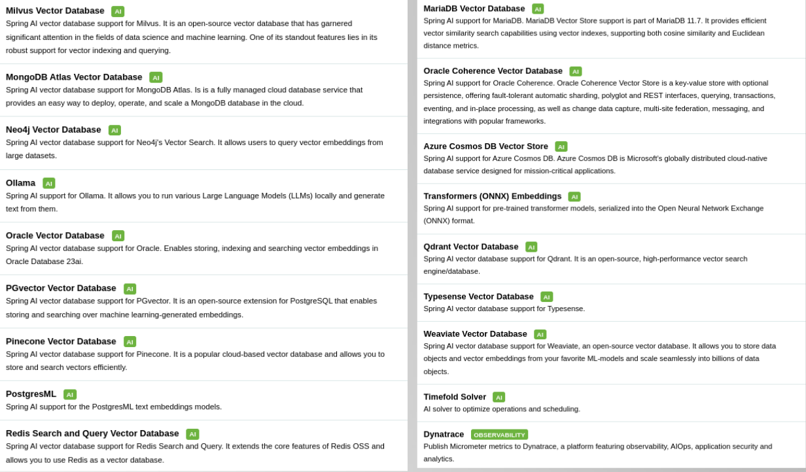
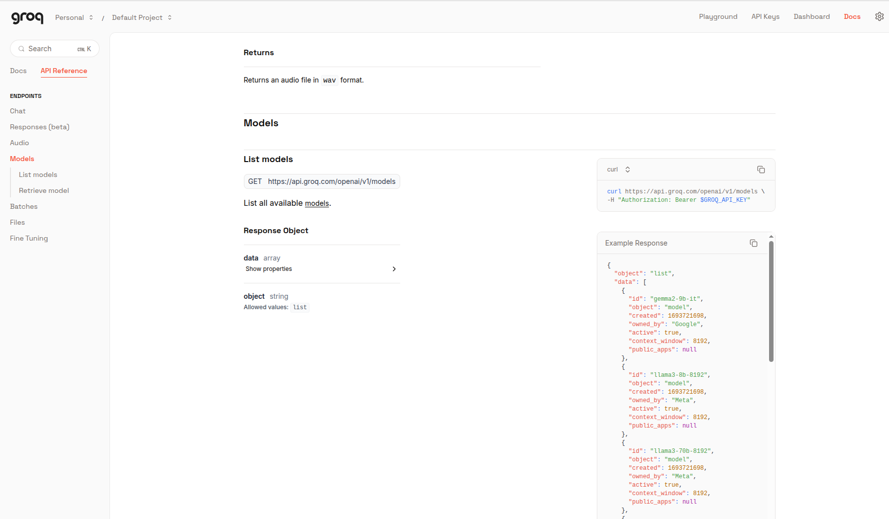
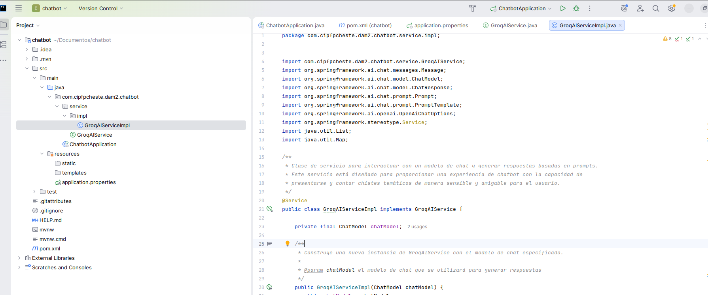

# NLP: SpringAI

**Ponente:** Jose Ramón Cebolla Cebolla
**Objetivos de la sesión:**

En esta sesión aprenderemos a: 

- Utilizar otro **lenguaje de programación diferente a Python para IA**.
- Comprender como funciona el ecosistema de **LLMs** que proporciona **Groq**.
- Crear un chatbot con **Spring AI**.

---
## IA: Java vs. Python:

En esta práctica vamos a utilizar Java para realizar un chatbot cuentachistes.

### ¿Por qué utilizaremos Java y no Python?

- Aunque actualmente el **lenguaje dominante en IA es claramente Python**, no solo se puede hacer IA con Python.
- **Spring Boot** está abriendo una puerta enorme a utilizar la IA en proyectos Java con sus **dependencias de Maven relacionadas con la IA**.
- The New Stack, una plataforma de medios tecnológicos enfocada en noticias, análisis y recursos sobre Desarrollo Software, Tecnologías Cloud Nativas y herramientas Open Source ha publicado recientemente (7 de Febrero de 2025) un artículo sobre este tema y afirma que Java se está posicionando para superar a Python como lenguaje dominante en el desarrollo de inteligencia artificial en un máximo de 3 años, especialmente en entornos empresariales. Afirman que Python probablemente mantendrá su posición en investigación y prototipado rápido, pero Java está ganando terreno en implementaciones empresariales de IA gracias a su rendimiento, escalabilidad y ecosistema maduro. La industria parece estar moviéndose hacia un modelo donde Python se usa para experimentación inicial y Java para implementación a producción. Este cambio podría redefinir el panorama de desarrollo de IA en los próximos años, con Java recuperando terreno en un dominio donde Python ha reinado durante más de una década.

---

### Spring AI – Dependencias disponibles

Como podemos ver, el framework de Java **Spring Boot** ya pone a nuestra disposición muchas **dependencias relacionadas con IA**:




---

### Spring AI – Documentación oficial

Spring Boot también nos proporciona con **Spring AI** una web centrada en Inteligencia Artificial desde [https://docs.spring.io/spring-ai/reference/index.html](https://docs.spring.io/spring-ai/reference/index.html):


---

## Ecosistema Groq

Antes de crear nuestra aplicación debemos tener claro qué LLM queremos utilizar para conseguir una **API_KEY del LLM seleccionado**.

Con Spring Boot podemos seleccionar **múltiples LLMs de manera nativa con las dependencias de Spring Boot**: Mistral, OpenAI, Ollama, …

En la práctica anterior utilizábamos Mistral, ahora podríamos seguir utilizándola, pero cambiemos y pasemos a utilizar el **ecosistema Groq**, que pone a nuestra disposición un listado de modelos de manera totalmente gratuita y que podemos utilizar durante las prácticas y ejercicios de prueba.


> ⚠️ **Aviso:** la información que le pasas en los prompts puede ser utilizada por la empresa y no debe ser confidencial.

Para empezar a utilizar Groq debemos de crear la API_KEY que usaremos para acceder al modelo. Accede a [https://console.groq.com/keys](https://console.groq.com/keys).


Al pulsar en “**Login**” nos podemos logear con nuestra cuenta de Gmail o cualquiera de los métodos que nos propone de manera gratuita


### Creación de API_KEY


Hemos escogido **Groq** por la variedad de modelos que nos permite utilizar de manera totalmente gratuita que nos permite programar sin tener GPU.




#### Ecosistema Groq:

Vemos que la oferta es muy grande si ejecutamos el curl que nos devuelve los modelos que Groq permite utilizar :

```bash
curl https://api.groq.com/openai/v1/models \ -H "Authorization: Bearer $GROQ_API_KEY"
```


### Configuración de variable de entorno

Podemos poner directamente la API_KEY donde hemos escrito $GROQ_API_KEY o configurar $GROQ_API_KEY en Ubuntu en el fichero “.bashrc” añadiendo al final del fichero una linea con:

En Ubuntu (en `.bashrc`):


```bash
export GROQ_API_KEY="aquí_tu_clave"
```


------

### Tabla de modelos Groq (Octubre 2025)

| Categoría                | Nombre del Modelo (ID)                        | Propietario   | Ventana de Contexto | Límite de Respuesta | Uso Recomendado                |
| :----------------------- | :-------------------------------------------- | :------------ | :------------------ | :------------------ | :----------------------------- |
| Text-to-Speech           | playai-tts                                    | PlayAI        | 8192                | 8192                | Síntesis de voz general        |
| Text-to-Speech           | playai-tts-arabic                             | PlayAI        | 8192                | 8192                | Síntesis de voz en árabe       |
| Text Generation          | groq/compound                                 | Groq          | 131072              | 8192                | Generación de texto general    |
| Text Generation          | meta-llama/llama-4-scout-17b-16e-instruct     | Meta          | 131072              | 8192                | Instrucciones y conversaciones |
| Text Generation          | alam-2-7b                                     | SDAIA         | 4096                | 4096                | Generación de texto básico     |
| Text Generation          | openalign-oss-20b                             | OpenAI        | 131072              | 65536               | Texto largo y complejo         |
| Text Generation          | querytower-3-32b                              | Alibaba Cloud | 131072              | 40500               | Chat multilingüe               |
| Text Generation          | llama-3.3-70b-versatile                       | Meta          | 131072              | 32766               | Tareas versátiles              |
| Text Generation          | moonshotalk/mini-k2-instruct                  | Moonshot AI   | 131072              | 16384               | Instrucciones y razonamiento   |
| Text Generation          | moonshotalk/mini-k2-instruct-0905             | Moonshot AI   | 262144              | 16384               | Contextos muy largos           |
| Text Generation          | groq/compound-mini                            | Groq          | 131072              | 8192                | Generación eficiente           |
| Text Generation          | meta-llama/llama-4-maverick-17b-128e-instruct | Meta          | 131072              | 8192                | Instrucciones especializadas   |
| Text Generation          | openalign-oss-120b                            | OpenAI        | 131072              | 65536               | Tareas complejas               |
| Text Generation          | llama-3.1-8b-instant                          | Meta          | 131072              | 131072              | Respuestas instantáneas        |
| Speech-to-Text           | whisper-large-v3-turbo                        | OpenAI        | 448                 | 448                 | Transcripción rápida           |
| Speech-to-Text           | whisper-large-v3                              | OpenAI        | 448                 | 448                 | Transcripción de alta calidad  |
| Specialized (Moderation) | meta-llama/llama-guard-4-12b                  | Meta          | 131072              | 1024                | Moderación de contenido        |
| Specialized (Moderation) | meta-llama/llama-prompt-guard-2-22m           | Meta          | 512                 | 512                 | Moderación básica de prompts   |
| Specialized (Moderation) | meta-llama/llama-prompt-guard-2-96m           | Meta          | 512                 | 512                 | Moderación avanzada de prompts |

Normalmente si superas la ventana de contexto (limite del texto de la pregunta) el modelo olvidará las primeras palabras. **1 token ≈ 0.75 palabras en inglés**.


> ⚠️ **Nota:** **Groq actualiza la lista de modelos sin previo aviso**.

------


## Nuestro primer chatbot de IA en Java

### 1. Crear proyecto Spring Boot

Accede a [https://start.spring.io](https://start.spring.io/) y configura:

- **Project:** Maven
- **Spring Boot:** 3.5.9 (o la más reciente estable) . En la fecha de generar esta documentación la dependencia OpenAI no está todavía para Spring 4.
- **Dependencies:**
  - Spring Web
  - Thymeleaf
  - OpenAI (Spring AI)
- **Java:** 17 o 21


Genera y descarga el proyecto, luego ábrelo con **IntelliJ**.

El pom.xml deberá contener la siguiente información:

```xml
<?xml version="1.0" encoding="UTF-8"?>
<project xmlns="http://maven.apache.org/POM/4.0.0" xmlns:xsi="http://www.w3.org/2001/XMLSchema-instance"
	xsi:schemaLocation="http://maven.apache.org/POM/4.0.0 https://maven.apache.org/xsd/maven-4.0.0.xsd">
	<modelVersion>4.0.0</modelVersion>
	<parent>
		<groupId>org.springframework.boot</groupId>
		<artifactId>spring-boot-starter-parent</artifactId>
		<version>3.5.9</version>
		<relativePath/> <!-- lookup parent from repository -->
	</parent>
	<groupId>com.cipfpcheste.dam2</groupId>
	<artifactId>chatbot</artifactId>
	<version>0.0.1-SNAPSHOT</version>
	<name>chatbot</name>
	<description>Ejemplo de chatbot con SpringIA</description>
	<url/>
	<licenses>
		<license/>
	</licenses>
	<developers>
		<developer/>
	</developers>
	<scm>
		<connection/>
		<developerConnection/>
		<tag/>
		<url/>
	</scm>
	<properties>
		<java.version>21</java.version>
		<spring-ai.version>1.1.2</spring-ai.version>
	</properties>
	<dependencies>
		<dependency>
			<groupId>org.springframework.boot</groupId>
			<artifactId>spring-boot-starter-thymeleaf</artifactId>
		</dependency>
		<dependency>
			<groupId>org.springframework.boot</groupId>
			<artifactId>spring-boot-starter-web</artifactId>
		</dependency>
		<dependency>
			<groupId>org.springframework.ai</groupId>
			<artifactId>spring-ai-starter-model-openai</artifactId>
		</dependency>

		<dependency>
			<groupId>org.springframework.boot</groupId>
			<artifactId>spring-boot-starter-test</artifactId>
			<scope>test</scope>
		</dependency>
	</dependencies>
	<dependencyManagement>
		<dependencies>
			<dependency>
				<groupId>org.springframework.ai</groupId>
				<artifactId>spring-ai-bom</artifactId>
				<version>${spring-ai.version}</version>
				<type>pom</type>
				<scope>import</scope>
			</dependency>
		</dependencies>
	</dependencyManagement>

	<build>
		<plugins>
			<plugin>
				<groupId>org.springframework.boot</groupId>
				<artifactId>spring-boot-maven-plugin</artifactId>
			</plugin>
		</plugins>
	</build>

</project>

```


### 2. Configuración de `application.properties`


```properties
spring.application.name=chatbot
server.port=8090
#Configuramos el encoding
server.servlet.encoding.charset=UTF-8
server.servlet.encoding.enabled=true
server.servlet.encoding.force=true

# Para obtener API_KEY DE Groq: https://console.groq.com/keys
# 2 OPCIONES para configurar la API_KEY en la webapp de Spring Boot:
# 1º Poner la clave directamente:
# spring.ai.openai.api-key=aqui tu clave
# 2º Utilizar una variable del sistema operativo (GROQ_API_KEY) y leerla aquí:
spring.ai.openai.api-key=${GROQ_API_KEY} 
# si no te funciona, coloca esto:
# spring.ai.openai.api-key=sk-aqui tu clave
# Url de la API de GROQ:
spring.ai.openai.base-url=https://api.groq.com/openai
```


### 3. Estructura del proyecto


```tex
src/main/java/com/example/chatbot/
├── ChatbotApplication.java
├── controller/
│   ├── GroqAIController.java
│   └── FrontendController.java
└── service/
    ├── GroqAIService.java
    └── impl/
        └── GroqAIServiceImpl.java
```

### 4. Interfaz: `GroqAIService`

Empezamos nuestra API Rest definiendo los 2 método públicos que queremos que tenga el servicio GroqAIService, la presentación del **humorista** y el **chiste**.
Para aquellos que no han trabajado nunca con SpringBoot, creamos el fichero GroqAIService.java en el mismo directorio que ChatbotApplication.java y al indicar el nombre del paquete nos situamos encima de la linea en rojo y seleccionamos **Quick Fix** y **Move**:

```java
package com.cipfpcheste.dam2.chatbot.service;

public interface GroqAIService {    /**
 * Genera una respuesta de presentación personalizada para el usuario.
 *
 * @param nombre El nombre del usuario que se incluirá en la presentación
 * @return Un String que contiene la respuesta de presentación generada por la IA
 */

String getPresentacionAlUsuario(String nombre);

    /**
     * Genera una respuesta con un chiste sobre la temática especificada.
     *
     * @param tema La temática sobre la cual se generará el chiste
     * @return Un String que contiene el chiste generado por la IA
     */
    String getChisteTematico(String tema);

}

``


### 5. Servicio: `GroqAIServiceImpl`

Una vez declarada la interface GroqAIService ya podemos declarar en el subpaquete ‘impl’ la clase que implementará ese servicio en la práctica: GroqAIServiceImpl.
En la implementación nos apoyaremos en los método privados: getOptions, generateResponse, getPromptPresentacionAlUsuario y getPromptChisteTematico:

```java
package com.cipfpcheste.dam2.chatbot.service.impl;


import com.cipfpcheste.dam2.chatbot.service.GroqAIService;
import org.springframework.ai.chat.messages.Message;
import org.springframework.ai.chat.model.ChatModel;
import org.springframework.ai.chat.model.ChatResponse;
import org.springframework.ai.chat.prompt.Prompt;
import org.springframework.ai.chat.prompt.PromptTemplate;
import org.springframework.ai.openai.OpenAiChatOptions;
import org.springframework.stereotype.Service;
import java.util.List;
import java.util.Map;

/**
 * Clase de servicio para interactuar con un modelo de chat y generar respuestas basadas en prompts.
 * Este servicio está diseñado para proporcionar una experiencia de chatbot con la capacidad de
 * presentarse y contar chistes temáticos de manera sensible y amigable para el usuario.
 */
@Service
public class GroqAIServiceImpl implements GroqAIService {

    private final ChatModel chatModel;

    /**
     * Construye una nueva instancia de GroqAIService con el modelo de chat especificado.
     *
     * @param chatModel el modelo de chat que se utilizará para generar respuestas
     */
    public GroqAIServiceImpl(ChatModel chatModel) {
        this.chatModel = chatModel;
    }
    // Definir el nombre del modelo de Groq (LLM) que utilizaremos
    private final String modelName = "llama-3.3-70b-versatile";
    //Definir el limite de tokens de respuesta para el modelo llama-3.3-70b-versatile
    private final String maxTokens = "32768";

    /**
     * Configura y devuelve las opciones para el modelo de chat Groq AI.
     *
     * Este método crea un objeto OpenAiChatOptions con configuraciones predefinidas:
     * - Utiliza el modelo especificado en modelName
     * - Establece la temperatura en 0.4 para equilibrar creatividad/consistencia
     * - Establece el máximo de tokens basado en la configuración maxTokens
     *
     * @return OpenAiChatOptions objeto configurado con los parámetros especificados
     */
    private OpenAiChatOptions getOptions() {
        OpenAiChatOptions options = OpenAiChatOptions.builder()
                .model(modelName)
                .temperature(0.4)
                .maxTokens(Integer.parseInt(maxTokens))
                .build();
        return options;
    }

    /**
     * Genera una respuesta utilizando el modelo de chat basado en el prompt proporcionado.
     *
     * @param prompt El objeto prompt que contiene el mensaje de entrada para generar una respuesta
     * @return La respuesta generada como texto en formato String
     * @throws RuntimeException si el modelo de chat falla al generar una respuesta
     */

    private String generateResponse(Prompt prompt) {
        ChatResponse response = chatModel.call(prompt);
        return response.getResult().getOutput().getText();
    }

    /**
     * Genera una respuesta de presentación personalizada para el usuario.
     *
     * @param nombre El nombre del usuario que se incluirá en la presentación
     * @return Un String que contiene la respuesta de presentación generada por la IA
     */

    @Override
    public String getPresentacionAlUsuario(String nombre) {
        return generateResponse(getPromptPresentacionAlUsuario(nombre));
    }

    /**
     * Genera una respuesta con un chiste sobre la temática especificada.
     *
     * @param tema La temática sobre la cual se generará el chiste
     * @return Un String que contiene el chiste generado por la IA
     */
    @Override
    public String getChisteTematico(String tema) {
        return generateResponse(getPromptChisteTematico(tema));
    }

    /**
     * Crea un prompt para la interacción inicial con el usuario, configurando un chatbot de IA
     * que se especializa en contar chistes.
     *
     * El método configura una plantilla de prompt que presenta al chatbot con un nombre dado
     * y lo prepara para contar chistes sobre cualquier tema solicitado por el usuario.
     *
     * @param nombre El nombre que se usará para el chatbot en la interacción
     * @return Prompt Un objeto prompt configurado que contiene el mensaje y las opciones de chat OpenAI
     */

    private Prompt getPromptPresentacionAlUsuario(String nombre) {
        // 1. Crear plantilla de prompt con variables
        PromptTemplate promptTemplate = new PromptTemplate(
                """
                    Por favor, actúa como chatBot de inteligencia artificial llamado '{nombre}'
                    que siempre tiene ingenio para contar chistes sobre cualquier temática.
                    No hace falta que hagas una introducción, simplemente preséntate y pregunta 
                    sobre qué temática le gustaría al usuario que le contaras un chiste en una 
                    frase no demasiado larga.
                    Por favor, ten cuidado y sé sensible respecto al contenido.
                """
        );
        // 2. Reemplazar variables en el prompt
        Message message = promptTemplate.createMessage(
                Map.of("nombre", nombre)
        );
        // 3. Leer las opciones del modelo
        OpenAiChatOptions options = getOptions();
        // 4. Crear Prompt combinando mensaje y opciones
        return new Prompt(List.of(message), options);
    }

    /**
     * Crea un prompt para generar un chiste sobre una temática específica.
     *
     * El método configura una plantilla de prompt que solicita al modelo
     * generar un chiste apropiado sobre el tema proporcionado, asegurando
     * que el contenido sea adecuado y sensible.
     *
     * @param tema La temática sobre la cual se generará el chiste
     * @return Prompt Un objeto prompt configurado con el mensaje y las opciones de chat
     */
    private Prompt getPromptChisteTematico(String tema) {
        // 1. Crear plantilla de prompt con variables
        PromptTemplate promptTemplate = new PromptTemplate(
                """
                    Vas a actuar como una persona graciosa y contarme un chiste sobre la temática 
                    '{tema}' teniendo en cuenta lo siguiente:
                    · Si crees que la temática es sobre un tema controvertido que puede ofender a alguien,
                    por favor, cambia la temática a algo más seguro lo más parecido posible a la temática original,
                    pero no digas que has cambiado de temática.
                    · No empieces diciendo la temática del chiste ni cuál es tu intención al contarlo, simplemente 
                    cuenta el chiste de una manera graciosa y divertida sin ser demasiado escueto ni demasiado largo.
                    · El chiste debe ser adecuado para un público general pensando que lo está contando un 
                    profesor a sus alumnos. Por favor, ten cuidado y sé sensible respecto al contenido.
                    · Por último, acaba preguntando al usuario de manera divertida y sobre todo escueta sobre qué 
                    otra temática le gustaría que le contaras un chiste.
                """
        );
        // 2. Reemplazar variables en el prompt
        Message message = promptTemplate.createMessage(
                Map.of("tema", tema)
        );
        // 3. Leer las opciones del modelo
        OpenAiChatOptions options = getOptions();
        // 4. Crear Prompt combinando mensaje y opciones
        return new Prompt(List.of(message), options);
    }
}
```



### 6. Controlador: `GroqAIController`

El controlador de esta API Rest cuenta chistes es muy reducido porque utiliza el servicio para llamar a las funciones ‘getPresentacionAlUsuario’ para presentarse y ‘getChisteTematico’ para contar un chiste de un tema concreto:

```java
package com.cipfpcheste.dam2.chatbot.service.controller;

import com.cipfpcheste.dam2.chatbot.service.GroqAIService;
import org.springframework.web.bind.annotation.GetMapping;
import org.springframework.web.bind.annotation.RequestMapping;
import org.springframework.web.bind.annotation.RequestParam;
import org.springframework.web.bind.annotation.RestController;

@RestController
@RequestMapping("api/v1")
public class GroqAIController {

    private final GroqAIService groqService;

    public GroqAIController(GroqAIService groqService) {
        this.groqService = groqService;
    }

    @GetMapping("/getPresentacionAlUsuario")
    public String getPresentacionAlUsuario() {
        return groqService.getPresentacionAlUsuario("Simarret");
    }

    @GetMapping("/getChisteTematico")
    public String getChisteTematico(@RequestParam String tema) {
        return groqService.getChisteTematico(tema);
    }
}
```


#### 6.1. Depurando y probando

Vamos al explorador del proyecto y entramos en el controlador. Pongamos un punto de interrupción en la linea 21 (donde el controller solicita al servicio de Groq que se presente). Para hacerlo pulsamos en la parte izquierda del número de linea y aparecerá un punto rojo. Si en el navegador entramos en la url veremos como se para en esa linea. Si
queremos continuar le damos al play y nos mostrará la presentación:


Accede desde el navegador a la url: http://localhost:8090/api/v1/getPresentacionAlUsuario

Si vas dando un step by step verás que al final te devuelve lo siguiente:


Quita el break point y bamos ahora a probar el API.

Prueba esta: http://localhost:8090/api/v1/getChisteTematico?tema=programadores


### 7. Frontend con Thymeleaf

#### 7.1. FrontendController

Ahora vamos a sacar provecho de la dependencia Thymeleaf para poder crear un chatbot con interface gráfica. Empezamos creando el controlador que renderizará la página principal del chatbot:


#### `FrontendController.java`


```java
package com.cipfpcheste.dam2.chatbot.service.controller;

import org.springframework.stereotype.Controller;
import org.springframework.ui.Model;
import org.springframework.web.bind.annotation.GetMapping;

@Controller
public class FrontendController {
    // Este controlador maneja la ruta raíz y devuelve la vista index.html
    @GetMapping("/")
    public String index(Model model) {
        // Aquí puedes agregar datos al modelo si fuera necesario
        return "index"; // Renderiza index.html
    }
}
```


#### Archivos estáticos

Coloca en `src/main/resources/`:

- `static/css/styles.css` [styles.css](./recursos/springIA/styles.css)
- `static/images/logo_simarro.jpg` [logo_simarro.jpg](./recursos/springIA/logo_simarro.jpg)
- `static/images/simarret.jpg` [simarret.jpg](./recursos/springIA/simarret.jpg)
- `static/js/script.js` [script.js](./recursos/springIA/script.js)
- `templates/index.html` [index.html](./recursos/springIA/index.html)


### 8. Ejecución y prueba

1. Ejecuta la aplicación
2. Accede a:
   - `http://localhost:8090/api/v1/getPresentacionAlUsuario`
   - `http://localhost:8090/api/v1/getChisteTematico?tema=programadores`
   - `http://localhost:8090/` (interfaz web)


------

## Creatividad del LLM

### Parámetros de control

#### Temperatura (`temperature`)

Controla el grado de aleatoriedad en las respuestas.

| Valor    | Efecto                                          | Casos de Uso                                     |
| :------- | :---------------------------------------------- | :----------------------------------------------- |
| 0.0      | Determinista, repetitivo                        | Hechos científicos, respuestas técnicas          |
| 0.1–0.4  | Conservador, enfocado                           | Asistentes profesionales, chatbots empresariales |
| 0.5–0.7  | Equilibrio creatividad/coherencia (recomendado) | Redacción creativa, brainstorming                |
| 0.8–1.0+ | Altamente creativo/impredecible                 | Poesía, ideas disruptivas                        |

#### Top-P (Nucleus Sampling)

Controla la diversidad restringiendo la selección a un subconjunto de opciones probables.

| Valor | Comportamiento                 | Uso                                  |
| :---- | :----------------------------- | :----------------------------------- |
| 0.1   | Muy conservador                | Traducciones técnicas                |
| 0.5   | Equilibrio coherencia/variedad | Respuestas creativas pero relevantes |
| 0.9   | Diverso y original             | Historias, diálogos                  |
| 1.0   | Máxima diversidad              | Experimentación artística            |

### Combinaciones recomendadas


```java
OpenAiChatOptions.builder()
    .model("llama-3.3-70b-versatile")
    .temperature(0.7)    // Creatividad media
    .topP(0.9)           // Diversidad controlada
    .maxTokens(32768)
    .build();
```


#### Guía rápida

| Objetivo            | Temperature | Top-P   |
| :------------------ | :---------- | :------ |
| Respuestas técnicas | 0.1–0.3     | 0.1–0.3 |
| Chat creativo       | 0.6–0.8     | 0.7–0.9 |
| Generación de ideas | 0.9–1.2     | 0.9–1.0 |
| Poesía/Arte         | 1.0–1.5     | 1.0     |

------

## Entrega: Chatbot

Crea un nuevo proyecto Spring Boot (o Flask en Python) que utilice los modelos de Groq.

**Se valorará:**

- Funcionalidad interesante (texto, audio, moderación, etc.).
- Experimentación con `temperature` y `top_p`.
- Informe con conclusiones sobre el comportamiento del modelo.


